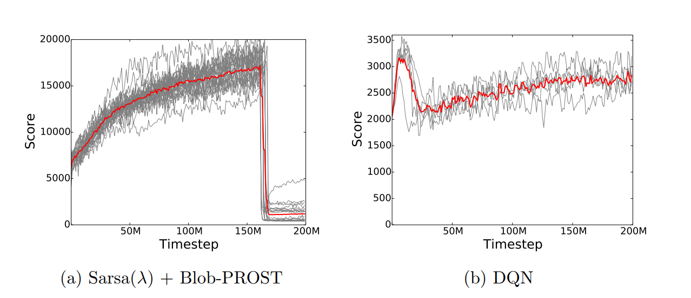
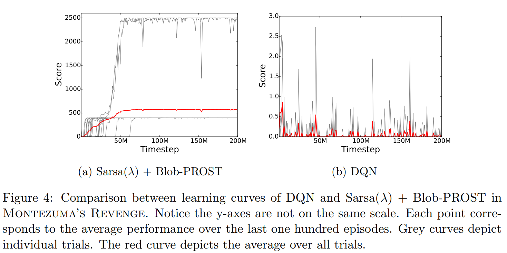
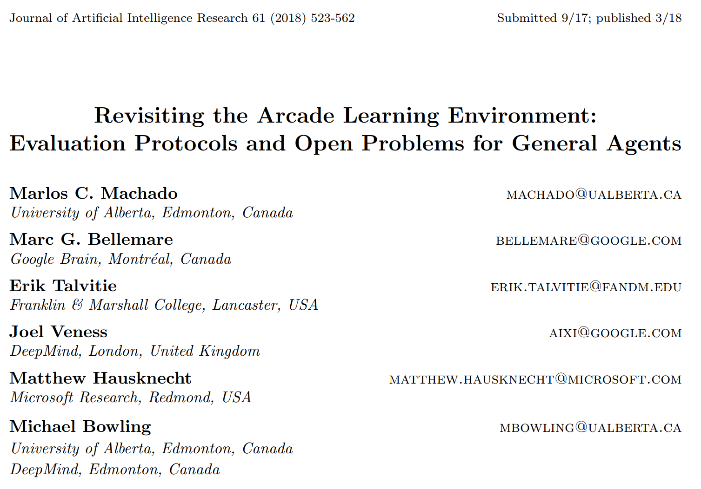

---

title: 强化学习算法性能度量的常用方法
 
description: 

#多个标签请使用英文逗号分隔或使用数组语法

tags: 杂谈

#多个分类请使用英文逗号分隔或使用数组语法，暂不支持多级分类

---

本文介绍一下强化学习中的常用性能度量方法，或者说是强化学习中常用的性能测量标准。

常用的两种RL中的算法性能度量方法：

1. 训练过程中不对训练过程进行暂停，不单独测试算法性能而是使用训练过程的性能表现作为算法的性能表现。

 

 

 

本文参考资料：

