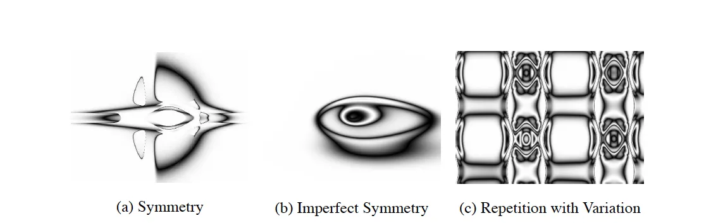

---

title: 【转载】遗传算法—HyperNEAT Explained——Advancing Neuroevolution
 
description: 

#多个标签请使用英文逗号分隔或使用数组语法

tags: 杂谈

#多个分类请使用英文逗号分隔或使用数组语法，暂不支持多级分类

---

原文地址：

https://hunterheidenreich.com/posts/next-gen-neuroevolution-hyperneat/

 

 

## Expanding NeuroEvolution

Last week, I wrote an article about [NEAT (NeuroEvolution of Augmenting Topologies)](https://hunterheidenreich.com/posts/neuroevolution-of-augmenting-topologies/) and we discussed a lot of the cool things that surrounded the algorithm. We also briefly touched upon how this older algorithm might even impact how we approach network building today, alluding to the fact that neural networks need not be built entirely by hand.

Today, we are going to dive into a different approach to neuroevolution, an extension of NEAT called [HyperNEAT](http://axon.cs.byu.edu/~dan/778/papers/NeuroEvolution/stanley3**.pdf). NEAT, as you might remember, had a direct encoding for its network structure. This was so that networks could be more intuitively evolved, node by node and connection by connection. HyperNEAT drops this idea because in order to evolve a network like the brain (with billions of neurons), one would need a much faster way of evolving that structure.

HyperNEAT is a much more conceptually complex algorithm (in my opinion, at least) and even I am working on understanding the nuts and bolts of how it all works. Today, we will take a look under the hood and explore some of the components of this algorithm so that we might better understand what makes it so powerful and reason about future extensions in this age of deep learning.

## HyperNEAT

### Motivation

Before diving into the paper and algorithm, I think it’s worth exploring a bit more the motivation behind HyperNEAT.

The full name of the paper is [“A Hypercube-Based Indirect Encoding for Evolving Large-Scale Neural Networks”](http://axon.cs.byu.edu/~dan/778/papers/NeuroEvolution/stanley3**.pdf), which is quite the mouthful! But already, we can see two of the major points. It’s a hypercube-based indirect encoding. We’ll get into the hypercube part later, but already we know that it’s a move from direct encodings to indirect encodings (see my last blog on NEAT for a more detailed description of some differences between the two). Furthermore, we get the major reasoning behind it as well: For evolving big neural nets!

More than that, the creators of this algorithm highlight that if one were to look at the brain, they see a “network” with billions of nodes and trillions of connections. They see a network that uses repetition of structure, reusing a mapping of the same gene to generate the same physical structure multiple times. They also highlight that the human brain is constructed in a way to exploit physical properties of the world: symmetry (have mirrors of structures, two eyes for input for example) and locality (where nodes are in the structure influences their connections and functions).

Contrast this what we know about neural networks, either built through an evolution procedure or constructed by hand and trained. Do any of these properties hold? Sure, if we force the network to have symmetry and locality, maybe… However, even then, take a dense, feed-forward network where all nodes in one layer are connected to all nodes in the next! And when looking at the networks constructed by the vanilla NEAT algorithm? They tend to be disorganized, sporadic, and not exhibit any of these nice regularities.

Enter in HyperNEAT! Utilizing an indirect encoding through something called connective Compositional Pattern Producing Networks (CPPNs), HyperNEAT attempts to exploit geometric properties to produce very large neural networks with these nice features that we might like to see in our evolved networks.

### What’s a Compositional Pattern Producing Network?

In the previous post, we discussed encodings, and today we’ll dive deeper into the indirect encoding used for HyperNEAT. Now, indirect encodings are a lot more common than you might think. In fact, you have one inside yourself!

DNA is an indirect encoding because the phenotypic results (what we actually see) are orders of magnitude larger than the genotypic content (the genes in the DNA). If you look at a human genome, we’ll say it has about 30,000 genes coding for approximately 3 billion amino acids. Well, the brain has 3 trillion connections. Obviously, there is something indirect going on here!

Something borrowed from the ideas of biology is an encoding scheme called developmental encoding. This is the idea that all genes should be able to be reused at any point in time during the developmental process and at any location within the individual. Compositional Pattern Producing Networks (CPPNs) are an abstraction of this concept that have been show to be able to create patterns for repeating structures in Cartesian space. See some structures that were produced with CPPNs here:

​                                                                                                       CPPN Images 

 

 

 

**个人github博客地址：**
[https://devilmaycry812839668.github.io/](https://devilmaycry812839668.github.io/ "https://devilmaycry812839668.github.io/")