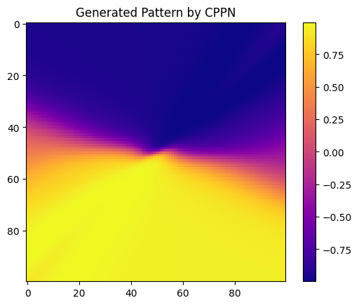
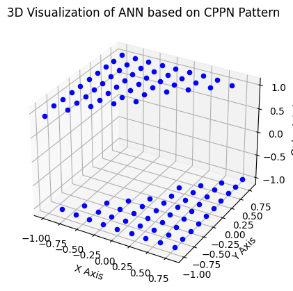

---

title: 【转载】遗传算法-HyperNEAT Approach in Neuroevolution
 
description: 

#多个标签请使用英文逗号分隔或使用数组语法

tags: 杂谈

#多个分类请使用英文逗号分隔或使用数组语法，暂不支持多级分类

---

原文地址：

https://medium.com/@eugenesh4work/hyperneat-approach-in-neuroevolution-d2ead10aad33


<br/>

<br/>

HyperNEAT (Hypercube-based NeuroEvolution of Augmenting Topologies) innovative algorithm extends the capabilities of evolutionary computation, particularly in evolving Artificial Neural Networks (ANNs). HyperNEAT stands out for its ability to harness geometric regularities in network topology, paving the way for evolving large-scale, efficient neural networks. This article delves into the intricacies of HyperNEAT, exploring its foundational principles, operational mechanics, and its impactful role in the broader context of machine learning and artificial intelligence.

Neuroevolution, a subset of evolutionary algorithms focused on evolving neural networks, has evolved from simple structures to complex architectures capable of tackling a myriad of challenging tasks. The introduction of HyperNEAT marked a turning point in this evolution, offering a novel perspective on how neural networks can be developed and optimized.

## Foundational Concepts

HyperNEAT is an extension of the NEAT (NeuroEvolution of Augmenting Topologies) algorithm, which was originally designed to evolve both the topology and weights of neural networks. The crux of HyperNEAT lies in its indirect encoding mechanism, which uses a **Compositional Pattern Producing Network (CPPN)** to encode connectivity patterns of ANNs as a function of geometry. This approach allows for the efficient representation of large networks with inherent regularities such as symmetry and repetition, which are often observed in natural biological networks.

Compositional Pattern Producing Networks (CPPNs) are a form of artificial neural network that have fundamentally altered the landscape of evolutionary computation and the development of complex neural topologies. Unlike traditional neural networks, CPPNs are not designed for tasks like classification or regression. Instead, they are used to generate patterns and structures, which can be applied in various domains, especially in evolving the topologies and weights of Artificial Neural Networks (ANNs).

At their core, CPPNs are inspired by the processes of natural development and morphogenesis — the biological processes that govern the shape and form of an organism. They use a composition of mathematical functions to create complex patterns. These patterns can manifest in various ways, from symmetric structures found in biological organisms to intricate designs and network topologies.

The structure of a CPPN resembles that of a standard neural network, consisting of nodes (neurons) and connections. However, the key difference lies in the diversity of activation functions used in the nodes. While typical ANNs might use a single type of activation function (like ReLU or sigmoid), CPPNs employ a variety of functions such as Gaussian, sine, cosine, and sigmoid. This diversity allows CPPNs to produce a wide range of output patterns, depending on the inputs and the arrangement of these functions within the network.

Basic Compositional Pattern Producing Network (CPPN) in Python involves defining a network that can generate patterns based on its input coordinates. Typically, a CPPN includes a variety of activation functions to produce complex patterns. Below is a simplified Python example of a CPPN. This example will create a basic CPPN and use it to generate a 2D pattern.


```python
import numpy as np
import matplotlib.pyplot as plt

class CPPN:
    def __init__(self, input_size, hidden_layers, output_size):
        self.layers = [np.random.randn(input_size, hidden_layers[0])]
        self.layers += [np.random.randn(hidden_layers[i], hidden_layers[i+1]) for i in range(len(hidden_layers) - 1)]
        self.layers.append(np.random.randn(hidden_layers[-1], output_size))

    def activation(self, x, function='tanh'):
        if function == 'tanh':
            return np.tanh(x)
        elif function == 'sin':
            return np.sin(x)
        elif function == 'gaussian':
            return np.exp(-x**2)
        else:
            return x  # linear

    def generate_pattern(self, x, y, activation_function='tanh'):
        inputs = np.array([x, y])
        output = inputs
        for layer in self.layers:
            output = np.dot(output, layer)
            output = self.activation(output, activation_function)
        return output

# Create a CPPN
cppn = CPPN(input_size=2, hidden_layers=[10, 10, 10], output_size=1)

# Generate a 2D pattern
pattern = np.zeros((100, 100))
for i in range(100):
    for j in range(100):
        x = i / 50 - 1  # Normalize x coordinates to range [-1, 1]
        y = j / 50 - 1  # Normalize y coordinates to range [-1, 1]
        pattern[i, j] = cppn.generate_pattern(x, y)

# Plot the generated pattern
plt.imshow(pattern, cmap='plasma')
plt.colorbar()
plt.show()
```




<br/>

The result here is a two-dimensional NumPy array with floating-point numbers. The array is structured in a grid-like format, indicative of two dimensions. This structure is common in data that has spatial relationships, such as images or output patterns from a process like a Compositional Pattern Producing Network (CPPN). If we consider this array as a ANN spatial substrat patter, so each element could correspond to the weight of a connection or the activation level of a neuron in an ANN for specific spatial coordinates.

We can make a 3D visualization:

```python
import matplotlib.pyplot as plt
from mpl_toolkits.mplot3d import Axes3D

def visualize_ann_3d(cppn, threshold=0.5, size=10):
    fig = plt.figure()
    ax = fig.add_subplot(111, projection='3d')

    # Iterate through the grid and plot neurons with output above threshold
    for i in range(size):
        for j in range(size):
            x = i / size * 2 - 1  # Normalize to [-1, 1]
            y = j / size * 2 - 1  # Normalize to [-1, 1]
            output = cppn.generate_output(x, y)[0]
            if abs(output) > threshold:
                # Plot the neuron
                ax.scatter(x, y, output, color='blue')

    ax.set_xlabel('X Axis')
    ax.set_ylabel('Y Axis')
    ax.set_zlabel('Output Axis')
    plt.title("3D Visualization of ANN based on CPPN Pattern")
    plt.show()

# Visualize the ANN in 3D based on the CPPN pattern
visualize_ann_3d(cppn, threshold=0.5, size=10)

```




<br/>

In this visualization:

- Each blue dot represents a neuron in the ANN.
- The x and y coordinates of each dot correspond to the neuron’s position in the 2D substrate.
- The z-axis represents the output of the CPPN for each neuron, indicating the strength and nature of the connections from that neuron.

This visualization helps illustrate how the CPPN generates a pattern of connectivity across the neural network. Neurons with higher or lower CPPN outputs are more likely to form stronger connections, as indicated by their position along the z-axis. This 3D view provides a more intuitive understanding of the spatial distribution and connectivity strengths in the ANN as determined by the CPPN.

## Operational Mechanics

The operational framework of HyperNEAT begins with defining a set of nodes in a multi-dimensional space, commonly referred to as a substrate. Each node is assigned coordinates, and the CPPN, evolved through NEAT, is used to query the connectivity between these nodes. This process effectively maps the geometric relationships in the substrate to the structure of the ANN, leading to the generation of complex, yet organized, neural networks.

## Advantages and Applications

One of the key advantages of HyperNEAT is its ability to evolve large-scale neural networks that can capture intricate patterns and dependencies within data. This makes it particularly suitable for tasks involving high-dimensional input spaces, such as image and signal processing. Additionally, the geometric approach to network connectivity facilitates the evolution of modular and hierarchical structures, which are critical for efficient information processing and learning in ANNs.

HyperNEAT has been successfully applied in various domains, demonstrating its versatility and effectiveness. For instance, in image classification tasks, HyperNEAT’s ability to evolve deep neural architectures has shown promise, particularly when integrated with other machine learning techniques. It also holds potential in evolving control systems for robotic applications, where the ability to adapt and learn complex behaviors is paramount.

## Challenges and Future Directions

Despite its successes, HyperNEAT faces challenges, particularly in controlling the precise weights of connections in the evolved networks. This limitation often necessitates the combination of HyperNEAT with other learning algorithms for tasks requiring fine-tuned adjustments. Furthermore, the exploration of effective substrate configurations remains an area of ongoing research, with potential implications for the scalability and generalizability of the evolved networks.

Future research in HyperNEAT is geared towards enhancing its integration with other machine learning paradigms, exploring adaptive and dynamic substrate configurations, and extending its applicability to a broader range of tasks. The intersection of HyperNEAT with recent advancements in evolutionary strategies and deep learning presents an exciting frontier, promising to further elevate its capabilities in evolving sophisticated neural architectures.

HyperNEAT emerges as a groundbreaking tool in the arsenal of neuroevolution, offering a unique approach to evolving neural networks that encapsulate the complexity and efficiency seen in natural systems. As research in this field advances, HyperNEAT is poised to play a pivotal role in the development of intelligent systems, capable of tackling increasingly complex and dynamic problems in the realm of artificial intelligence.


<br/>

<br/>

**个人github博客地址：**
[https://devilmaycry812839668.github.io/](https://devilmaycry812839668.github.io/ "https://devilmaycry812839668.github.io/")