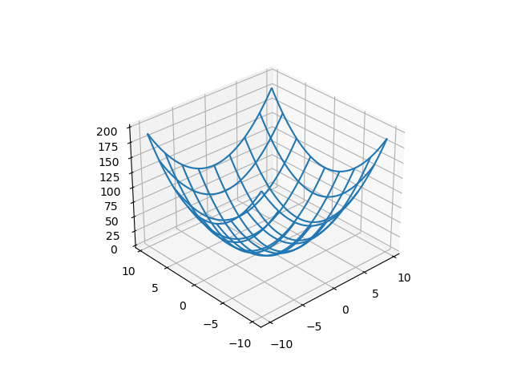
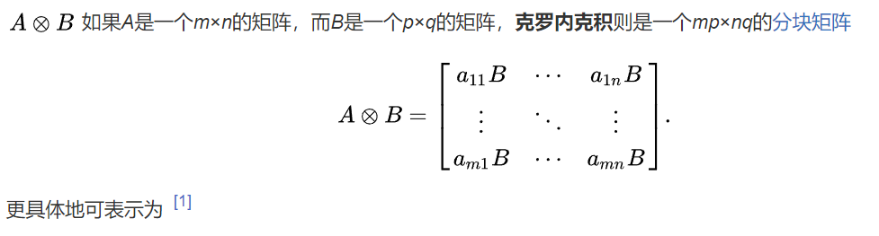
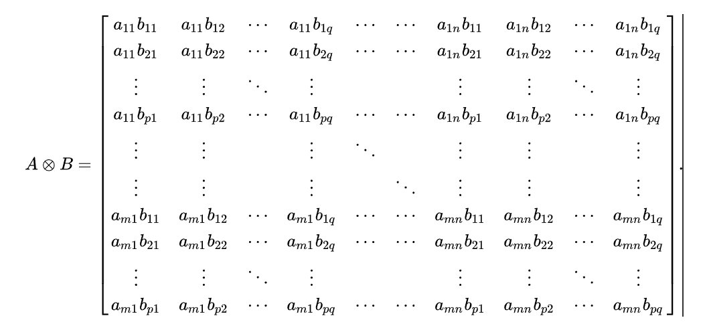
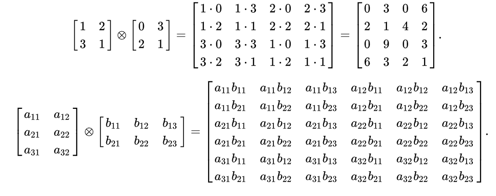

---

title: python统计人的视角(1)——python基础
 
description: 

#多个标签请使用英文逗号分隔或使用数组语法

tags: 杂谈,Python

#多个分类请使用英文逗号分隔或使用数组语法，暂不支持多级分类

---


1. 3D画图

```python
import matplotlib
import matplotlib.pyplot as plt
import numpy as np

fig=plt.figure()

ax=fig.add_subplot(111, projection="3d")
x=np.arange(-10, 10, 0.5)
y=np.arange(-10, 10, 0.5)
X, Y=np.meshgrid(x, y)
Z=X**2+Y**2

ax.plot_wireframe(X,Y,Z, rstride=5, cstride=5)
plt.show()
```




<br/>


2. kronecher乘积 (克罗内克积)

   

   

```python
>>> x=np.array([[2,3], [4,5]])
>>> y=np.array([[3,6], [9,12]])
>>> np.kron(x, y)
array([[ 6, 12,  9, 18],
       [18, 24, 27, 36],
       [12, 24, 15, 30],
       [36, 48, 45, 60]])
```




<br/>


<br/>


