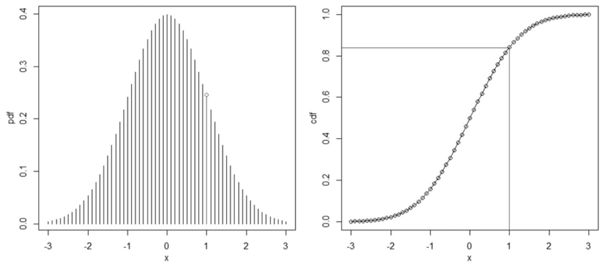

---

title: 【转载】scipy.stats.norm.ppf —— 分位点函数（CDF的逆）（也被用作“标准偏差乘数”）
 
description: 

#多个标签请使用英文逗号分隔或使用数组语法

tags: 杂谈

#多个分类请使用英文逗号分隔或使用数组语法，暂不支持多级分类

---


原文地址：

https://www.cnblogs.com/jiangkejie/p/15292260.html

<br/>

<br/>


## scipy.stats.norm.ppf()

分位点函数（CDF的逆）（也被用作*“标准偏差乘数”*）

即累计分布函数的**逆函数**（分位点函数，给出分位点返回对应的x值）。

scipy.stats.norm.ppf(0.95， loc=0，scale=1)返回累积分布函数中概率等于0.95对应的x值（CDF函数中已知y求对应的x）。




<br/>


```python
ppf = norm.ppf(0.975, loc=172.7815, scale=4.1532)


interval_value = std * ppf


lower_95 = mean - interval_value
upper_95 = mean + interval_value
```

