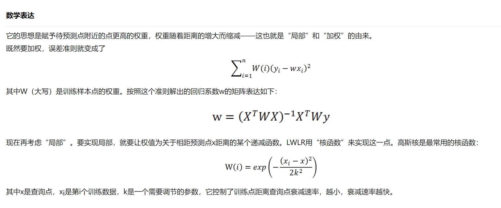
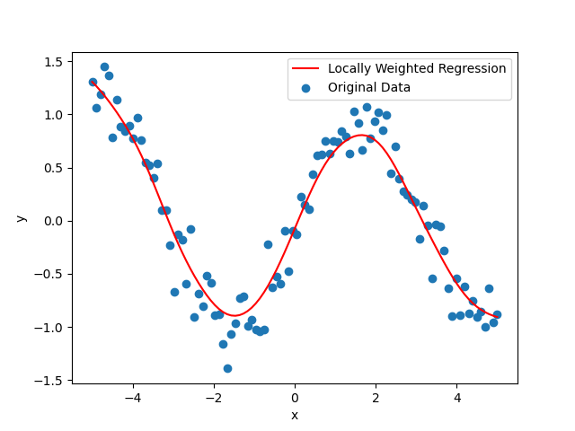

---

title: 局部加权回归（Lowess）
 
description: 

#多个标签请使用英文逗号分隔或使用数组语法

tags: 杂谈

#多个分类请使用英文逗号分隔或使用数组语法，暂不支持多级分类

---





<br/>


代码示例：（源自：<https://blog.csdn.net/weixin_71158509/article/details/136060826>）

```python
import numpy as np
import matplotlib.pyplot as plt
 
def local_weighted_regression(x, y, query_point, tau):
    m = len(x)
    weights = np.exp(-0.5 * ((x - query_point) / tau) ** 2)
    X = np.column_stack((np.ones(m), x))
    W = np.diag(weights)
    theta = np.linalg.inv(X.T @ W @ X) @ X.T @ W @ y
    return theta[0] + theta[1] * query_point
 
# 生成带噪声的非线性数据
np.random.seed(0)
x = np.linspace(-5, 5, 100)
y = np.sin(x) + np.random.normal(0, 0.2, 100)
 
# 设定tau参数
tau = 0.5
 
# 针对每个x点进行局部加权回归拟合
pred_y = [local_weighted_regression(x, y, query_point, tau) for query_point in x]
 
# 绘制原始数据和拟合曲线
plt.scatter(x, y, label='Original Data')
plt.plot(x, pred_y, color='red', label='Locally Weighted Regression')
plt.xlabel('x')
plt.ylabel('y')
plt.legend()
plt.show()
```





参考：

http://www.360doc.com/content/23/1114/09/1103876076_1103876076.shtml

https://blog.51cto.com/u_14405/10716690

https://blog.51cto.com/u_16213668/10656049

https://www.bilibili.com/video/BV1pFHxexE61

https://blog.csdn.net/longgb123/article/details/79520982

https://www.cnblogs.com/mooba/p/5947161.html

https://www.bilibili.com/video/BV1NP411K7eS/
