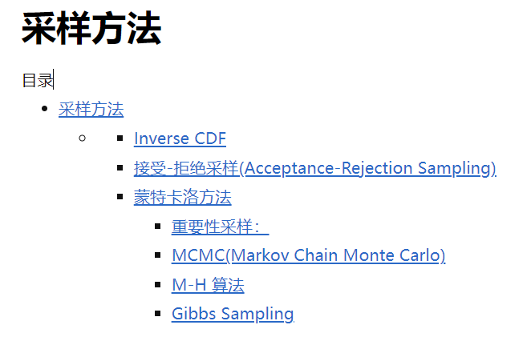

---

title: 计算机中是如何实现高斯分布采样的
 
description: 

#多个标签请使用英文逗号分隔或使用数组语法

tags: 杂谈

#多个分类请使用英文逗号分隔或使用数组语法，暂不支持多级分类

---

**重点：**

计算机只能直接从均匀分布中随机采样，或者说计算机只能根据伪随机数生成的方式直接生成均匀分布的采样，那么对于其他的分布又是如何实现采样的呢？

 

### Inverse CDF

最简单，最直观的方法是Inverse CDF，也称为Inverse transform sampling。 借助于PDF（概率密度函数）与CDF（累积分布函数）的关系进行抽样。

举例：

假设X服从高斯分布，那么关于X的CDF则是均匀分布的并且范围为[0, 1]，那么我们从[0, 1]范围中均匀随机生成某数值cdf(x)，我们可以根据CDF的逆函数$CDF^{-1}$获得cdf(x)所对应的x，而此时的x则是服从高斯分布的，由此我就可以获得高斯分布的采样数据了。

 

 

这里只介绍最基本的实现方法，在<https://www.cnblogs.com/vpegasus/p/sampling.html>中给出了其他的几种方法，大致内容如下，如有继续深入研究者可参考该资料：

 

相关：

https://www.cnblogs.com/vpegasus/p/sampling.html

https://blog.csdn.net/bbbeoy/article/details/80885577
