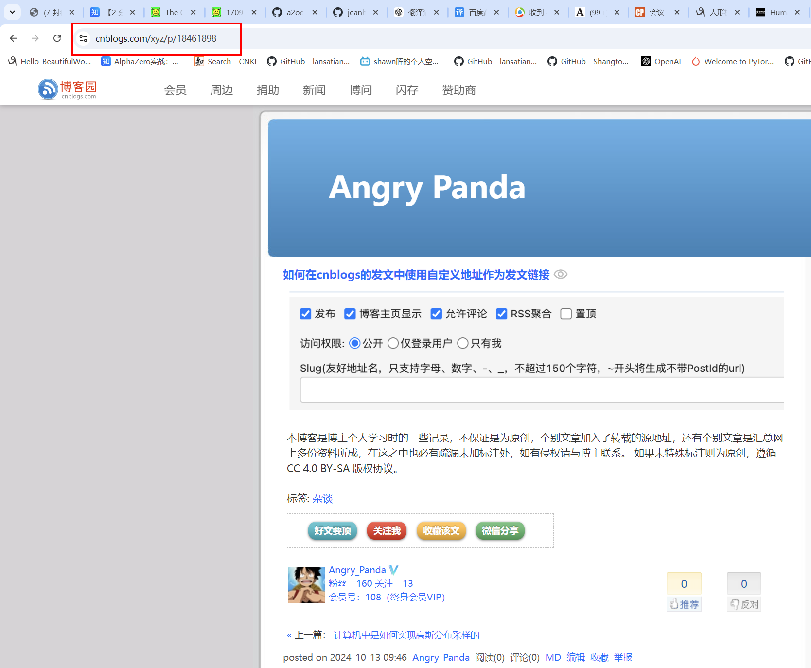
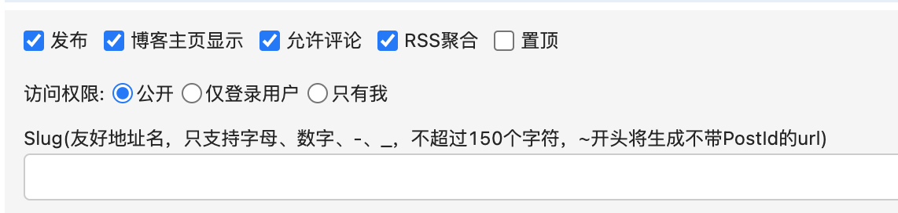
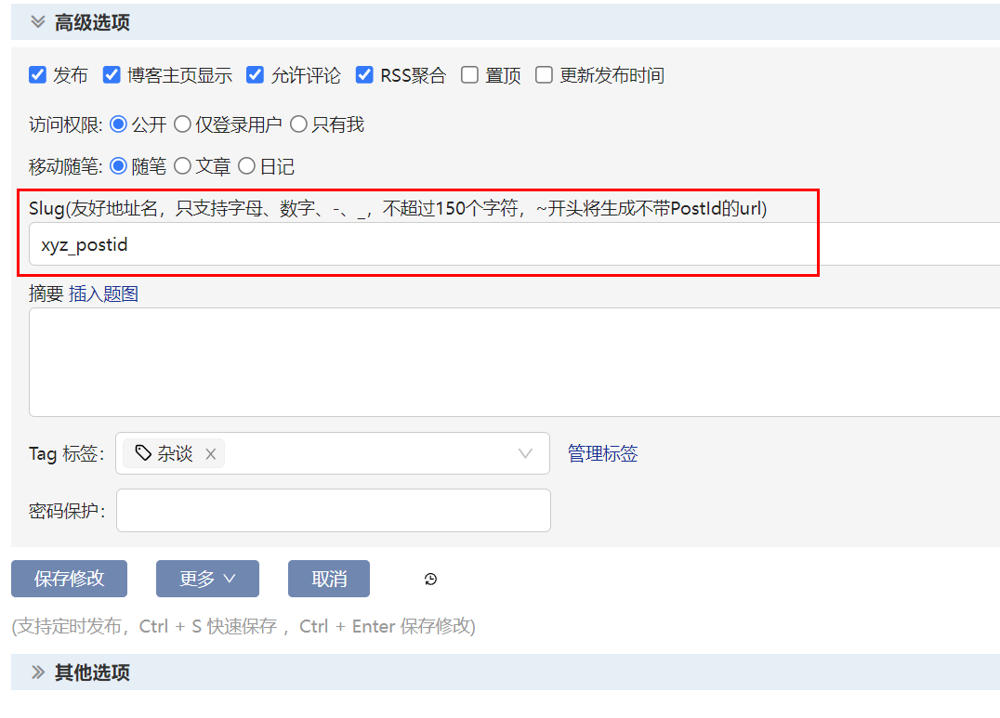
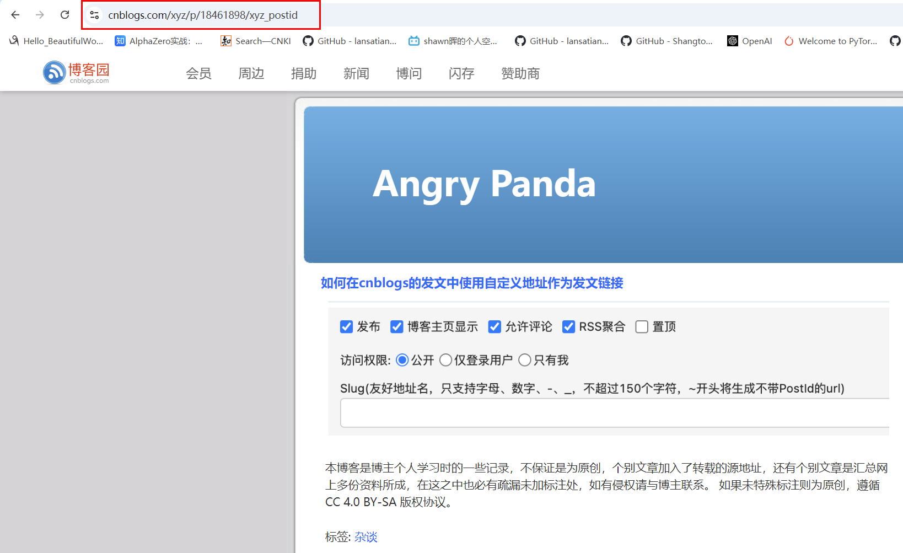
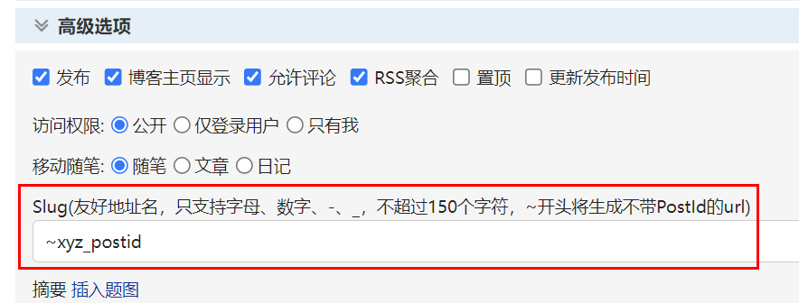

---

title: 如何在cnblogs的发文中使用自定义地址作为发文链接
 
description: 

#多个标签请使用英文逗号分隔或使用数组语法

tags: 杂谈

#多个分类请使用英文逗号分隔或使用数组语法，暂不支持多级分类

---

要知道在cnblogs中发表内容后其默认的链接地址都是一串数字的形式，比如本篇的默认地址：<https://www.cnblogs.com/xyz/p/18461898>

 

但是为了让发表的内容更有个性化，于是我们可以指定发文内容的链接地址，也就是自定义发文内容的链接地址，具体方法为在发表时指定slug地址，具体如下：

 

如果我们直接指定链接地址的字符形式，如下：

那么我们实际得到的地址为**数字形式+字符形式**，如下：

 

为了完全使用自定义的字符串地址而不使用数字形式（postID），那么我们需要在指定slug时添加特殊字符“~”，如下：

于是得到下面的效果：
