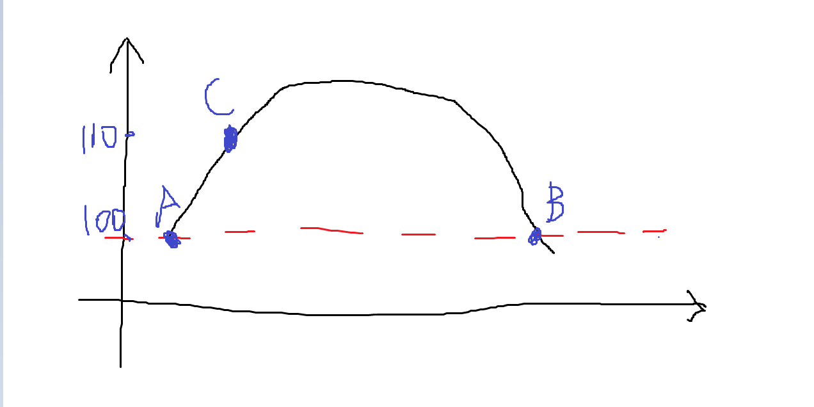
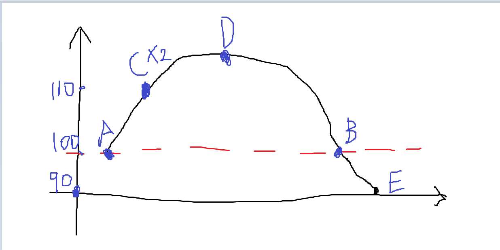

---

title: 长期角度来看股票市场上赚钱的人所赚的钱就是那些赔钱的人所赔的那些钱
 
description: 

#多个标签请使用英文逗号分隔或使用数组语法

tags: 杂谈

#多个分类请使用英文逗号分隔或使用数组语法，暂不支持多级分类

---

最近我国股票市场上的剧烈波动引起了我的一些关注，毕竟不论是出去吃饭还是理头总是会有人提到股市的，甚至有好友特意联系我来说这个股市的事情，这里我说一些我对股票的理解。

 

**我的观点：**

长期角度来看股票市场上赚钱的人所赚的钱就是那些赔钱的人所赔的那些钱。

我的这个观点是被认为极为大胆的，很多经管专业的人听了后都是直摇头，为了更形象的说明我的观点给出下面的示意图：

我们这里有一些假设，我们假设某股票在长期时间内其股票的价值不变，但是其价格会有浮动，长期来看其价值为100元，但是在某个时期内会出现价格向上浮动，但是在长期来看最终依旧会回到真实价值所在的价格，即100元；下图中可以看到，红色线段表示的是该股票的长期的真实价值，即价格为100元，A点和B点均为真实价值所在的价格位点，即100元，由于该股票在短期内会受市场的不确定性因数影响而产生波动，下图中该股票由100元价格上涨然后又回落到100元的位置；假设某人甲是长期持有该股票的，即持有价格为100元，但是在C点的时候甲以110元的价格卖给乙，于是甲赚差价10元，而乙最终在B点时以100元的价格卖给丙，可知乙赔了10元，由此可见在这个过程中甲赚的钱正好是乙所赔的钱。

 

 

注意，我这个观点是基于几个假设的，第一，股票的长期价值不变，所以长期来看股票无论如何波动最终都是会回到真实价值线的；第二，整个过程必须是长期角度来看，也就是说是长期市场而不是短期市场来看待和处理这个股票。

要知道，这里假设长期来看股票的价值不变是为了便于讨论的，而且本文所讨论的都是股票已经在长期时间内到达过真实价值后的操作，如果一个新上市的股票则不同于刚才说讨论的情况。

 

为了更形象的来说这个问题，我们再给出一个更形象的相似例子，如下图：

这个示意图中，可以看到，某人甲在C点的位置以110元的价格挂出两个单位的股票，路人乙购入甲所出售的两单位股票；然后路人乙在D点的位置以120元价格卖给丙一个单位的股票；路人丙在B点的位置以100元卖出所购入的1单位股票；路人乙则在E点以90元的价格卖给路人丁所剩的1单位该股票，由此我们可以得到甲乙丙丁四人的盈亏情况：

甲：110元卖出两单位，赚10*2=20元；

乙：110元单位购入两单位，120元时售出1单位，赚10元，90元时售出1单位，赔20元，总计赔10元；

丙：120元购入真实价值100元的股票1个单位，赔20元；

丁：90元时购入真实价值100元的股票1个单位，赚10元；

由此可以看到，整个市场上所有人的盈亏情况为：

+20-10-20+10=0

由此可以看到，在长期时间线来看，某股票的赚的人所赚的钱是等于赔的人所赔的钱的，当然这里还没有算上交易手续费，如果算上交易手续费的话那么整个市场所赚的钱等于赔的人所赔的钱加上交易手续费。

 

要知道股票的投资更多的是应该看待分红的，而不是为了“炒”的，所以真正玩股票的高手都是锚定一个有潜力的优质股票然后低价购入并长期持有，然后等待3年、5年，甚至是10年，直到所持有的这个股票价格上升到自己说认为的这个股票真正的价格线的位置后再抛出的，如果只是单纯的买涨卖跌那么必然会出现频繁交易，而这样也是极容易导致亏本而不是赚钱的。

 

有了本文的讨论，可能有人来说既然这个股票的交易是个零和游戏，那么又有什么存在的意义呢，其实这个股票市场其实真正的意义是为了带动金钱的流动的，并且在这个流动过程中来为企业筹集投资金额的，也正是因为有人买卖某个公司的股票才会给这个股票所属的公司筹集到公司运营的本金的，当然，这也是基于这个公司股票是有真实价值的，并且可以长期运营的，如果这个公司的股票突然退市了就不属于这种情况了。如果某个公司的股票在一定合理范围内波动是不会对企业运营造成不好影响的，但是有的时候会出现剧烈波动，不论这种剧烈波动受何种外力所影响，这种剧烈波动都是会对企业运营造成影响的，如果某个股票被强制清仓退市那么就会对企业运营带来致命的打击，所以有些公司在企业初期采取股票上市的手段来获取市场资金，然后再企业运行稳定或是有较大收益后就会回购市场上的股票，以此来规避市场上不可预期的危险的。

 

本文讨论的背景是股票的长期价值不变，但是实际上股票的价值是会随时间而变化的，而改变股票价值的主要因素就是科学技术；如果某只股票所属的公司有了更强的科技力量，那么他们会占据更多的销售市场，那么势必该公司的股票的真实价值也就会上升的，反之同理，如果某个股票所属的公司科技落后，被对手逐渐侵吞掉市场，那么其股票的价值也就势必减少。

不过对于一个长期运营的公司所发售的长期运营的股票来说，相对比的就是刚刚初创的公司，这类公司的股票的始发价格是有可能高于其真实价值的，也可能是低于其真实价值的；可以真正赚到初创公司低于其真实价值发售的股票并长期持有才会赚到最大的投资回报的，这也是大投资者的投资策略，不过该种投资需要更多的是专业知识和超凡的洞察力和眼光的，不过与此相对的就是只赚股票市场波动所造成的利差来赚钱的投资者的（这里指的不是韭菜），这里以量化投资者为代表，这样的投资者不在意股票真实价值，量化投资者判断的是市场上的人心，他们主要以股票走势图来预估其未来走势，这其中普遍采用统计学和人工智能领域的专业技术来作短期趋势预测，并采用多种策略的多支股票操作的方式低价买高价卖来盈利。虽然量化投资在国内也是最近几年才兴起，但是量化投资在欧美已经是有几十年的应用历史了，不过在国内对于量化并没有欧美那么友好，主要是国内为维护市场秩序是不允许对同支股票在一年内多次买卖的，而在欧美却没有这个限制，但是量化投资在国内股票市场上这几年的表现也是十分出色的，虽然有交易次数的限制但是不影响多账户的多支股票的这种交易形式，采用这种方式规避国内股票市场的限制也是能够有机会大幅度获利的，这样的专注于国内市场的量化投资公司在上海、深圳等城市也是很多的。不过要注意，国内的量化公司采用各种trick规避国内股票市场的限制极有可能造成股票市场的交易异常，并且可能涉嫌违法，从这几年深圳、上海、杭州的一些量化投资公司被证监会的罚款就可以看到这样做的风险，不过从这些公司所宣称的一年可以赚几十亿的量化投资收益来看好像证监会的几百万罚款更多的是体现意义，而不是实际的影响。

 

PS:

本文的讨论使用了一些基本的经济学术语，如：价格、价值，等等，需要阅读者有一定的相关基础知识。

一个股票的价值是需要长期市场数据和公司各种报表数据所体现的，并且这个价值是没有一个固定计算方法，可以说真实的价值是需要投资者根据自己的专业知识和历史观察来基于客观资料给出的一个主观判定的，由此可见搞股票投资的高手其实很多人都是可以有超越常人的眼光来看到企业真实价值的人，如股神巴菲特，要知道在股神巴菲特投资比亚迪的时候比亚迪还是一个不起眼的小公司的，而就是那个时候巴菲特就根据各种资料判断比亚迪的真实价值是要远远高于其股票的市场价格的，也正是巴菲特以独特眼光看到了比亚迪未来会有不凡的市场表现才会决定投资比亚迪的。

 
