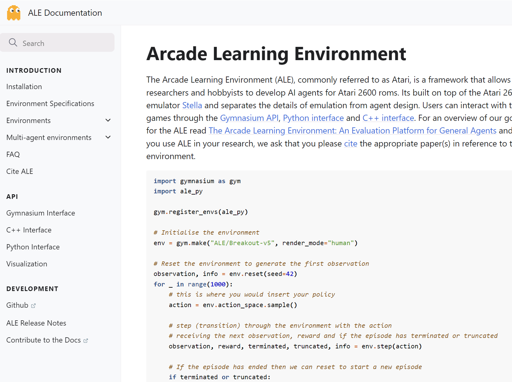
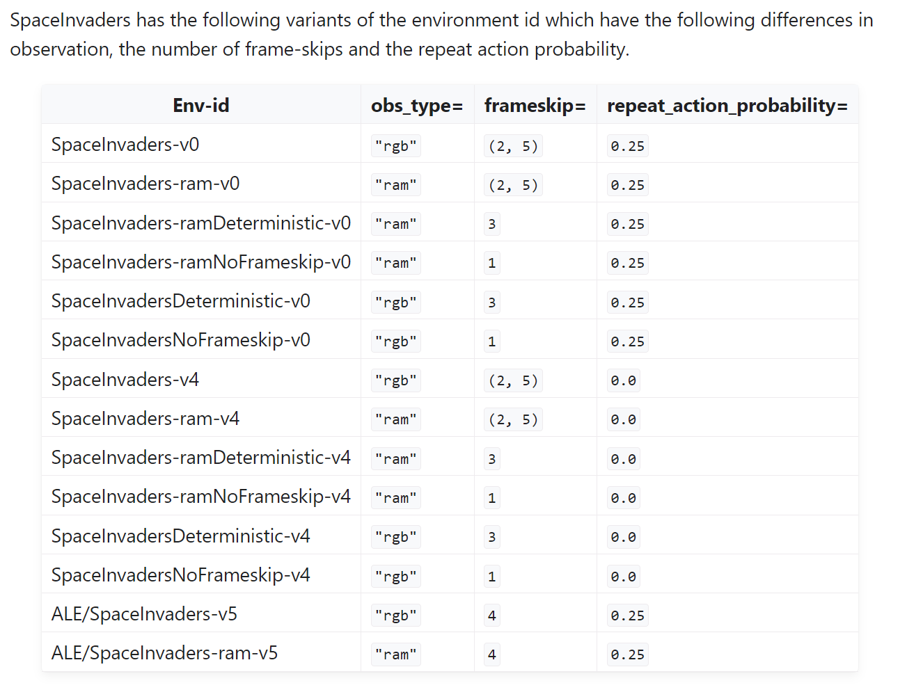
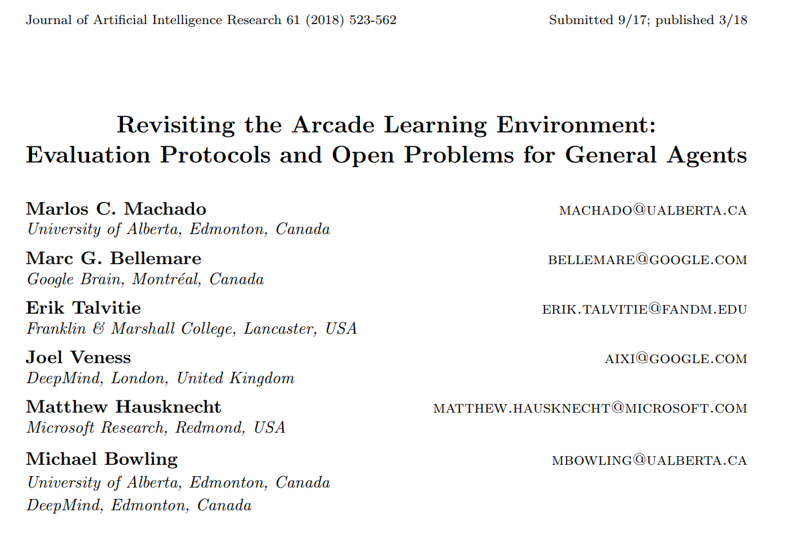
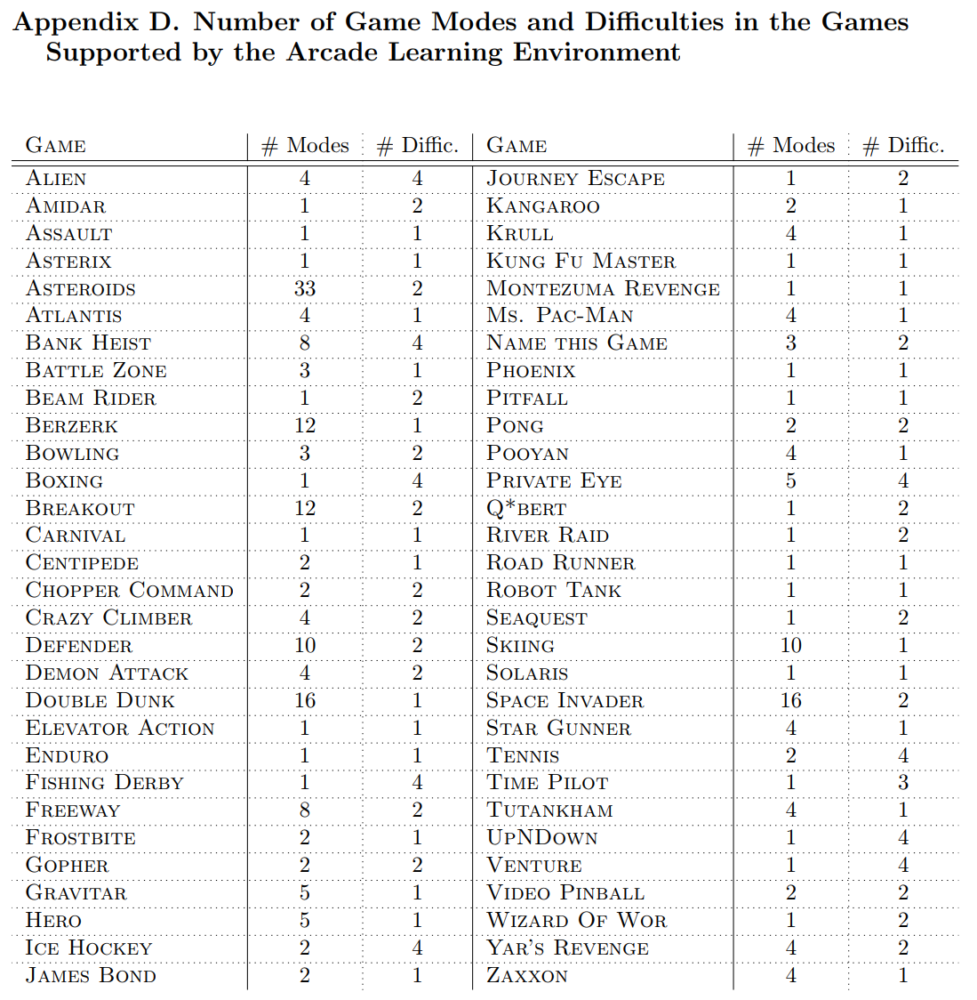
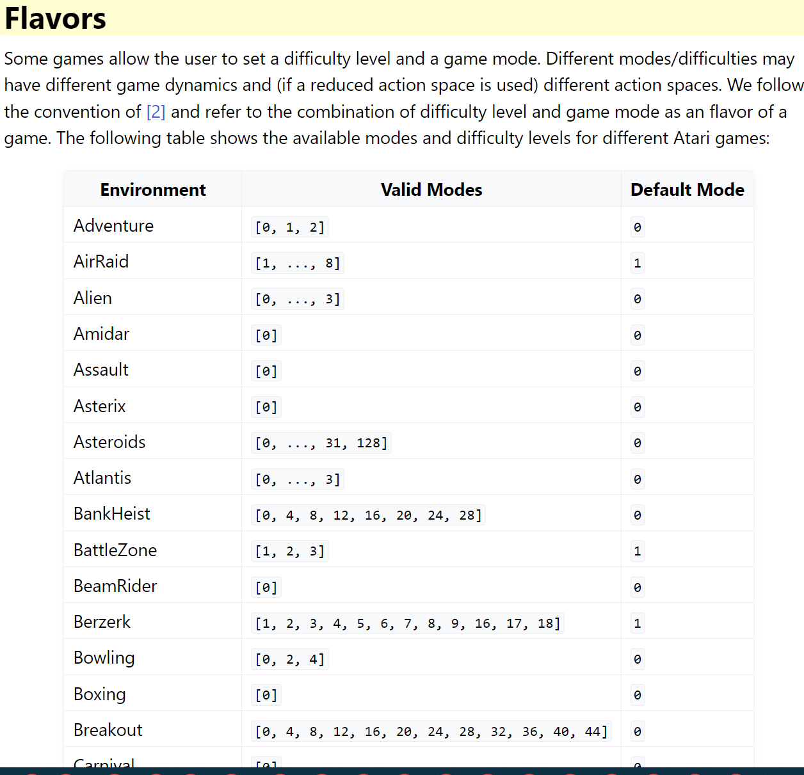
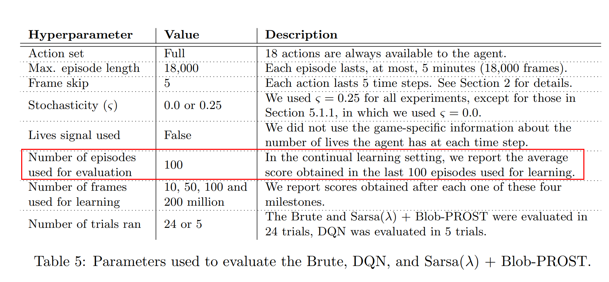

---

title: 强化学习环境gym/gymnasium下的atari环境的v0、v4、v5的说明
 
description: 

#多个标签请使用英文逗号分隔或使用数组语法

tags: 杂谈

#多个分类请使用英文逗号分隔或使用数组语法，暂不支持多级分类

---

**声明：**

本文是[最新版gym-0.26.2下Atari环境的安装以及环境版本v0，v4，v5的说明](https://www.cnblogs.com/xyz/p/16929419.html)的部分更新和汇总，可以看作是更新和延续版本。

 

由于gym已经由openai公司独立出来，虽然开发团队和投资方都没有变，但是相关的网站和版本已经由变化了，名字也从gym变成gymnasium，因此我们在讨论gym的时候默认都是指最新的gymnasium版本，其相关地址：

https://gymnasium.farama.org/

但是其所含的atari环境也从gymnasium中独立出来，其最新地址为：

https://ale.farama.org/

 

本文内容主要是对[最新版gym-0.26.2下Atari环境的安装以及环境版本v0，v4，v5的说明](https://www.cnblogs.com/xyz/p/16929419.html)的延续和更新，关于v0,v4,v5版本的不同请转至该链接地址下。

 

**更新：**

space_invaders游戏下v5版本的frameskip=4，而不是3，但是这并不会出现什么太大问题，因为v5版本下repeat_action_probability=0.25，这种随机性可以避免原始DQN论文中指出的可能出现的问题；而当repeat_action_probability=0时要么frameskip=3，要么frameskip =（2,3,4）中的随机数值，由此可以看到在space_invaders的真实交互中只要保证一定的随机性，那么即使v5版本中frameskip=4也不会影响真实的DQN算法训练的。

  

**论文：**

Machado et al.
“Revisiting the Arcade Learning Environment: Evaluation Protocols and Open Problems for General Agents”
Journal of Artificial Intelligence Research (2018)
URL: https://jair.org/index.php/jair/article/view/11182

中对游戏的模式和难度级别给出的大致情况：

gym给出的具体实现重点模式和难度级别情况：

https://www.gymlibrary.dev/environments/atari/#flavors

 

 

使用DQN算法解决atari游戏时的常用超参设置：

 

PS:

为什么在atari游戏中使用repeat_action_probability很重要呢，因为atari游戏是确定性游戏而不是随机性游戏，也就是说atari游戏是从同一个起始点开始的，如果采用相同的交互动作，那么多次生成的新的episodes将会是完全相同的，而这种不具备随机性的游戏环境是不符合真实强化学习应该解决的问题的要求的，因此需要加入该参数以增加强化学习算法对随机环境的适应能力。

  

**相关：**

[最新版gym-0.26.2下Atari环境的安装以及环境版本v0，v4，v5的说明](https://www.cnblogs.com/xyz/p/16929419.html)

[（续） gym atari游戏的环境设置问题：Breakout-v0, Breakout-v4, BreakoutNoFrameskip-v4和BreakoutDeterministic-v4的区别](https://www.cnblogs.com/xyz/p/14665402.html)

[【转载】 gym atari游戏的环境设置问题：Breakout-v0, Breakout-v4, BreakoutNoFrameskip-v4和BreakoutDeterministic-v4的区别](https://www.cnblogs.com/xyz/p/14665072.html)

[gym中所有可以用的模拟环境](https://www.cnblogs.com/xyz/p/14665111.html)
