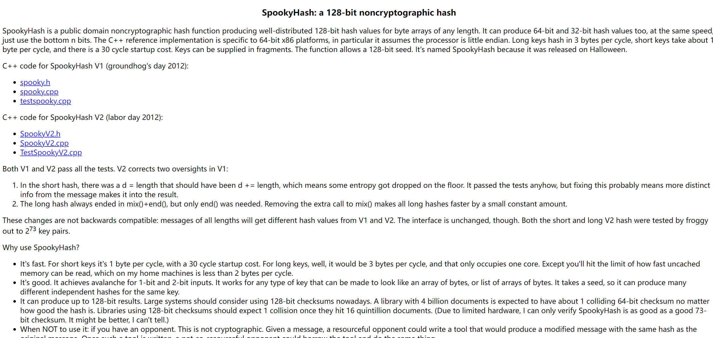

---

title: 非加密哈希函数库-SpookyHash
 
description: 

#多个标签请使用英文逗号分隔或使用数组语法

tags: 杂谈

#多个分类请使用英文逗号分隔或使用数组语法，暂不支持多级分类

---

地址：

https://burtleburtle.net/bob/hash/spooky.html

 

 

SpookyHash is a public domain noncryptographic hash function producing well-distributed 128-bit hash values for byte arrays of any length. It can produce 64-bit and 32-bit hash values too, at the same speed, just use the bottom n bits. The C++ reference implementation is specific to 64-bit x86 platforms, in particular it assumes the processor is little endian. Long keys hash in 3 bytes per cycle, short keys take about 1 byte per cycle, and there is a 30 cycle startup cost. Keys can be supplied in fragments. The function allows a 128-bit seed. It's named SpookyHash because it was released on Halloween.

 

**SpookyHash 概述**

SpookyHash 是一种公共领域的非加密哈希函数，旨在快速且良好地分布哈希值。以下是 SpookyHash 的一些关键特性和特点：

### 关键特性：

- **哈希输出大小**：
  - 生成 128 位的哈希值。
  - 还可以生成 64 位和 32 位的哈希值，只需使用 128 位输出的低 n 位。
- **性能**：
  - 长键的哈希速度约为每个周期 3 字节。
  - 短键的哈希速度约为每个周期 1 字节。
  - 哈希过程有 30 周期的初始启动成本。
- **输入灵活性**：
  - 接受任意长度的字节数组，并可以处理以片段方式提供的键。
- **种子值**：
  - 允许使用 128 位的种子生成哈希，这使得相同输入可以产生不同的输出。
- **平台特定性**：
  - C++ 的参考实现针对 64 位 x86 平台进行了优化，并假设为小端字节序。

### 命名：

- "SpookyHash" 的名称源于其发布的日期，恰好在万圣节。

### 用例：

SpookyHash 通常用于速度至关重要的应用程序，并且加密安全性不是主要关注点。适用于以下任务：

- 进行快速查找的数据哈希。
- 创建数据完整性的校验和。
- 用于软件中的非加密目的，在这些场景中，哈希冲突是可以接受的。

### 结论：

SpookyHash 在速度和有效哈希分布之间提供了良好的平衡，使其成为许多非加密应用程序的实用选择。

 

 
