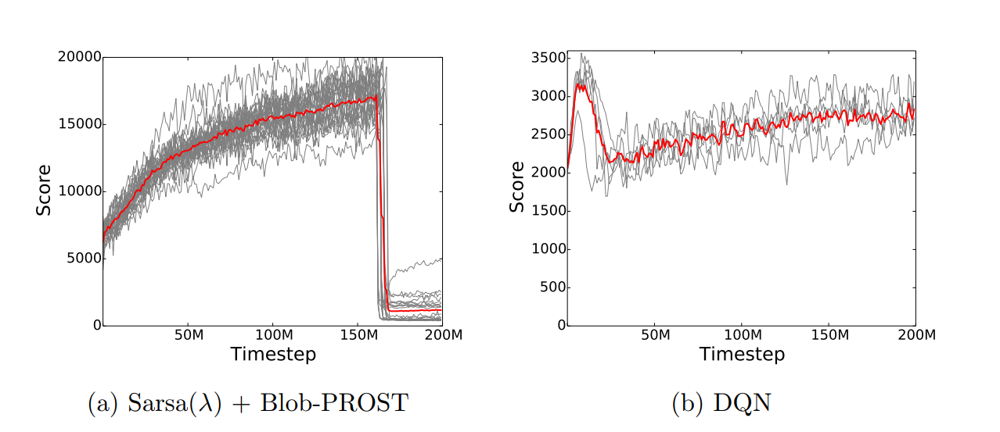
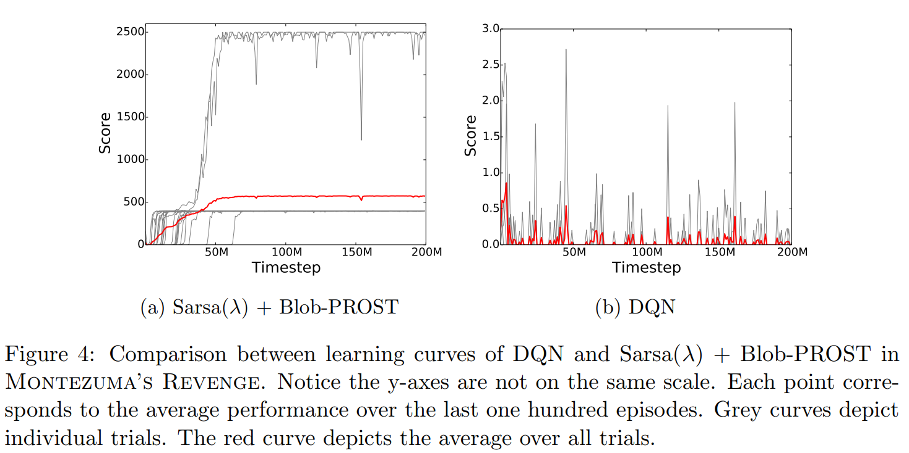
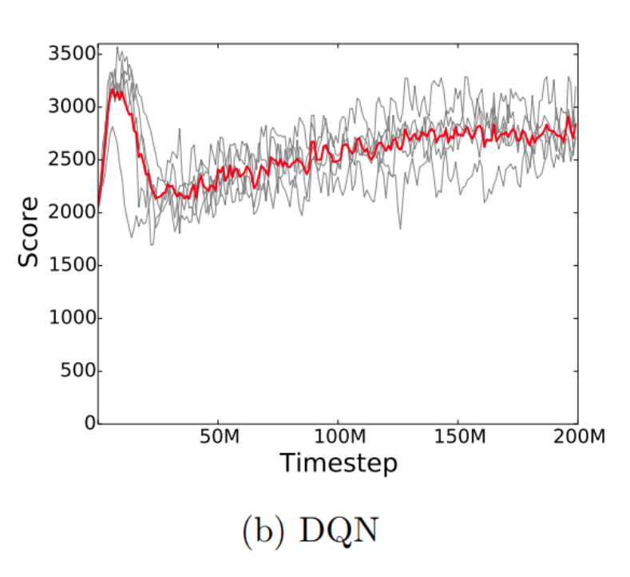
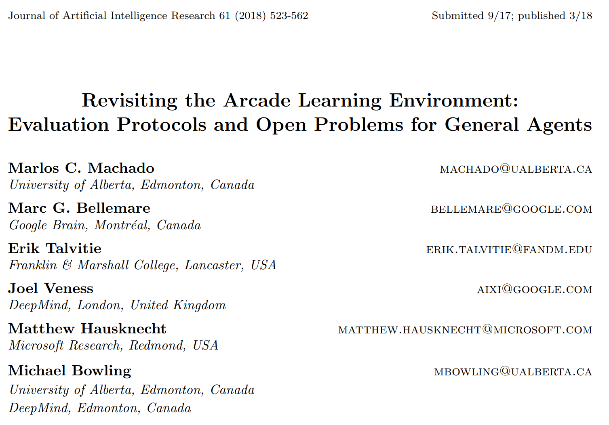

---

title: 强化学习算法性能度量的常用方法
 
description: 

#多个标签请使用英文逗号分隔或使用数组语法

tags: 杂谈

#多个分类请使用英文逗号分隔或使用数组语法，暂不支持多级分类

---

本文介绍一下强化学习中的常用性能度量方法，或者说是强化学习中常用的性能测量标准。

常用的两种RL训练过程中的算法性能度量方法/性能测试方法 **(两种性能曲线图的绘制)**：

1. 训练过程中不对训练过程进行暂停，不单独测试算法性能而是使用训练过程的性能表现作为算法的性能表现，具体为取训练过程中最近历史的100个episodes的奖励和的均值作为性能指标。需要注意的是虽然y轴为奖励值，但是x轴为训练的step数或者是采集的数据帧数，也或者时训练过程中的episodes数，但是由于训练过程中每个episode的长度（一个episode完整的总step数），因此使用训练过程的episodes数作为x轴并不能均匀的显示训练过程的数据采样时间的跨度的均匀性，所以更为通用的是是使用训练过程的steps数或是数据采样帧数。为了在一定程度上体现实验效果的统计性，我们一般使用多次训练的方式，即重复实验，多次trial，分别给出多次trial的性能曲线图的最高值曲线、最低值曲线，以及均值曲线，大致效果如下两图：

 

 

可以看到，最为常用的性能表示方式/性能度量方式是**X轴**取**timestep值**，而**Y轴**取**Score值**；需要注意的是在强化学习算法训练时我们的性能优化目标是最大化折扣奖励之和，而我们在最终算法性能比较时所使用的性能度量标准是使用奖励和，即score得分，二者的区别在于后者不使用折扣系数对奖励值加权。

注意，每个timestep点的score值都是最近100个episodes的score值的均值。虽然不能证明score得分最大那么折扣奖励和最大，但是一般来说score越大那么折扣奖励也越大，但是在常见的atari游戏等环境下由于一个episode内每个step的reward为+1，那么在这样的大多数环境下都是可以保证score得分最大那么折扣奖励和也最大。

 

2. 第二种性能曲线图并不常用（上一种性能曲线图是最为通用的），该种方式依旧是X轴为timestep（采样步数）、训练步数或采样的episode数，但是由于episode中step数不固定，因此最为常用的是timestep数（如果是固定采集数量后训练那么等价于训练步数），而y轴也是使用score得分而不是折扣奖励和；第一种和第二种曲线性能图的区别是第二种每个点的score值并不是来自于训练过程中，而是暂停训练后单独创建一个新的环境，并使用训练后的结果与该环境进行多trial的交互，如100episodes，取这100个episodes的score均值。可以看到，第一种方式是不需要暂停训练的，而第二种是需要暂停训练的，并且每个点都是重新进行100个episode的环境交互，也就是说如果第二种方式的曲线图的点数和第一种方式一样，假设为N，那么第一种方式所需要的额外的采样episodes数为0，而第二种则需要100*N个额外的episodes采样，可以看到第二种方式之所以不采用是因为第二种方式不仅在训练过程中需要暂停训练而单独进行测试，并且测试所需要的时间甚至超过训练时间，而这种对整体训练时间上的增加往往可能是无法接受的，比如一个200M帧的atari游戏训练需要1080ti显卡下99个小时，但是加上第二种的性能曲线的度量方式（性能测试方式）则可能需要300小时，甚至500小时以上，而这在实际的问题环境下是难以接受的。

 

上面给出了训练过程中的性能测试方式，分别为暂停训练和不暂停训练的两种方式，暂停训练的方式对训练策略的测试更加准确，但是耗时巨大，实际使用并不可行，而不暂停的方式虽然对性能测试的准确性没有暂停情况下高，但是几乎不会对训练过程造成任何性能负担，因此实际中最为常用。

需要注意的是这两种性能测试方式都是需要设置一定的时间间隔的，即曲线图的点所对应的X轴上的timestep是有间隔的，如果间隔为100，那么也就是每收集100个样本，即每100个timestep后取最近的100个episodes的score均值；之所以设置interval间隔是因为即使是第一种性能测试方法需要增加额外的计算量（虽然不需要额外的环境交互），如果每个timestep下都对最近100个episode的score取均值会明显增加训练时长的，并且这样过于频繁的计算性能表现也是没有实际意义和必要的。

对于第二种性能测试曲线的绘制方式（暂停训练的情况），如果绘制点时的interval间隔合理（比如100个timestep的间隔），那么这种情况下即使使用暂停训练后单独测试100个episodes的score均值所造成的额外时间也是可以接受的，此时使用第二种方式也是可以的。

至于使用暂停训练的方式还是不暂停训练的方式来计算训练过程中的性能表现，其核心思想就是如何将额外的时间花销控制在能接受的时间范围内，如果第二种的方式（暂停训练的方式）可以接受那么则选择该种，否则选择第一种方式（不暂停训练的方式）。

PS：

训练过程中的性能测试（性能测试曲线图）更多的是用来说明训练过程中的性能走势的，并不能作为算法的最终性能指标的。

 

 

 

 

# 强化学习算法的最终性能指标

前文交代了强化学习算法中的训练过程中的性能测试曲线的绘制方式，接着我们讨论强化学习算法的最终性能度量方式。

虽然强化学习算法训练过程中进行性能测试便于我们了解算法测试过程中的实际情况，但是这并不能代表强化学习算法的最终性能表现，关于强化学习算法的最终表现有两种度量方法，而这两种方法都依赖于刚刚介绍的训练过程中的性能曲线图。

在强化学习算法的训练过程中我们经常会遇到训练过程的性能曲线图中score的最高点并不出现在训练的最后一步甚至并不出现在最后阶段，给出下图以作示例；为此我们依然有两种度量方式，第一种：以训练过程中最高score作为算法的最终性能，第二种，以训练过程的最后一步的score作为算法最终性能。注意，下图中就是经典的最高score没有在训练最后阶段出现的情形。

最为常用的最终性能评价方式，即以算法最后一步时的score得分作为最终算法性能，如果性能曲线图是暂停训练取独立100 episodes得分均值的话，那么最终算法性能即是在训练结束后用最终的算法策略单独进行100个 episodes的采样，然后评价score值；如果性能曲线图是用训练过程中最近100 episodes的score均值，那么算法的最终性能即为算法训练结束前最后的100个episodes的score的均值。

另一种比较少见的评价方法，即用算法训练过程中（算法训练过程中的性能曲线图）最高score得分作为算法的最终性能；该种方式与使用算法训练过程最后一步score作为性能最终性能时的方式一样也是根据性能曲线图的绘制方式的不同而有两种不同的计算方法，即去最近100个episodes的均值还是暂停训练后独立采样100个episodes去平均。

取算法训练过程中的最高score作为算法最终性能的这种方式之所以较少被使用，很大程度上因为由于强化学习算法训练过程中性能表现的大波动性和不确定性，由此导致用训练过程中最高score得分作为最终算法性能会有较大的随机性和不确定性，毕竟每次的训练其最高score的出现都不是在同一个timestep上，但是取最后训练过程最后一步的表现作为算法最终性能会保证最终性能源自的timestep是固定的，因此更具备统计特性，这样多次trial后取均值也更有统计意义。

 

说下个人的偏向使用的性能测试方法：

性能曲线图使用暂停训练的方法，即在绘制曲线图设置一定的interval，然后固定的timestep间隔后固定现有的算法的模型参数（测试时强化学习算法的模型参数保持固定）；而在计算算法最终性能时就看与对比算法之间的对比情况，如果训练结束时的性能表现优于对比算法那么就使用训练结束时的算法性能，如果训练过程中最优性能值优于对比算法的训练过程中的最优训练值那么就使用训练过程中的最优性能值，但是后者有一个问题，那就是很多paper中给出的算法性能都是训练结束后的最终性能，面对这种情况我们可以使用GitHub上复现的代码重新跑一下benchmark算法的性能表现，然后看看使用训练过程中的最优值是否有更好的表现，也或者直接发现复现后的benchmark代码其最终性能表现远没有原始paper中给的那么好，那么我们在自己的paper指明benchmark算法的结果源自复现代码并且该算法最终性能结果不如自己所提算法即可。总之，具体使用什么性能测试方法所要依从的都是更有利于自己所提算法的角度，并且只要不违反该领域所使用的方法范围即可。

 

PS：

实际来说，在不考虑性能曲线图的绘制方式的不同以外，算法最终性能取算法训练过程的最后一步的score值更为通用，但是如果是写材料的时候可以不必教条，如果使用训练过程中最高score作为算法性能的最终表现可以使算法在对比算法中有更好表现，那么也是完全可以换用训练过程的最高score作为算法的最终性能的。

最为重要的是要知道其实不论使用什么方式的性能测试方法并没有任何限定，很多时候其实很多researcher也不会在paper中说明具体使用的是什么性能测试方法，但是一般认为如果为了保证更加公平、更加利于学术社区发展的话，那么不论具体是使用的何种性能测试方法都应该要在paper进行说明。

 

 

本文参考资料：

 

 

**个人github博客地址：**
[https://devilmaycry812839668.github.io/](https://devilmaycry812839668.github.io/ "https://devilmaycry812839668.github.io/")
