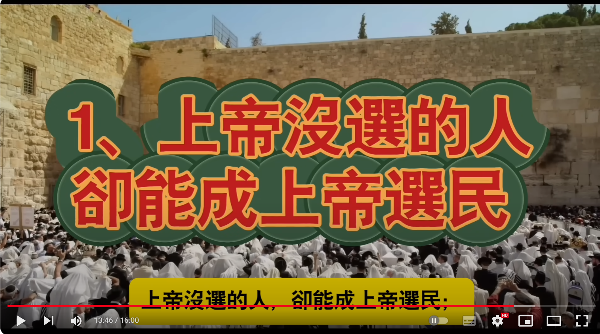

---

title: 一个中国人如何成为犹太人？

description: 

#多个标签请使用英文逗号分隔或使用数组语法

tags: 杂谈

#多个分类请使用英文逗号分隔或使用数组语法，暂不支持多级分类

---

 
 

相关：

# [在中国是人民，在以色列却是“贱民”！犹太种姓制下的中国犹太人](https://www.youtube.com/watch?v=ylJTkj_E1Qc)

 

 

犹太民族的种姓制。

 

 

