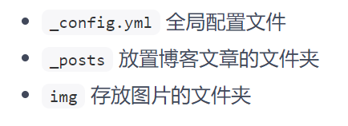
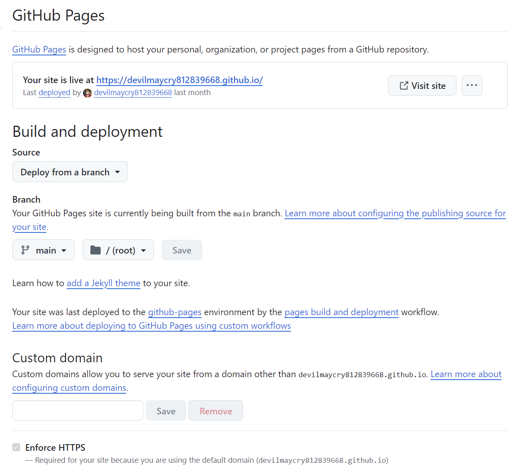
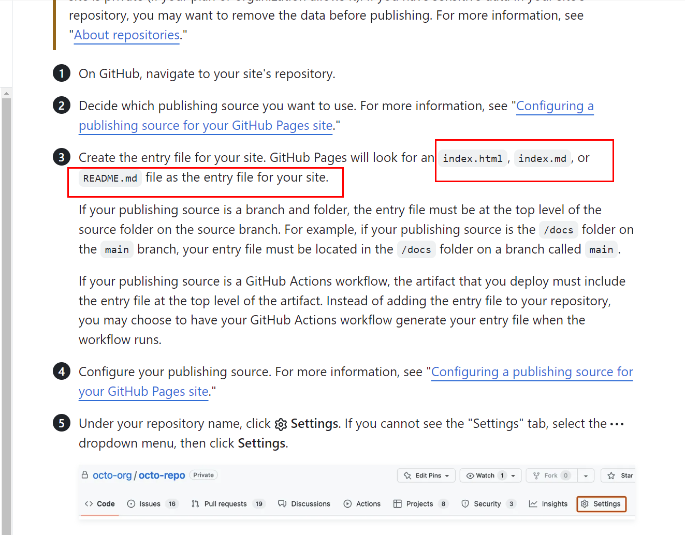
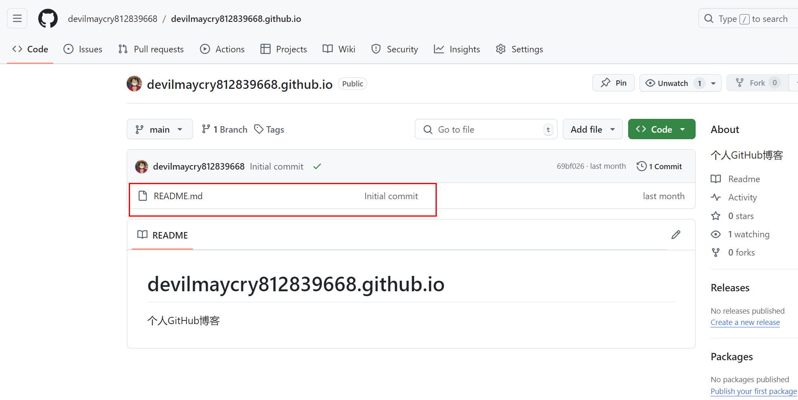
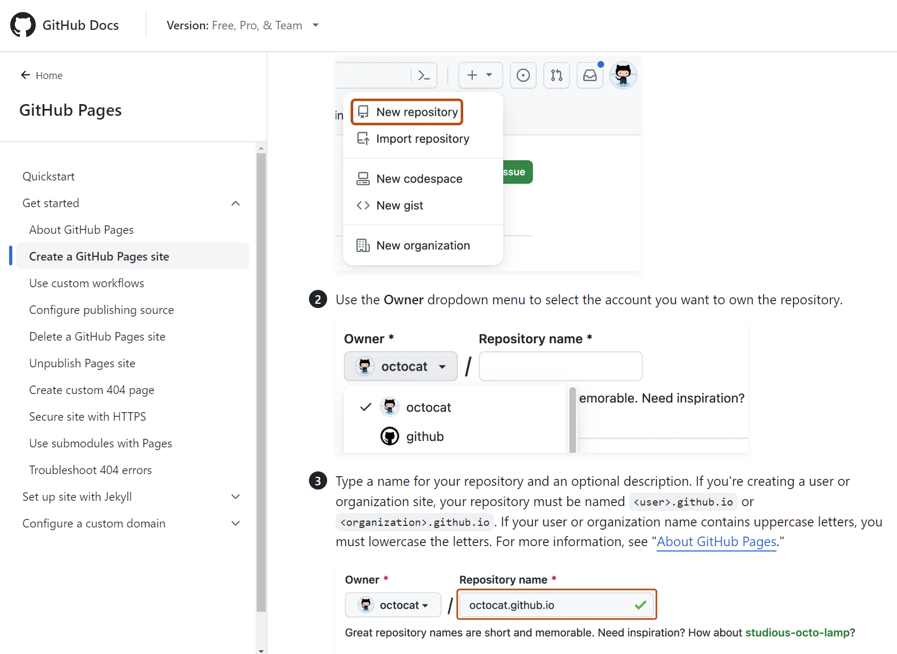

---

title: github/gitee个人博客到底是什么一个运行原理？
 
description: 

#多个标签请使用英文逗号分隔或使用数组语法

tags: 杂谈

#多个分类请使用英文逗号分隔或使用数组语法，暂不支持多级分类

---

本文主要讲的是GitHub、Gitee这样的代码存储网站上提供的个人博客建站的原理分析，需要注意的是，本文并不介绍GitHub、Gitee上建立个人blog的操作步骤，本文只介绍原理，不介绍实操步骤。

 

 

在交代本文主要内容之前需要说明几个概念，那就是动态网站、静态网站的区别，在这两个概念之上我又提出一个名词，那就是**伪动态网站**。

**静态网站**，就是网站服务器只提供静态数据服务，说直白些就是Nginx服务器上只提供html的解析，不负责动态交互数据的存储、检索、展示等功能，更直白的说就是静态网站是没有数据库的网站。

**动态网站**，与静态网站最大的不同就是提供数据库服务，比如动态网站可以支持blog的用户注册，用户或游客的blog评价，blog的访问量计数等等功能，而这些功能的提供最主要的原因就是有数据库在做支撑，并且动态网站往往在服务器Nginx的后端运行着asp.net、php、python、JavaScript、C++这样的语言编写的动态网页解析服务，这样的网络服务器服务（asp.net、php等等）可以动态的从数据库中取出数据，然后和已有的html文件内容生产新的html文件内容发送给客户端的浏览器，而这个过程就是所谓的“动态”。

简单理解，静态服务器就是Nginx服务器程序+html文件所组成；动态服务器就是Nginx服务器程序+html文件+php这样的动态服务器程序+数据库，所组成。

然后说下我所提出的伪动态网站，其组成为Nginx服务器程序+html文件所组成+数据库；可以看到，这里的伪动态网站和静态网站的最大区别就是伪动态网站是有后端数据库的，伪动态网站和动态网站的最大区别是动态网站后端有php、asp.net等等动态服务器程序。

在静态网站中，Nginx对HTML文件的解析是完全按照服务器端存储的html文件的内容进行解析并发送给客户端浏览器的；而在动态服务器中，由于有php+数据库这类的组合，因此其服务器上存储的html文件往往只是页面的大致的布局和框架类的内容，而每个页面的最后发送给客户端的内容则是动态从数据库中取出然后由php进行解析然后再交给Nginx，Nginx再将其与静态存储的html文件内容组合再发送给客户端浏览器。举个例子：假设一个blogs网站，静态服务器需要存储1.html，2.html，......，100.html，这样的100个html页面，而动态服务器则可能只保存top.html，left.html，right.html，down.html，这样的四个html文件，然后100个blogs的内容存储在数据库中，然后当客户端浏览器访问时其url为https://cnblogs.com/xyz/1.html, 那么Nginx把请求发给php，php根据1.hml这个字段从数据库中取出该页面应该对应的页面内容并交给Nginx，Nginx再将其与top.html，left.html，right.html，down.html进行组合得到最终的1.html并发送给客户端浏览器。

而伪动态服务器在具体运行时比如也是有100个页面，其真实存储时也是保存1.html，2.html，......，100.html，这样的100个html页面在服务器上，但是每个页面对应的评论信息，IP访问信息则是保存在服务器的数据库中，由于伪动态服务器是没有php、asp.net这样的动态程序运行在服务器端的，因此其运行过程与动态网站还是有很大不同的，最大的一个区别就是这种的伪动态服务器上运行的是JavaScript、python这样的程序，这样的程序更适合作函数过程调用（阿里云、腾讯云、百度云，等等，都有这种函数调用的服务），也就是说在伪动态服务器中是通过服务器端运行的JavaScript或python这样的程序从数据库中取出数据，而且伪动态网站从数据库中取出的数据并不是直接交给Nginx服务的，而是绕过Nginx直接发送给客户端浏览器的，因为这样的伪动态网站所存储的1.html，2.html，......，100.html，这样的100个html页面都是有调用跨域的JavaScript脚本的，也正是这些最终运行在客户端浏览器中的JavaScript代码向伪动态网站的JavaScript或python发起数据库查询请求的。由于伪动态网站的html访问和动态数据访问时完全独立的，html访问时通过Nginx的，动态数据访问（blogs网站的评论数据）是客户端浏览器运行的JavaScript再次向服务器的JavaScript或python程序发起的请求，因此伪动态网站的服务器可以将Nginx服务进程与数据库服务的python/javascript进程完全独立到不同的物理服务器上，甚至很多公司会单独提供这种第三方的数据库服务的，比如腾讯云、阿里云的函数调用服务。

 

**GitHub、Gitee这样的代码存储网站上提供的个人博客建站**其实就是静态网站服务，是GitHub、Gitee公司单独搭建的一个Nginx服务器，由于静态服务器对性能要求低，不提供数据动态交互服务，安全性高等等特点，因此GitHub、Gitee这样的公司才有能力向所有用户提供这种blogs静态建站服务。GitHub、Gitee提供的这种静态建站服务就是将html文件或者markdown写的.md文件存储到自己网站上的代码仓库中，然后再将Nginx服务器中的对应的连接地址执行这个代码仓库即可。

说明一下：

GitHub提供的静态页面解析服务可以解析md和HTML文件格式，md文件的内容的语法其实是html语法的一个删减版，因此md文件可以被翻译成html文件格式，这也是为什么在GitHub、Gitee中可以直接在代码仓库中点击md文件从而打开一个对应的解析网页的原因。

关于个人blogs的链接地址：

github.com为github.io结尾，gitee.com为 gitee.io结尾。

 

由于伪动态网站可以通过在静态网站的html文件中声明调用的JavaScript代码的形式实现，因此为了给GitHub、Gitee个人blogs建站增加功能，因此很多人采用这样的方式将其改为伪动态网站的形式，为GitHub、Gitee个人blogs静态网站加入了用户评价、用户注册、IP统计，等等功能。

 

很多人为了更好的给静态网站增加更好的页面效果，比如设置字体、页面框架等等功能，于是使用一些静态博客写作客户端来自动生成对应的静态的html文件，这样的工具都是可以直接使用html语言或markdown语言进行编写的，不过为了更好管理和更方便使用，这样的工具最好都是用来写md文件的。常见的静态博客写作客户端有：    hugo  heox  Gridea  Jekyll 这样的博客形态的静态站点生产器。

在这样的静态博客写作工具中使用markdown格式编写.md文件（也可以直接编写html文件），但是都是需要在指定文件夹下编写文件，然后再在这些工具中调用对应的命令生成html格式的静态文件格式，然后再将生成的静态html文件上传到GitHub的对应代码仓库中。

在这些工具（hugo  heox  Gridea  Jekyll ）中，往往提供更换html页面主体、布局、字体等等功能，而这些功能都可以在工具的_config.yml文件中进行设置和调整的，以便于生成更符合用户满意的静态html页面的。

对于这些工具根据用户设置和用户编写的.md文件自动生成的html文件，用户可以通过这些工具在本地调试，下面给出这些工具的配置和用户编写md文件和其他资源（图片）的存储文件夹名称：

 

需要注意的是，不论md还是html文件，在使用这些工具编写blog时都需要在文件开头写声明格式：每篇文章的头部，必须有一个yaml文件头，用来设置一些元数据。它用三根短划线"---"，标记开始和结束，里面每一行设置一种元数据，这种声明的要求和cnblogs.com中使用GitHub同步到blogs的要求是相似的，这里给出本文所用的声明格式：

 

我们可以在GitHub、Gitee中个人blogs内容所对应的代码仓库的设置中指定这个仓库内容在交给Nginx解析时的入口文件的：

在GitHub对应仓库设置个人blogs首页，即网站入口：index.html 或者是  readme.md，如：

 

可以看到，GitHub、Gitee个人blogs的默认主页文件为index.html,index.md，README.md，在我的个人建站：

<https://devilmaycry812839668.github.io/>中使用的就是README.md文件：

 

md文件本身是html语法的删减版本，本身markdown语法就兼容html语法，因此markdown语法可以直接被HTML服务器（Nginx）解析为html语言的格式发送给客户端（浏览器），而这些工具（hugo  heox  Gridea  Jekyll ）都是JavaScript编写的，自带本地静态服务器功能和md文件转HTML文件功能（渲染），这些工具编写的md文件转成html文件后可以在本地的工具中进行查看，这些工具都是自带浏览器内核的（JavaScript的运行环境就是浏览器内核）。

 

这些工具（hugo  heox  Gridea  Jekyll ）在生成html文件时可以指定添加伪动态网站的JavaScript代码的，这样伪动态网站的数据库服务一方可以直接接受GitHub、Gitee个人建站blogs的JavaScript请求，也可以通过中间方，如果通过中间方的话就需要在提供数据库服务的函数调用服务器上配置access token。

比如Leancloud网站就提供这种函数调用功能给伪动态网站，以实现GitHub、Gitee这种个人建站的静态网站的点击计数、IP统计、评论等功能。

需要注意的是这种数据库功能（云服务的函数调用功能）的提供方（阿里云、腾讯云、Leancloud网站，等等）提供动态数据库功能，由于跨域的安全限制，本地的服务器（hugo  heox  Gridea  Jekyll 工具自带的本地浏览器内核）无法查看这些信息，上传GitHub后访问GitHub.io上对应的地址可以在浏览器的JavaScript中访问对应的动态服务功能，从而获得这些信息，并在本地浏览器中得到展示。

 

上面的内容就是本文对GitHub、Gitee上生成的个人blogs静态网站及升级的伪动态网站所给出的原理解释，可以说这样的blog网站其本质依然是静态网站，其数据库的存储功能都是托管给第三方的（阿里云、腾讯云、Leancloud网站，等等），可以说我们通过这种的方式只能把网页静态数据掌握在自己手里（html静态文件资源存储在个人代码仓库中），当然，如果你在这样的网站中加入了第三方图库/图床上的图片资源，那么html中只有文字内容是保存在自己手上的，图片也是托管给第三方的。

需要注意的是，虽然GitHub、Gitee上生成的个人blogs静态网站是免费的，但是托管的第三方图库的访问是有免费限额的，而免费的第三方函数调用也是有免费限额的，也就是说这样的个人blogs网站上页面的图片数据和评论数据（第三方提供的数据库远程函数调用功能）都是有每日的免费访问次数的，如果超过免费限制则无法正常访问，不过一般在GitHub、Gitee上建站的blog其访问量都是十分有限的，个人的经验就是一些搞学术的researcher才喜欢通过这种方式搞blogs。

 

这种个人建站的方式，自己搭建blog网站，更自由，可以使用更新更炫的技术，如：Ajax，等等，可以加页面音乐，加动漫形象，搞半透明页面，网站页面格式可以自定义，模板可以自由更换，可以说有更高的定制化和个性化的功能，比csdn、cnblogs有很多的自由度，不过缺点就是极为麻烦，需要个人维护，唯一的好处是这种使用GitHub、Gitee建站的html文件的物理存储是免费的，不过对于不是很喜欢折腾的人来说还是建议使用csdn、cnblogs的网站，不过如果你是researcher，使用GitHub个人blogs完整只是发发个人的publication的话，那也不用太麻烦，很多国外的学者就是使用这样的方式建站的，上面的blog页面一般也都是个人发表了什么CCF A B C的期刊和会议论文的，这样的做法也是常见的。

 

不过对于搞技术的用户，不是那种学术researcher，而且不喜欢csdn、cnblogs这样的网站的用户，如果希望自己掌握所有的网站数据，希望发布到自己搭建的云服务器Nginx上（阿里云、腾讯云、百度云、华为云，等等），那么使用WordPress这样的方式建站也是不错的选择。

我个人认为GitHub、Gitee建站除了麻烦、繁琐，需要个人维护以外，最大的缺点就是动态数据的解析依旧是托管在第三方，不同于WordPress是可以把所有数据都自己掌握的。

 

如果GitHub、Gitee建站使用第三方数据库（实现评论功能等等）和图床服务，那么严格来说就不是完全把网站数据掌握在个人手中。

 

github官方给出个人建站的教程：

<https://docs.github.com/en/pages>

 

**相关：**

[零基础在Github上搭建个人博客](https://blog.csdn.net/u012190388/article/details/103339348)

[在Github搭建个人博客-详细步骤整理](https://blog.csdn.net/wufengfeng130/article/details/131251961)

[搭建一个免费的，无限流量的Blog----github Pages和Jekyll入门](https://cloud.tencent.com/developer/article/1096396)

https://gitee.com/skylee/gitblog/

[搭建个人博客（四）：如何实现评论系统](https://catisnotfound.github.io/2024/06/%E6%90%AD%E5%BB%BA%E4%B8%AA%E4%BA%BA%E5%8D%9A%E5%AE%A2%EF%BC%88%E5%9B%9B%EF%BC%89%EF%BC%9A%E5%A6%82%E4%BD%95%E5%AE%9E%E7%8E%B0%E8%AF%84%E8%AE%BA%E7%B3%BB%E7%BB%9F/#%E5%9C%A8-Deta-%E4%B8%AD%E6%9F%A5%E7%9C%8B%E8%AF%84%E8%AE%BA)

[搭建个人博客（二）：如何详细配置 Hexo + 使用 Redefine 主题美化博客](https://zhuanlan.zhihu.com/p/694390919)

欢迎使用 Waline，只需几个步骤，你就可以在你的网站中启用 Waline 提供评论与浏览量服务

 

 

