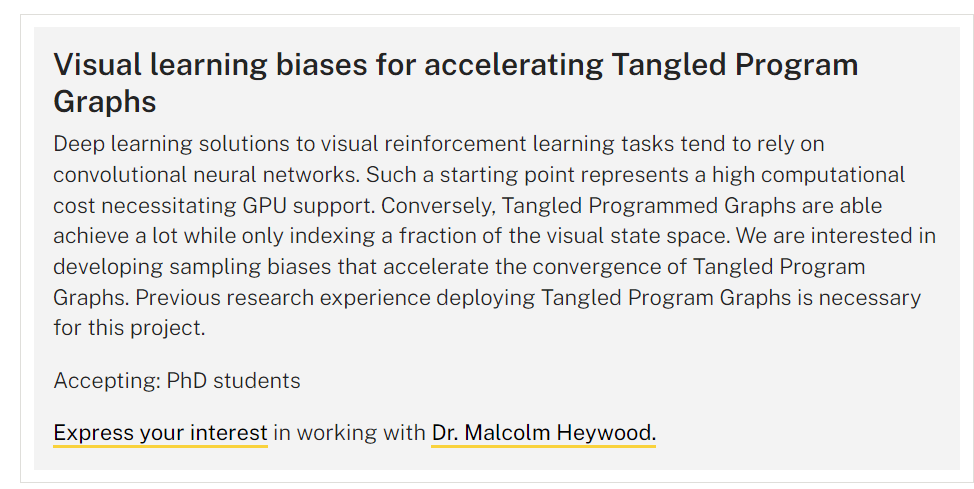
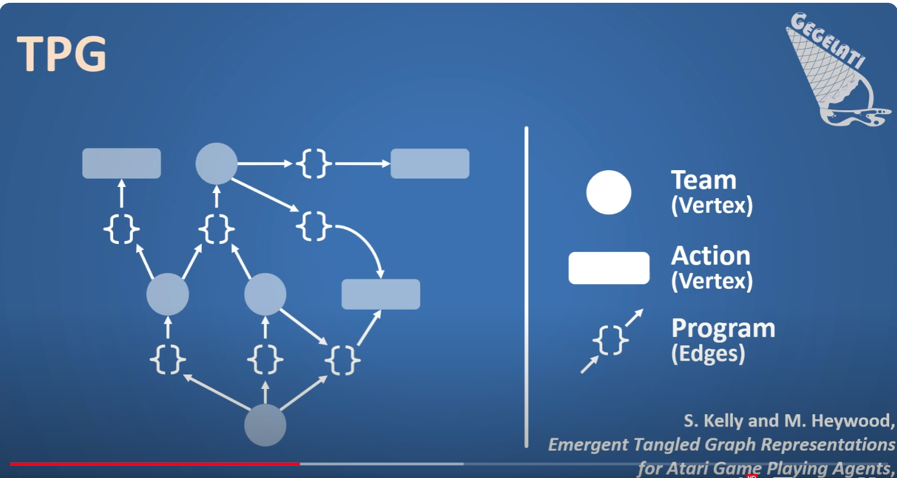
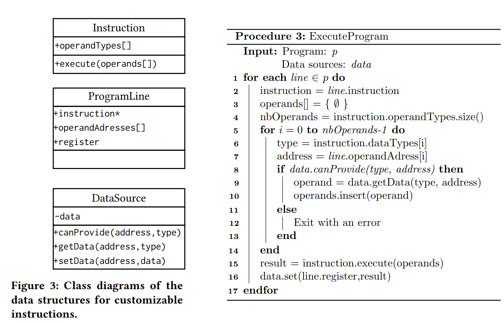
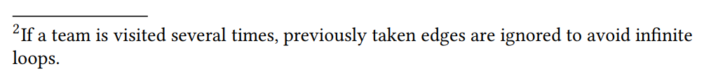

---

title: 使用遗传算法（遗传编程）解决强化学习问题是否可行
 
description: 

#多个标签请使用英文逗号分隔或使用数组语法

tags: 杂谈

#多个分类请使用英文逗号分隔或使用数组语法，暂不支持多级分类

---

看到这么一个研究课题的方向，虽然这个外国学校的排名相当于我国的211大学的水平，但是这个研究课题方向也不能说就没有意义，但是这个研究方向是否真的有研究价值也是有些不好直接下定论的。

地址：

<https://www.dal.ca/faculty/computerscience/graduate-programs/grad-handbook/student-funding/fellowship-opportunities.html>

> ### Visual learning biases for accelerating Tangled Program Graphs
>
> Deep learning solutions to visual reinforcement learning tasks tend to rely on convolutional neural networks. Such a starting point represents a high computational cost necessitating GPU support. Conversely, Tangled Programmed Graphs are able achieve a lot while only indexing a fraction of the visual state space. We are interested in developing sampling biases that accelerate the convergence of Tangled Program Graphs. Previous research experience deploying Tangled Program Graphs is necessary for this project.
>
> Accepting: PhD students
>
> [Express your interest](https://graduate.cs.dal.ca/form/fellowship-inquiry?subject=Fellowship Inquiry Dr. Malcom Heywood - BigData) in working with [Dr. Malcolm Heywood.](https://www.dal.ca/faculty/computerscience/faculty-staff/malcolm-heywood.html)

 

强化学习算法现在有很多不足难以克服，比如计算的高复杂性，不仅需要进行非常高的样本量并且需要非常大的计算资源和计算周期，这其中对GPU的需求和CPU的需求都是十分巨大的，而遗传算法由于有极高的全局搜索性，因此在一些现有的梯度优化的解决方法难以很好解决的问题上有不错的表现，不仅对计算资源要求的较少，并且计算周期很短，而且算法最终表现也是优于主要的梯度优化算法的，但是基于遗传算法（遗传编程）的方法来解决强化学习问题往往又有着天然的劣势，那就是遗传算法（遗传编程）适用范围和通用性都很有限，并且最为关键的是很难进行改进，难以与其他的改进技术结合，而这也进一步限制了遗传算法（遗传编程）在强化学习任务上的应用。

 

相关资料：

视频：[GEGELATI - Reinforcement Learning Framework with Tangled Program Graphs](https://www.youtube.com/watch?v=t0Ta5Vo5h7s)

代码：<https://github.com/gegelati/gegelati>

 

 

 

