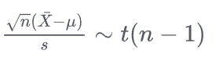

---

title: 机器学习中验证两个算法之间是否存在显著差距的t-test检验
 
description: 

#多个标签请使用英文逗号分隔或使用数组语法

tags: 杂谈

#多个分类请使用英文逗号分隔或使用数组语法，暂不支持多级分类

---

**同一主题的简单分析版本，建议查看:**

## [机器学习领域中假设检验的使用 ](https://www.cnblogs.com/xyz/p/16955511.html)

 

本文内容为在上文基础上进一步分析版本。

 

相关：

[t检验](https://baike.baidu.com/item/t%E6%A3%80%E9%AA%8C/9910799)

[t检验应用条件](https://mp.weixin.qq.com/s?__biz=MzIxOTAxNjA5MA==&mid=2455284845&idx=1&sn=05d87485fea9adf3ec2208e70ef94f62&chksm=81e5bc5d5b0d8848465948c879b5156bda9d18d0bf0bbc1f515b29133534d129cdc502491444&scene=27)

[t检验（t-test）](https://blog.csdn.net/weixin_61365716/article/details/137371504)

[t-test终极指南](https://zhuanlan.zhihu.com/p/510806739)

[一文详解t检验](https://zhuanlan.zhihu.com/p/138711532)

 

> t检验，亦称student t检验（Student's t test），主要用于样本含量较小（例如n < 30），总体标准差σ未知的正态分布。 t检验是用t分布理论来推论差异发生的概率，从而比较两个平均数的差异是否显著。
>
> 
>
> t检验是一种常用的统计方法，主要用于比较两组数据的平均值是否存在显著差异。
>
> 
>
> t-test的使用场景非常广泛，只要涉及到需要比较两组数据平均值差异的情况，都可以考虑使用t-test进行分析。
>
> 
>
> 在机器学习实践中，我们可能会尝试不同的算法或模型来解决同一个问题。t检验可以帮助我们比较这些算法或模型在性能上的差异，从而选择出最优的模型。
>
> 
>
> 总之，t检验在机器学习领域是一种有用的统计工具，它可以帮助我们更好地理解数据，优化模型，并做出更明智的决策。

为什么使用t-test检验，或者说为什么使用t分布统计量，也或者说高斯分布/正太分布之间的关系，等等，这些统计学的问题，包括相关统计假设的数学定理及其推导，说实话，自己也不会，大学学的就是标准的人教版教材，告诉的也就是用这个东西来作统计就是，至于具体原因以及背后的深刻数学原理这里也无法讨论，但是说一个自己的一个简单理解的小例子：

投掷一枚硬币，正反面出现的概率均为0.5，那么连续投掷10000次，最后出现正面次数为0、1、2、3,......97、98、99、100的概率其实就是服从一个正太分布的，关于二项式分布与正太分布之间的数学推导这里也就不介绍了，这里举这个例子要说明的是在日常的发生事件的统计模型建立时使用状态分布的有效性及其背后有相关数学理论支撑。

如果在统计建模时我们的样本量较小（样本量小于30时），那么该模型更趋向于t分布而不是正太分布，因此在日常统计建模检验时我们常使用t分布而不是正太分布。大致可以这么理解，一个分布是正太分布，但是对这个分布抽样较少的样本，那么由于样本量较少，因此抽取的样本更符合t分布而不是正太分布。

 

t检验可分为**单总体检验**和**双总体检验**，以及**配对样本检验**。

 

> t检验用于比较两个均值是否存在显著差异。具体来说：
>
> - **单样本t检验**：用于检测一个样本的均值是否与某个已知的总体均值有显著差异。
> - **独立样本t检验**：用于比较两个独立样本之间的均值差异。
> - **配对样本t检验**：用于比较同一对象在不同条件下的均值差异（如治疗前后）。

 

在使用t检验时都是将两个分布的差异不显著设置为$H_0$假设，因为我们是需要根据$H_0$假设进行统计建模的，而只有假设差异不显著才能符合这里的t分布统计模型，然后再根据抽样数据和统计模型判断是否可以否定$H_0$假设，$H_0$假设就是假设$u_{抽样样本}-u_{总体分布}$差异不显著，或者说$H_0$假设就是假设由$u_{抽样样本}-u_{总体分布}$所构建的统计量$t$是符合t分布，于是才有后面的依据统计模型进行的假设检验。

 

在使用t检验判断两个总体分布均值差异是否显著时需要假设两样本总体方差相同，因为t检验要求两总体分布方差相同，当然这里也只是假设二者相同。

在使用t检验对样本抽样均值和总体均值差异显著判断时要求总体方差未知，否则就可以利用 Z 检验（也叫U检验，就是正态检验）

 

要知道统计学理论和计算机领域的机器学习一样都是建立在假设之上的，也就是说在预先设置假设后才在这些假设之上构建的后面的理论。这里使用t检验时对两总体分布均值差异显著性判断时就是假设两总体方差相同的。

 

声明：下面的公式来源**[一文详解t检验](https://zhuanlan.zhihu.com/p/138711532)**。

1. **抽样样本与目标总体分布之间均值差异性判断构建的统计量：**

2. **两个抽样样本均值差异性判断，$H_0$假设这两个抽样样本来自于均值相同的两个总体分布：**

3. **配对样本均值检验，来自某总体分布的抽样样本X在某因素影响下对应改变为另一种样本抽样Y，如：同一受试对象的自身前后对照（如检验癌症患者术前、术后的某种指标的差异）**

 

### t检验在机器学习领域中的应用

在机器学习领域，我们针对某个问题可以构建几个不同的算法或模型，往往为了判断哪两个算法更优我们会使用t检验。我们假设由两个算法A、B，每个算法均进行24次重复实验，即24次trial，我们可以根据重复实验的结果计算出A、B算法的实验结果的均值，从而我们可以构建t统计量:

这个例子中$n_1=24$，$n_2=24$，抽样样本方差$s_1$和$s_2$可以通过A、B算法的重复实验中获得，同样可以在A、B算法的重复实验中分别获得抽样样本均值，在这里则是使用双侧的$t(0.025, 46)$，即$n=n_1+n_2-2=24+24-2=46$。

 

**问题示例：**（一个实例的单总体t检验对t检验）

判断一个**抽样样本**（下例子中样本数为35）是否与**某总体分布**具有统计学意义？

零假设，由于统计量中主要计算部分为$u_0-u_1$或者是$u_{抽样样本}-u_{总体分布}$，因此$H_0$事件假设就是假设这个抽样样本源自于该总体分布；而且我们知道抽样样本的均值和方差，并且知道目标总体分布的均值（不知道总体方差），我们的目标是判断这个样本抽样与总体分布之间的差异是否显著，因此我们知道如果$H_0$假设假定成立，即假定抽样样本与总统分布差异不显著或者说抽样样本来自于目标总体分布，那么我们可以得到**t分布**的统计量$t=\frac{u_{抽样样本}-u_{总体分布}}{\frac{s}{\sqrt{n}}}$，其中，$s$为抽样样本方差，$n$为抽样样本数；由于我们的$H_0$假设是抽样样本和总体分布的差异不显著，也就是说这种差异性可能是抽样样本均值大于总体分布均值有可能是抽样样本均值小于总体分布均值，那么也就意味着我们需要考虑的不仅是$u_{抽样样本}-u_{总体分布}$还需要考虑$u_{总体分布}-u_{抽样样本}$，即$t=|\frac{u_{抽样样本}-u_{总体分布}}{\frac{s}{\sqrt{n}}}|$，也就是说下面例子是t分布的双侧检验，一般认为小概率事件是发生概率小于0.05的，即5%，那么由于是双侧检验，因此单侧检验的小概率为0.05/2=0.025，也就是说当$t=|\frac{u_{抽样样本}-u_{总体分布}}{\frac{s}{\sqrt{n}}}| \geq t(34, 0.025)=2.032$时则该$H_0$事件的发生概率为小概率，由于小概率事件在统计学上认为不可能发生，于是否定$H_0$事件发生，于是否定样本抽样来自于目标总体分布，也就是说抽样样本与总体分布在统计学上差异显著；与之相反，如果$t=|\frac{u_{抽样样本}-u_{总体分布}}{\frac{s}{\sqrt{n}}}| \leq t(34, 0.025)=2.032$，那么就说明该$H_0$事件的发生概率不为小概率，于是我们无法否定$H_0$假设，也就是说我们无法否定样本抽样来自于目标总体分布，或者说抽样样本与总体分布在统计学上差异不显著，这里需要注意的是按照统计学理论来说我们只是无法依据现有抽样数据否定样本抽样来自于总体分布，重点是**无法否定**并不等于认同，**无法否定抽样来自于总体分布不等于承认样本抽样来自于目标总体分布**。

由于$u_{抽样样本}$可能大于$u_{总体分布}$，也可能$u_{抽样样本}$小于$u_{总体分布}$，从而知道这个例子是t检验的双侧检验，小概率事件为0.05概率，双侧检验（由于存在两种可能性，不清楚每一种可能的发生概率的差异，于是两种可能等概率，于是单一一种可能的小概率为0.025）的小概率为单侧发生概率小于0.025。

当，$t=\frac{u_{抽样样本}-u_{总体分布}}{\frac{s}{\sqrt{n}}} \geq t(34, 0.025)=2.032$或$t=\frac{u_{抽样样本}-u_{总体分布}}{\frac{s}{\sqrt{n}}} \leq t(34, -0.025)=2.032$时，我们认为之前的$H_0$假设为小概率假设，于是可以否认$H_0$假设，即不接受$H_0$假设。

  

**个人github博客地址：**
[https://devilmaycry812839668.github.io/](https://devilmaycry812839668.github.io/ "https://devilmaycry812839668.github.io/")