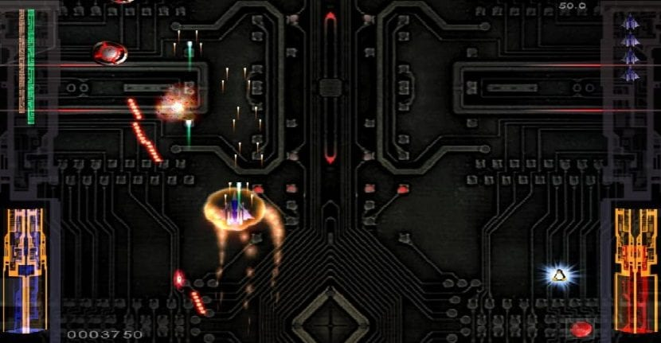
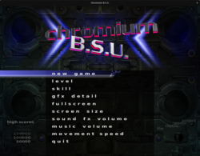
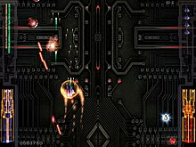

---

title: ubuntu环境安装街机风格的太空飞船游戏（2D飞机射击游戏）游戏——Chromium_B.S.U.
 
description: 

#多个标签请使用英文逗号分隔或使用数组语法

tags: 杂谈

#多个分类请使用英文逗号分隔或使用数组语法，暂不支持多级分类
---

相关：

https://en.wikipedia.org/wiki/Chromium_B.S.U.

https://manpages.ubuntu.com/manpages/focal/en/man6/chromium-bsu.6.html

https://launchpad.net/ubuntu/+source/chromium-bsu

 

 

今天突然发现原来在ubuntu系统下面可以快速简单的安装《雷电》(**街机风格的太空飞船游戏**)游戏，本文就此记录一下。

**该游戏是一款街机类型的电子游戏，具有太空飞船的垂直射击风格。**

 

游戏安装：

`sudo apt-get install chromium-bsu`

 

 

 

强化学习算法library库：(集成库)

https://github.com/Denys88/rl_games

https://github.com/Domattee/gymTouch

**个人github博客地址：**
[https://devilmaycry812839668.github.io/](https://devilmaycry812839668.github.io/ "https://devilmaycry812839668.github.io/")