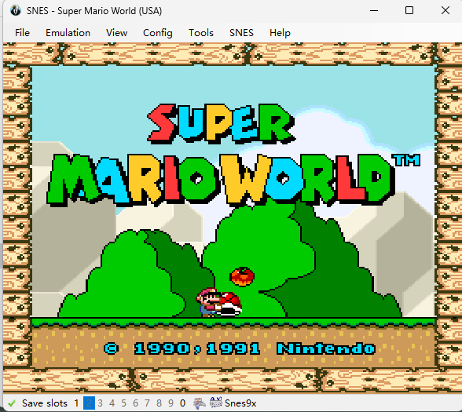
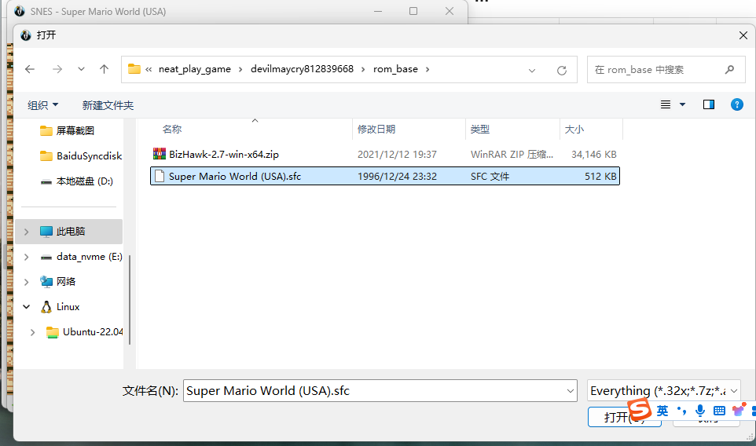
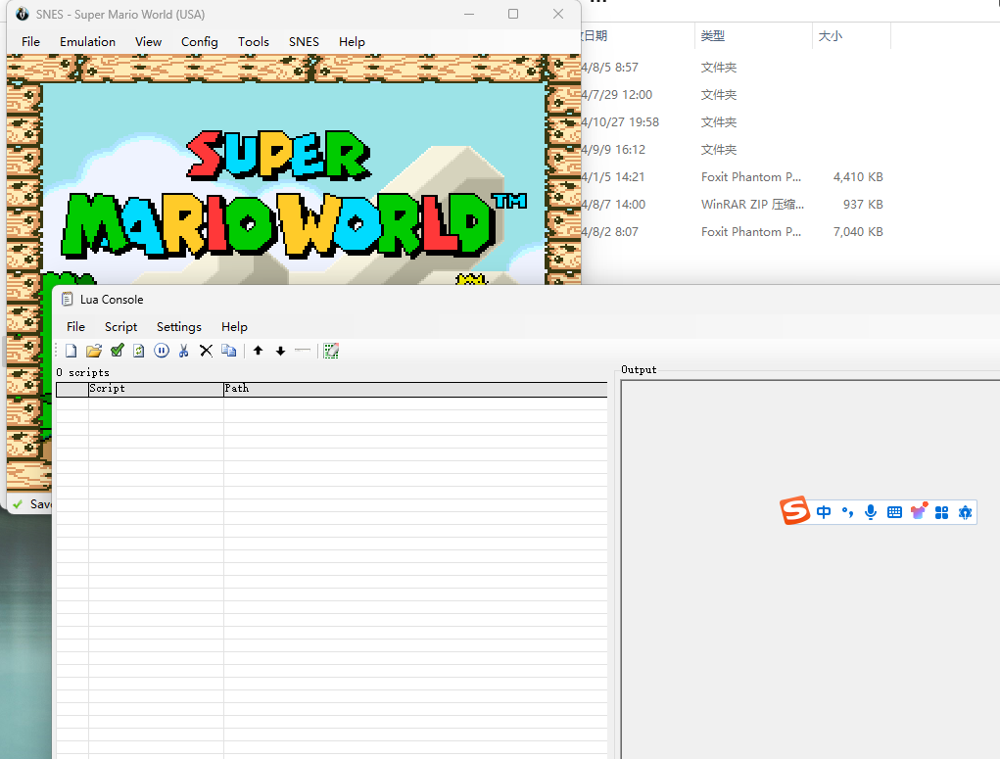
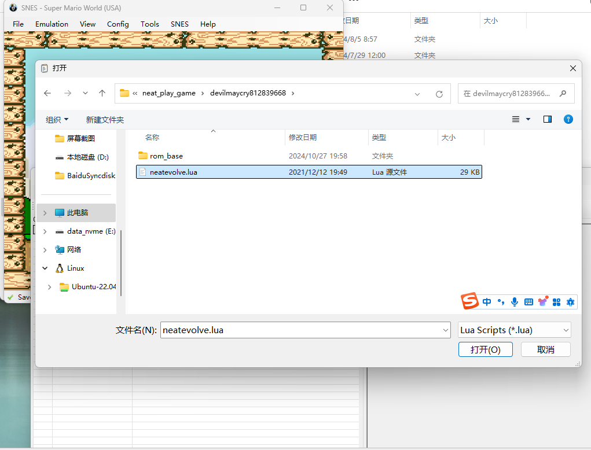
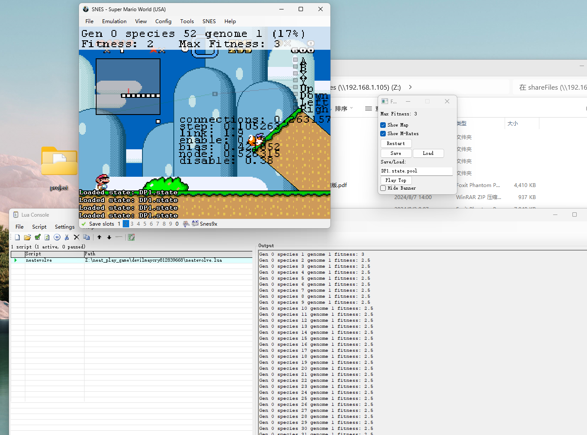

---

title: Lua代码——使用遗传进化算法（neat算法）玩超级玛丽游戏
 
description: 

#多个标签请使用英文逗号分隔或使用数组语法

tags: 杂谈

#多个分类请使用英文逗号分隔或使用数组语法，暂不支持多级分类
---

**前文：**

[模拟器运行环境及Lua代码——使用遗传进化算法（neat算法）玩超级玛丽游戏](https://www.cnblogs.com/xyz/p/18509095)

 

 

 

# SuperMario_GeneticEvolution_Neat

**项目介绍：**

模拟器运行环境及Lua代码——使用遗传进化算法（neat算法）玩超级玛丽游戏

 

**代码地址：**

<https://openi.pcl.ac.cn/devilmaycry812839668/SuperMario_GeneticEvolution_Neat>

 

**主页地址：**

<https://www.cnblogs.com/xyz/p/18509095>

 

本项目的neat代码来自于网上的某个外国网友，由于该代码是多年前在外网所得，具体来源已不可查，该代码编写语言为lua。

 

neat算法代码文件为neat_play_game/devilmaycry812839668/文件夹下面的**neatevolve.lua**文件。

 

超级马里奥游戏的环境文件为neat_play_game\devilmaycry812839668\rom_base文件夹下面的Super Mario World (USA).sfc文件。

 

 

 

强化学习算法library库：(集成库)

https://github.com/Denys88/rl_games

https://github.com/Domattee/gymTouch

**个人github博客地址：**
[https://devilmaycry812839668.github.io/](https://devilmaycry812839668.github.io/ "https://devilmaycry812839668.github.io/")