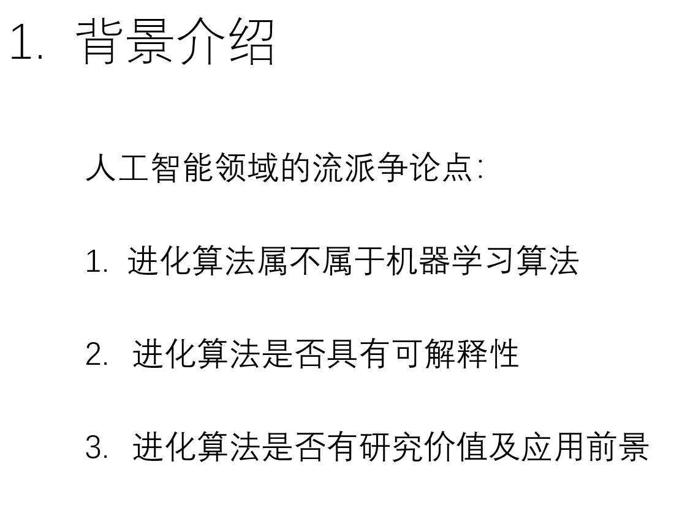
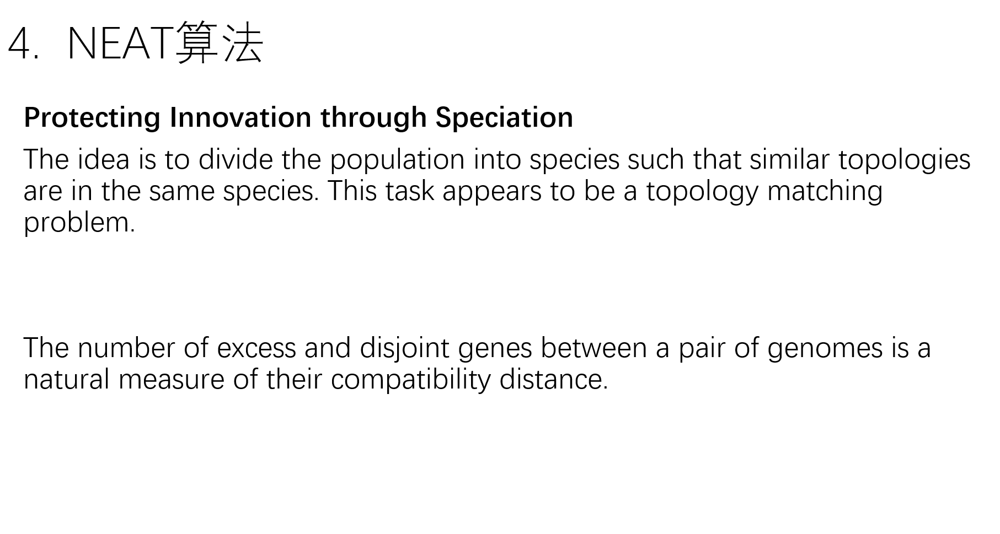

---

title: 基于进化神经网络的深度强化学习算法—2021年12月16日组会汇报
 
description: 

#多个标签请使用英文逗号分隔或使用数组语法

tags: 杂谈

#多个分类请使用英文逗号分隔或使用数组语法，暂不支持多级分类
---

几年前做的一个PPT，是在研究所里的学术组会时候使用的汇报材料，最近又再看这方面的资料，于是就把这个PPT找了出来，即当复习也当资料整理和备份了。

 

 

 

 

强化学习算法library库：(集成库)

https://github.com/Denys88/rl_games

https://github.com/Domattee/gymTouch

**个人github博客地址：**
[https://devilmaycry812839668.github.io/](https://devilmaycry812839668.github.io/ "https://devilmaycry812839668.github.io/")