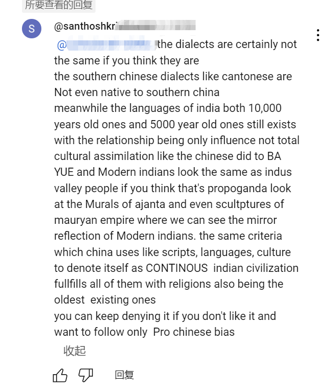

---

title: 为什么几千年印度大陆上出现文明后就一直部落国家形式存在而没有形态国家形态呢——印度大陆上自古以来为什么从来没有形成统一国家形态

description: 

#多个标签请使用英文逗号分隔或使用数组语法

tags: 杂谈

#多个分类请使用英文逗号分隔或使用数组语法，暂不支持多级分类

---

 

本文的问题：

为什么几千年印度大陆上出现文明后就一直部落国家形式存在而没有形态国家形态呢——印度大陆上自古以来为什么从来没有形成统一国家形态

 

在外网上和一个印度网友互喷了一整天，对方说印度国家形式一直存在，印度文明从几千年开始后就一直以国家形式存在，印度并没有被外敌和侵略者清洗和同化，印度的文字、语言、文化、历史等等都一直在连续；对方认为被入侵的印度依旧是十分的强大的，他们同化了所有的入侵者并保证了自己本土文化的一致性，反而这位印度网友认为中国的文明要落后于今天的印度；并且这位印度网友还极为自豪的认为印度不是被侵略者和殖民者同化，而是在保持自己原有文化的基础上多少借鉴一些而已。对于这个印度网友的观点我是驳斥了一整天，最后以本文总结下自己的观点。

 

个人认为：

印度次大陆上的文明尤其是古文明早已断绝，古印度是指今日的巴基斯坦这个土地上的5000年前出现的文明，而这个文明早在几千年前的外敌入侵中被灭绝，和今天的巴基斯坦和印度都没有任何关联；今日的印度次大陆上虽然在几千年前就有人类生活，甚至建立王朝，但是几乎都是从中亚迁徙过来的入侵者建立的王朝，他们对本土的文化、文字、语言、宗教、人种等等进行清洗和同化，可以说古代印度大陆上的文化、文明已然断绝，今日的印度次大陆上的人是不认识也不掌握古代次大陆上的文字、语言、宗教及历史的；而且即使古代印度次大陆上的各个入侵者建立的割据王朝也都只是原始的部落形式，和国家形态没有任何关系，可以说印度大陆上是从被英国殖民开始才首次形成了“统一”，而这种统一是源自英国殖民者依靠武力统一了印度次大陆上的各个原始部落和城邦，形成了统一的“东印度公司”这种统一的殖民土地，而印度次大陆上直到二次世界大战后英国放弃印度次大陆上的殖民统治权才让印度次大陆上首次实现了从各部落形态到国家形态的转变。

现如今的印度，尤其是受过教育的，特别是高种姓的那批人，总是认为印度是5000年甚至10000年的古国，有着5000年甚至10000年的文明传承，是人类历史上最古老最强大的文明和国家；对此我是真的呵呵了，一个靠殖民者殖民统治才从部落形态转变到统一殖民地，最后还是靠着殖民者退出才在千年历史上首次形成国家，这样的一个情况又怎么敢宣称印度有着10000年的历史呢，而且现在有考证支持人类文明在10000年前就已经存在的证据嘛，看来看多了宝莱坞的电影真的容易把自己给催眠了。

 

 

 

[印度数千年历史三个大一统朝代：孔雀王朝、笈多王朝、莫卧儿王朝](https://baijiahao.baidu.com/s?id=1668381492486736005&wfr=spider&for=pc)

[为什么印度无法统一](http://www.360doc.com/content/24/0713/17/31873237_1128683758.shtml#google_vignette)

[印度在历史上为什么不堵住开伯尔山口，导致不断被异族入侵？](https://mp.weixin.qq.com/s?__biz=MzkwNDEzNjA2MQ==&mid=2247484371&idx=1&sn=272767d44fc80eb8c34d8d986d561df3&chksm=c08ad7c1f7fd5ed79378658a50df8be271044ad54b77bb6d6c1b3c33119fd0fd1c1f0ac00d3c&scene=21#wechat_redirect)

[与中国同为文明古国，印度为何历史上很难形成过统一的国家？](https://baijiahao.baidu.com/s?id=1758788480196945007&wfr=spider&for=pc)

 

部分对话截图：

