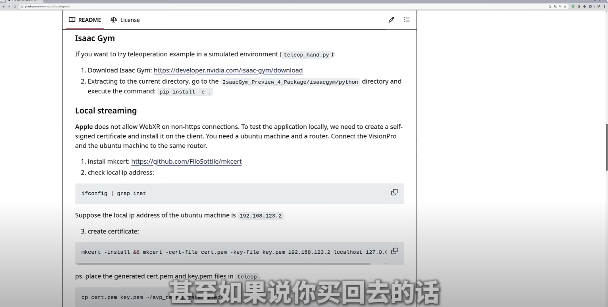
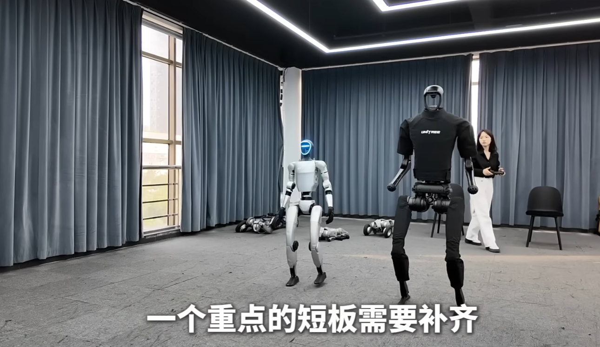
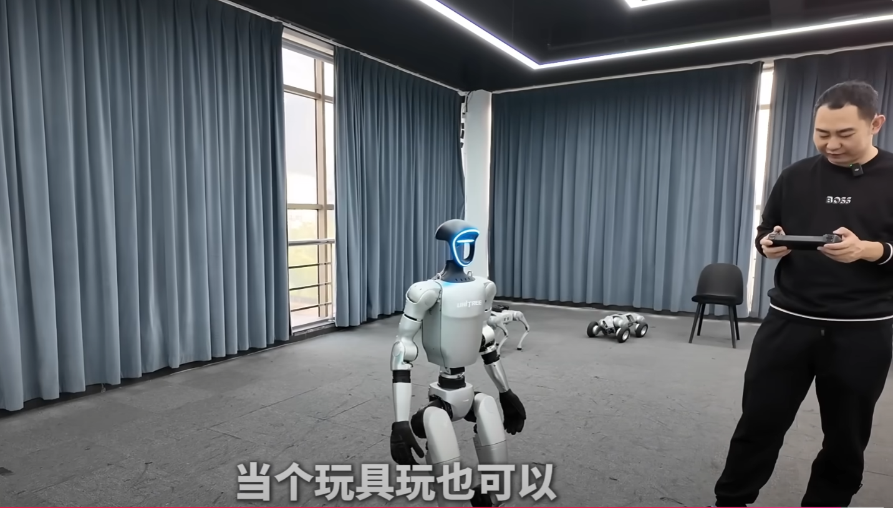

---

title: 9万9的人形机器人可以买吗？
 
description: 

#多个标签请使用英文逗号分隔或使用数组语法

tags: 杂谈

#多个分类请使用英文逗号分隔或使用数组语法，暂不支持多级分类
---

**相关：**

[9万9的人形机器人替你们看了！差点冲动下单！真实水平是怎样的？](https://www.youtube.com/watch?v=DmaHXkVK4EU)

 

**一个两三万的三折叠的手机都这么多人买，那么一个9.9W的人形机器人买回去玩玩又有什么不可呢！**

 

目前来说，人形机器人的硬件方面基本已经成熟，但是在软件方面，尤其是AI控制方面则还不是很成熟，有着很远的路要走，现在来说人形机器人的目前实际应用还不是很成熟，没有高智能的AI控制那么目前来说人形机器人更像是一个大玩具。

 

 

 

 

强化学习算法library库：(集成库)

https://github.com/Denys88/rl_games

https://github.com/Domattee/gymTouch

**个人github博客地址：**
[https://devilmaycry812839668.github.io/](https://devilmaycry812839668.github.io/ "https://devilmaycry812839668.github.io/")