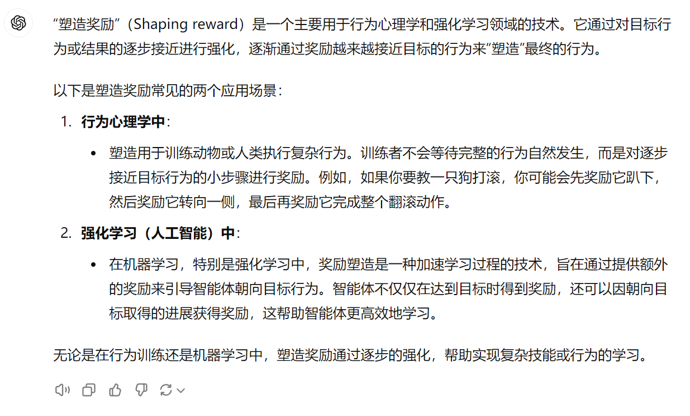

---

title: 强化学习：塑造奖励（Shaping reward）

description: 

#多个标签请使用英文逗号分隔或使用数组语法

tags: 杂谈

#多个分类请使用英文逗号分隔或使用数组语法，暂不支持多级分类

---

“塑造奖励”（Shaping reward）是一个主要用于行为心理学和强化学习领域的技术。它通过对目标行为或结果的逐步接近进行强化，逐渐通过奖励越来越接近目标的行为来“塑造”最终的行为。

以下是塑造奖励常见的两个应用场景：

1. **行为心理学中**：
   - 塑造用于训练动物或人类执行复杂行为。训练者不会等待完整的行为自然发生，而是对逐步接近目标行为的小步骤进行奖励。例如，如果你要教一只狗打滚，你可能会先奖励它趴下，然后奖励它转向一侧，最后再奖励它完成整个翻滚动作。
2. **强化学习（人工智能）中**：
   - 在机器学习，特别是强化学习中，奖励塑造是一种加速学习过程的技术，旨在通过提供额外的奖励来引导智能体朝向目标行为。智能体不仅仅在达到目标时得到奖励，还可以因朝向目标取得的进展获得奖励，这帮助智能体更高效地学习。

无论是在行为训练还是机器学习中，塑造奖励通过逐步的强化，帮助实现复杂技能或行为的学习。

 

 

