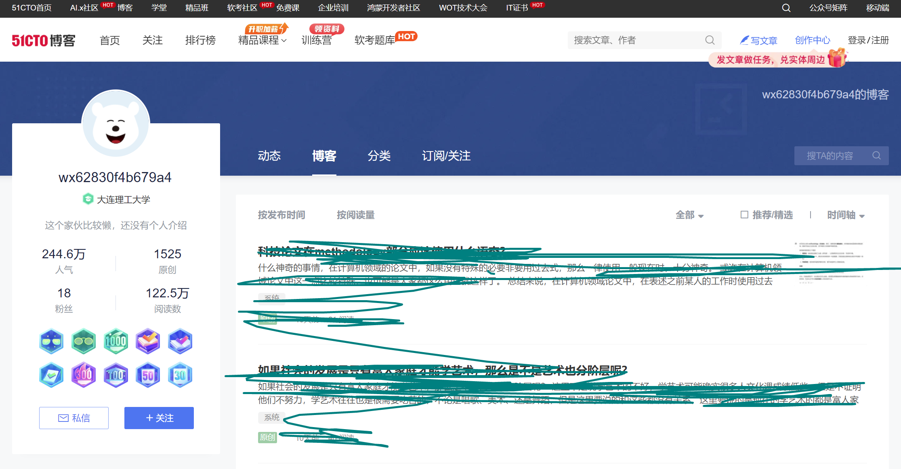

---

title: cnblogs内容同步到51cto上的说明（声明）

description: 

#多个标签请使用英文逗号分隔或使用数组语法

tags: 杂谈

#多个分类请使用英文逗号分隔或使用数组语法，暂不支持多级分类

---

 

51CTO网站上的blog地址为：https://blog.51cto.com/u_15642578

该地址是个人在博客园cnblogs上的同步账号（<https://cnblogs.com/xyz>），在cnblogs上发表的内容会不定期的在经过51CTO审核通过后同步到该51CTO地址下。

 

之所以将cnblogs上的文章同步到51CTO网站上，其原因有两个：

1. 希望自己的劳动成果（写的那些blogs内容）可以被更多的人看到，可以服务更多的人，也更有意义，毕竟写技术blogs这种秉承开源精神的技术分享其初衷就是更好的造福社会并促进社会更好的发展进步；
2. 由于cnblogs网站近几年经营不善导致收支不平凡，也是为了防止如果真的有一天cnblogs支撑不下来倒掉了的话至少自己辛苦写的东西不至于消失在中国互联网空间（虽然多年前由于讨厌csdn过于商业化的行为而弃用并选择cnblogs，但是万万也没想到多年后的今天cnblogs因为欠缺商业化而频频宣告运营危机）。

本文内容主要是为了声明，不然容易使人误会为什么cnblogs和51cto上的这两个账号下的内容一致，不过随着cnblogs被百度搜索引擎降权和减少收录，估计在国内互联网上cnblogs的可见率会变得少的可怜，而使用bing搜索引擎的毕竟是少数，而像我这种主要使用Google搜索引擎的估计可以忽略不计了。

 

 

对应的原始cnblogs地址：

https://www.cnblogs.com/xyz

 

 

同步到51CTO上的地址：

https://blog.51cto.com/u_15642578/

 

 

