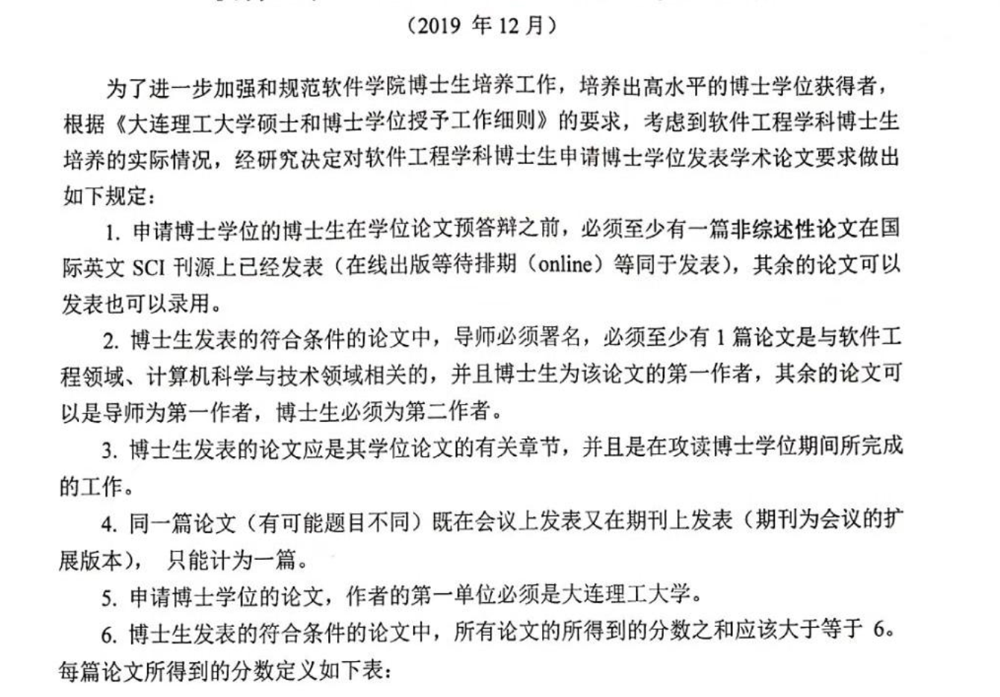

---

title: 2024年——博士延期第8年有感
 
description: 

#多个标签请使用英文逗号分隔或使用数组语法

tags: 杂谈

#多个分类请使用英文逗号分隔或使用数组语法，暂不支持多级分类

---

刚和期刊编辑社沟通邮件，被告知已接收录用的期刊排期为明年（2025年）5月份出版发表，然后我接到邮件后马上去翻找大连理工大学的博士毕业的要求，然后又赶紧去查了一下这个期刊的中科院SCI分区排名，最后得出一个结论，那就是学校要求论文得分6分才允许答辩，但是必须有一篇论文是已发表，而我现在的论文发表是已经有了一个2区的录用，得分为4，也就是说我还缺另一个SCI不论任何分区的论文，然后必须是明年3月份之前被发表才行。

经过一番确认，好消息是我还需要一篇SCI论文被发表（包括online发表）即可申请答辩；坏消息是我真的搞不动论文了，看似有希望的事情却要我现在也都感觉被大山压的透不过气。

不得不说，自己读博最大的败笔就是没有和导师搞好关系，并且最糟糕的是不仅没有搞好关系反而把关系搞的极为糟糕，我的博导对我简直是深恶痛绝，和我多说一句话也都是觉得不情愿，不要说什么学术指导和平时的关心与否了，就连基本的论文撰写和投稿都是没的管一下，而且最为愁人的是我投的论文并不是实验室指定范围内的高质量期刊和会议，而是属于学校允许范围内排名靠后的名副其实的“水刊”，所以实验室也不会为我的论文发表费用承担一分钱，而这个发表费用、审稿费用、以及论文英语的润色费用都需要我自费处理，而最为要命的是作为一个第8年延期的老博士来说已经4年没有得到学校官方的资金支持了，这几年的生活费和自己承担的科研设备费用等等相关费用已经把我个人本就微薄的积蓄花的底掉，再想想现在还差一个SCI论文，唉，感觉真的好无力。

现在来看，为了在第8年最后一年的可以申请答辩的时间里满足学校的答辩要求，我最为靠谱的水刊就是MDPI集团下属的期刊，但是想想2万人民币的费用需要独自承担，而最为可悲的是在我发现如果我即使能够在这类期刊付费发表论文那么同时也意味着我明年将没有任何的资金来准备答辩事宜的花销费用，准确的来说我将没有多余的资金来支付明年的生活费用，也就是说在最完美的预计下明年可以3月份申请答辩，5月份之前完成答辩，那么这2025年的不到半年的时间的生活费用我目前也是不够的。而且这些问题还是要在很完美的预计之下，是需要我真的可以弄完一个水刊论文的情况后还需要面对的现实问题。人是需要吃饭的，不吃饭会饿的，会没有力气干活的，如果真的不行的话或许真的只能向曾经同学举债了，也或者把我在用的笔记本电脑做二手出掉，估计可以换个两月的饭钱，这样的话在向其他地方挪动些钱来估计就可以勉强支撑到明年答辩结束了，而这也都是目前来看最顺利的情况下所必须要面对的现实问题。

 

想想自己也是感慨的很，读博之前我是拿到了几个大型互联网公司和大型国企的offer，有的直接给出项目经理和技术负责人的岗位的，想想不到10年前自己就能拿到月薪2W的收入，而那是不论是研究生学历还是社会的就业市场都是今天所不能比拟的，而那个时候就是自己博导的一通电话把我招到大连去，也是当时感觉到导师对我还是比较看重才决定退掉已经到手的职位和岗位，选择到大连继续自己的理想，但是没想到后来才发现这一切都不是那么回事；入学后才发现导师已经多年没有找到读PhD. 的学生了，而已经招收的也有很大比例处在延期和放弃的情况下，想想一个实验室，读PhD.的人中退的和延期的占半数以上，这真的是要人命的一件事，再加上在我入学后我的导师成功完成了难以完成的招生任务于是再也见不到人了，我就突然感觉自己掉到了一个传销诈骗团伙中一样。也不知道是自己说话太不懂得含蓄，还是自己太没有眼力见，也或者是自己的形象外表实在是招导师厌恶，更或者是导师说的我字迹潦草所以代表心性不稳所以需要练字两年才可，总之刚刚博士入学导师就对我极为不待见，随后并被导师要求自我反省2年，期间没有实验室的任何帮助，自己也分不到任何科研课题，总之就是被罚了，而且我还毫无反抗之力。在后来自己给实验室干了不少的苦力活，疫情前也成功有了科研方向，但是作为一个导师所谓的“试试看的”新课题方向，我是真的有些懵，再加上被导师一通惩罚，然后再加上没过几个月就赶上了新冠疫情，然后疫情第一次解封回校后没几个月同级博士就开始毕业了，而此时的我面对着是新的课题方向，而自己也是刚刚上手，并且马上就没有国家的资金支持的情况下，再看看身边同级同学拿到了offer，突然感觉天塌地陷，原本同批入学读Phd.的，结果我这刚要开始而其他人都准备毕业工作了，而且更为愁人的是延期我是没有任何奖学金和国家资助可以拿的，而如何解决我的个人生活费都成了头等的大事。

事情就怕堆积，有些是不好的事情，一件一件不好的事情挨着发生，确实打的我有些无力还手，于是我便开始一边研究赚生活费一边想着如何改善和导师的关系，一边想着如何能完成学校的论文要求，总之就是好像每天没有做多少事情，但是却感觉非常的累，可能不是身体累而是心累，最后更是严重到不想动一点点，就连基本的下楼吃饭和走动我都不想，特别是不想见人，和谁都不想见也不想说话，而这身心上的折磨造成的就是身心健康的迅速恶化，自己不仅体重暴涨80斤，并且不停的失眠，焦虑，而且还会是不是的长背痈，几乎是以每三个月长一次的频率发生，去了医院就是吃消炎药然后开刀祛脓，医生也是好奇的说怎么这个年龄这么大的火，这上火上的这个样子实在是不应该呀，再到后来不仅是长背痈和失眠，就连自己的血压和心率都已经不正常了，而这个情况下自己已经感觉活着已然不易了，但是这时候居然还在延期，并且这事情成了一个恶性循环，越是延期就越上火，而越上火就身体越不好，而身体越不好就也难以毕业而越要延期，最后这件事情成了一个完美的闭环，而在这个“完美闭环”的不断循环之下唯一的消耗就是我的青春，我的健康，我的时间和我的生命。

 

今天已经明确了自己与毕业答辩之间的现有距离，想想几个月时间还是有很大希望的，如果自己能够在后面的这段时间里完成了任务获得答辩机会，更或者是答辩通过而“顺利毕业”，那么我想只有那是才真的可以卸下所有的压力，也只有那时候才能真的迎来新生，希望未来之路可以顺路，可以不要像自己这些年荆棘之路的坎坷，望未来美好而不是“没好”！！！

 

 

附录：

