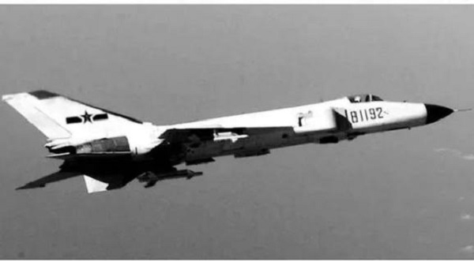

---

title: 81192 —— 英雄永垂不朽
 
description: 

#多个标签请使用英文逗号分隔或使用数组语法

tags: 杂谈

#多个分类请使用英文逗号分隔或使用数组语法，暂不支持多级分类

---

“81192”指的是中国海军航空兵飞行员王伟所驾驶的歼-8II战斗机编号。这架飞机与王伟在2001年4月1日南海上空的撞机事件中闻名。

事件背景：

当时，王伟驾驶81192号战斗机，正在监视美国海军EP-3E侦察机。EP-3E侦察机在中国领海附近执行侦察任务。
在拦截过程中，81192号与EP-3E发生碰撞，王伟战机损毁后坠海，他也因此牺牲。
王伟被誉为英雄，而81192号成为中国民众心中的象征性编号，象征着捍卫国家领土主权的勇气。
这一事件导致了中美之间的外交紧张，美国EP-3侦察机被迫降落在中国海南岛，美国机组人员随后被扣留并审讯，最终事件通过外交途径解决。

 

 

81192，英雄永垂不朽

 
 

