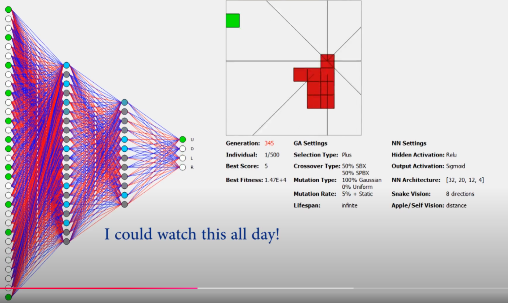
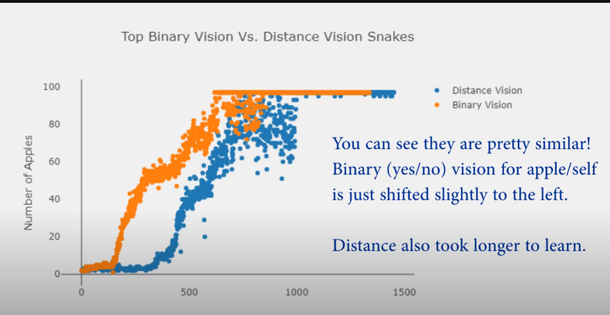
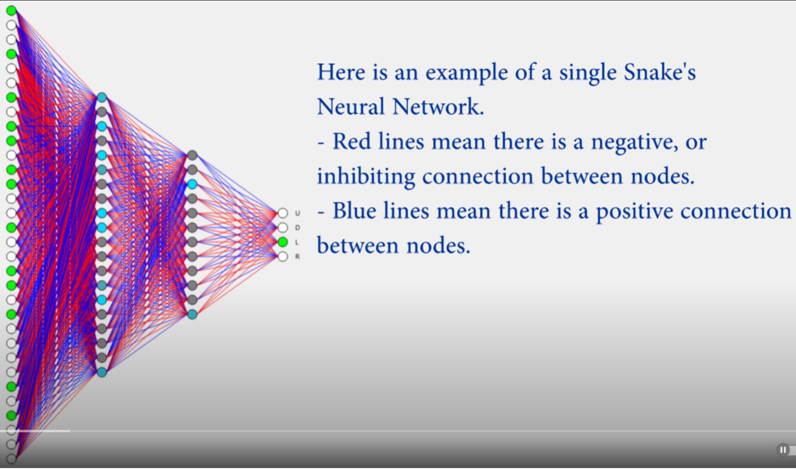
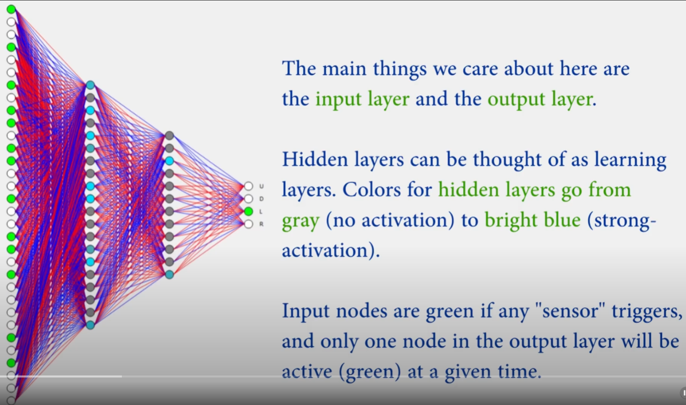
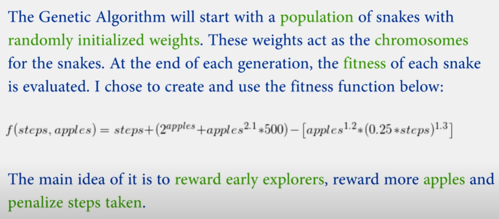

---

title: 如何求解贪吃蛇游戏问题
 
description: 

#多个标签请使用英文逗号分隔或使用数组语法

tags: 杂谈

#多个分类请使用英文逗号分隔或使用数组语法，暂不支持多级分类
---

相关：

[在很多游戏问题中规划算法表现的要比强化学习算法还好,那么为什么还要研究RL](https://www.cnblogs.com/xyz/p/18536686)

[AI Learns to play Snake!](https://www.youtube.com/watch?v=vhiO4WsHA6c)


代码实现：

https://github.com/Chrispresso/SnakeAI

<br/>

<br/>

关于如何设计使用DQN等RL算法解决《贪吃蛇》游戏的问题已经在前面几个blogs中给出，这里只是作为一个补充，并且本文给出了参考的代码地址，不过需要注意，经过测试后方向这个代码无法正常运行，会报错，不过里面的代码逻辑已经值得借鉴。


在我看来研究《贪吃蛇》游戏的解法，其目的并不是在于如何解决这个游戏的这个问题，而是在于理解和分析对于现实问题的建模，以及使用启发式方法、AI算法之间的区别，并且理解RL算法在稀疏问题上和遗传算法的差异。

<br/>

在项目：<https://github.com/Chrispresso/SnakeAI>中我们还可以学到如何利用已经训练后的遗传算法的模型来适应新的问题，具体如下：

> ## Loading snakes
>
> Let's say you have a 50 generations of snakes saved and you want to create a new population with the last 10 generations. You could start a new instance of `snake_app.py` and modify `for _ in range(self.settings['num_parents']):` portion to generate 10 less snakes. Then you can load your 10 best snakes and insert them into the population. This is where you can choose to either modify the constructor of your snake to have a different `apple_seed` or allow the snake to run it's previous course. The choice is up to you and totally dependent on your goals!

神经网络算法在梯度优化的情况下完成一个任务后重新适应新的问题，我们可以通过微调训练来实现，但是很少有资料来显示和说明使用遗传算法优化的神经网络算法训练好后的模型如何适用新的问题。这里给出的方法就是假设训练50代，我们保存最后10代中每一代的最好表现的种群个体编码，然后再随机生成90个种群个体编码（假设我们训练的运算过程需要100个种群个体编码），然后将二者合并得到种群个体数为100的新种群。还有一种相差不大的方法，那就是随机生成100个新种群个体编码然后与保存的10个个体编码合并，在进化的选择阶段保留100个种群个体。

<br/>

在这里使用遗传算法求解时和RL算法一样，都需要设置一个time limit值，比如为100，也就是说如果游戏中的蛇在100步内没有吃到苹果就自动结束游戏判定失败，这时因为防止存在贪吃蛇进入转圈死循环的过程。

<br/>

<br/>

**PS:**

虽然给出的代码不能成功运行，但是根据报错的信息可以估计是因为图形化方面的问题，不影响整个项目的逻辑代码的理解，整个GitHub上的该项目代码的逻辑部分整体读下来后发现完整度很高，在这个基础上完全可以修改修改用作其他项目上，整个项目的源码阅读下来还是很有启发作用的。


<br/>

<br/>


**关于神经网络的输入数据：**（这里是遗传算法优化神经网络，而不是用梯度法优化神经网络）


这里依旧是在蛇的头部发射出8个方向的激光射线，以获得不同方向上的测距，每个方向的测距返回值为3维向量，其中包括蛇头部在该方向上到墙、食物、蛇自身的距离，由于是8个方向，以及每个方向上3个返回值，因此这部分输入数据为$8*3=24$，在此基础上又将蛇的头部朝向和尾部朝向进行one-shot编码，比如：上下左右中如果(1,0,0,0)则代表朝向为上，如果（0,1,0,0）则代表朝向为下，如果是（0,0,1,0）则代表朝向为左，如果是（0,0,0,1）则代表朝向为右；因此蛇头和蛇尾的朝向编码维度为$4*2=8$，由此我们可以得到总共的输入维度为$24+8=32$。





<br/>

由于上面的输入数据为蛇的头部的8个方向的激光测距数值，为此也给出了另一种激光返回值，即每个方向返回的不再是蛇头到墙、苹果、自身的距离而是bool值，即如果该方向上有墙有苹果有自身那么返回值为（1,1,1），如果该方向有墙没有苹果没有自身，那么返回值为（1,0,0），以此类推，得到如下的使用测距和bool值的两种输入情况下算法的训练性能，可以看到二者差别较小。




<br/>

<br/>

<br/>

<br/>






<br/>

使用遗传算法时的**适应度函数**：





代码中的适应度函数形式：(根据专家经验人为设定)

```python3
    def calculate_fitness(self):
        # Give positive minimum fitness for roulette wheel selection
        self._fitness = (self._frames) + ((2**self.score) + (self.score**2.1)*500) - (((.25 * self._frames)**1.3) * (self.score**1.2))
        # self._fitness = (self._frames) + ((2**self.score) + (self.score**2.1)*500) - (((.25 * self._frames)) * (self.score))
        self._fitness = max(self._fitness, .1)

```


神经网络权重组成的遗传种群个体在交叉、变异后的clip处理：

```python
# Clip to [-1, 1]
np.clip(c1_params['W' + str(l)], -1, 1, out=c1_params['W' + str(l)])
np.clip(c2_params['W' + str(l)], -1, 1, out=c2_params['W' + str(l)])
np.clip(c1_params['b' + str(l)], -1, 1, out=c1_params['b' + str(l)])
np.clip(c2_params['b' + str(l)], -1, 1, out=c2_params['b' + str(l)])
```


<br/>

<br/>

强化学习算法library库：(集成库)

https://github.com/Denys88/rl_games


https://github.com/Domattee/gymTouch


**个人github博客地址：**
[https://devilmaycry812839668.github.io/](https://devilmaycry812839668.github.io/ "https://devilmaycry812839668.github.io/")