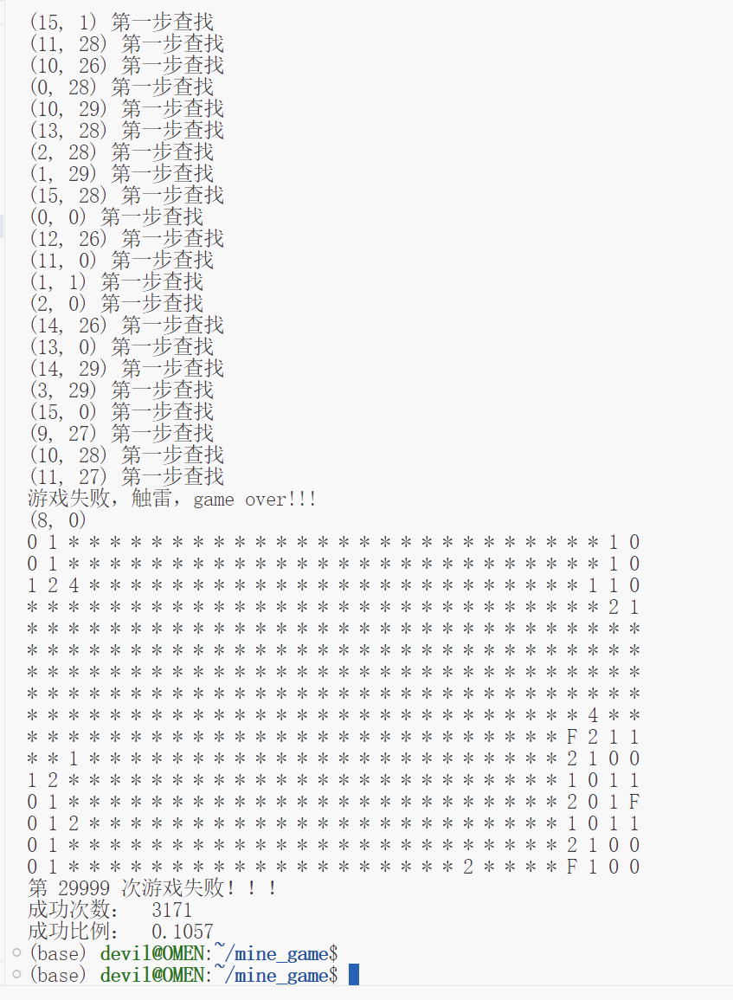

---

title: python实现的扫雷游戏的AI解法（启发式算法）
 
description: 

#多个标签请使用英文逗号分隔或使用数组语法

tags: 杂谈

#多个分类请使用英文逗号分隔或使用数组语法，暂不支持多级分类

---

相关：

[python编写的扫雷游戏](https://www.cnblogs.com/xyz/p/18547742)

[如何使用计算机程序求解扫雷游戏](https://www.cnblogs.com/xyz/p/18536687)

 

本文中实现的《扫雷》游戏的AI解法的项目地址：

https://openi.pcl.ac.cn/devilmaycry812839668/AI_mine_game

 

该项目的解法效果：

 

 

 

**个人github博客地址：**
[https://devilmaycry812839668.github.io/](https://devilmaycry812839668.github.io/ "https://devilmaycry812839668.github.io/")