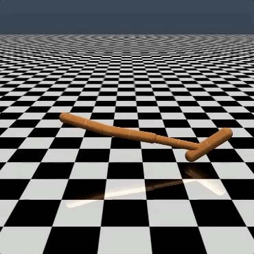
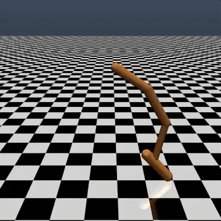
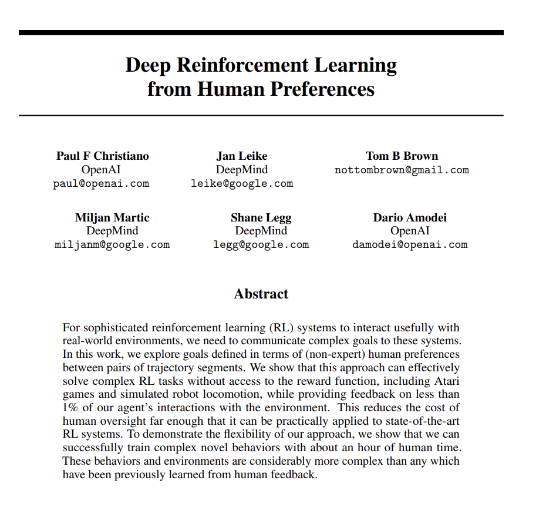

---

title: gym游戏_单腿翻滚的reward简略函数的设置
 
description: 

#多个标签请使用英文逗号分隔或使用数组语法

tags: 杂谈

#多个分类请使用英文逗号分隔或使用数组语法，暂不支持多级分类

---

相关：

https://openai.com/index/learning-from-human-preferences/

<br/>

<br/>

google的researcher人为设定了一个reward function，具体形式如下：

```python
def reward_fn(a, ob):
    backroll = -ob[7]
    height = ob[0]
    vel_act = a[0] * ob[8] + a[1] * ob[9] + a[2] * ob[10]
    backslide = -ob[5]
    return backroll * (1.0 + .3 * height + .1 * vel_act + .05 * backslide)
```

<br/>

这个reward function是单独为实现单腿翻滚这个目的设计的，是人为手工设计的，是凭借专家经验设置的，可以解读为这个设置是人工手调的，在这个奖励函数的设置下可以使用RL算法训练得到下面的效果：

<br/>



<br/>

<br/>

researcher同时给出了一种人为评价方式优化奖励函数的方法来优化reward function，其论文地址：

https://arxiv.org/pdf/1706.03741


在该种优化方式下获得的新的reward function，并在新获得的reward function情况下训练RL算法获得如下的运行效果：



可以看到使用这种通过人为偏好评价优化reward function的方式训练获得的效果会更加的平滑，效果更有。

<br/>

<br/>

相关：

https://arxiv.org/pdf/1706.03741




<br/>

<br/>

**个人github博客地址：**
[https://devilmaycry812839668.github.io/](https://devilmaycry812839668.github.io/ "https://devilmaycry812839668.github.io/")