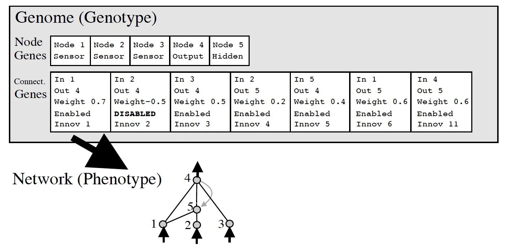
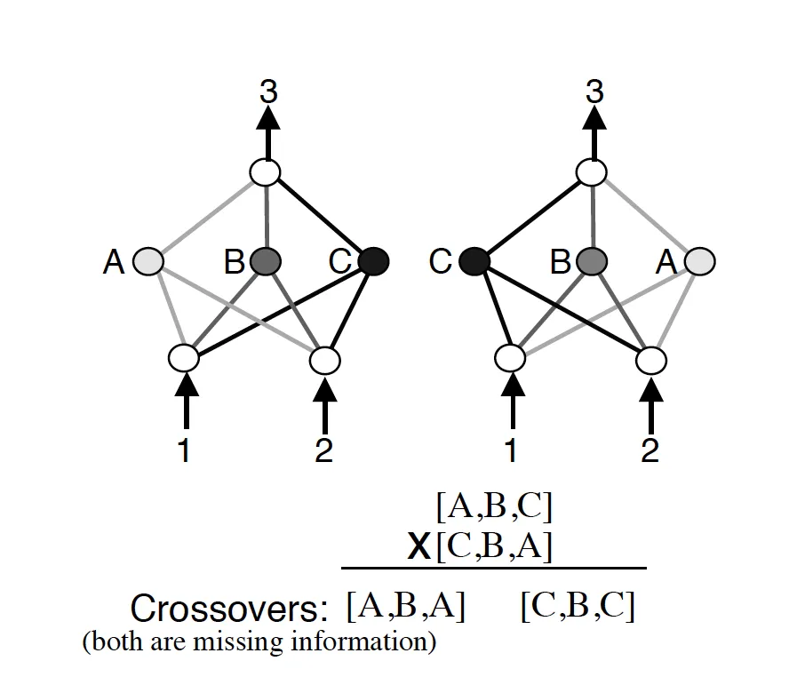
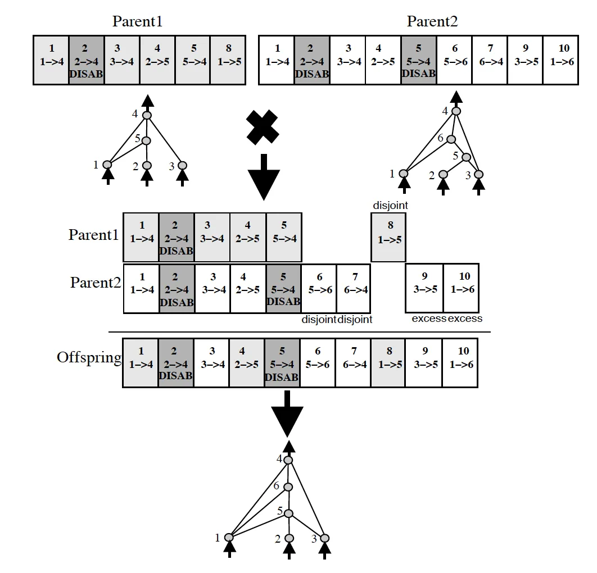

---

title: 【转载】遗传算法—Exploring NEAT-Neuroevolution of Augmenting Topologies
 
description: 

#多个标签请使用英文逗号分隔或使用数组语法

tags: 杂谈

#多个分类请使用英文逗号分隔或使用数组语法，暂不支持多级分类

---

原文地址：

https://hunterheidenreich.com/posts/neuroevolution-of-augmenting-topologies/

 

 

## A World of NeuroEvolution

Recently, I’ve been doing a lot of reading about something called neuroevolution. At a high-level, the idea is very simple. Instead of relying on a fixed structure for a neural network, why not allow it to evolve through a genetic algorithm? To me, this makes a lot of sense. Typically, when using a neural network, one selects a structure that may work based on empirical evidence. But is it the best structure that can be used? There’s no way to know for sure.

In my reading, I came across a paper called [Evolving Neural Networks through Augmenting Topologies](http://nn.cs.utexas.edu/downloads/papers/stanley.ec02.pdf) that discusses the algorithm NeuroEvolution of Augmenting Topologies, more commonly known simply as NEAT. Though the paper came out in 2002 and focused solely on evolving dense neural networks node by node and connection by connection, this paper was a critical starting point for me diving into neuroevolution and a paper that I plan to discuss in this article!

Now, you may be wondering how this algorithm can still be useful if it only evolves dense NNs and has to specifically evolve the connections between nodes. This was a question that I was thinking early on as well. But the thing is, the progress we have made with training NNs through gradient descent and back propagation need not be abandoned for a neuroevolutionary process. In fact, the two can be complementary. Recent papers have even highlighted ways to use NEAT and NEAT-like algorithms to evolved neural net structure and then use back propagation and gradient descent to optimize these networks, an area that I think is increasingly going to become relevant and important.

But now, without further ado, NeuroEvolution of Augmenting Topologies:

 

## The Problems with NeuroEvolution for Topologies

Before NEAT, there were a handful of attempts at evolving topologies of networks that were somewhat successful, however, they identified a series of problems that would need to be overcome before the technology could actually do anything incredibly useful. What made NEAT and its paper so interesting is some of the solutions it proposed to these problems, solutions that still make this paper relevant today!

### Encoding

In biology, we have a genotype and a phenotype. A genotype is the genetic representation of a creature and the phenotype is the actualized physical representation of the creature. Evolutionary algorithms always heavily mirror biology, neuroevolution being no different in this respect.

The question of encoding comes from the question of how do we wish to represent individuals genetically in our algorithm. The way in which we encode our individuals lays out the path for how our algorithm will handle the key evolutionary processes: selection, mutation, and crossover (also known as recombination). Any encoding will fall into one of two categories, direct or indirect.

A direct encoding will explicitly specify everything about an individual. If it represents a neural network this means that each gene will directly be linked to some node, connection, or property of the network. This can be a binary encoding of 1s and 0s, a graph encoding (linking various nodes by weighted connections), or something even more complex. The point is that there will always be a direct connection between genotype and phenotype that is very obvious and readable.

An indirect encoding is the exact opposite. Instead of directly specifying what a structure may look like, indirect encodings tends to specify rules or parameters of processes for creating an individual. As a result, indirect encodings are much more compact. The flip side is that setting the rules for an indirect encoding can result in a heavy bias within the search space, therefore, it is much harder to create an indirect encoding without substantial knowledge about how the encoding will be used.

The NEAT algorithm chooses a direct encoding methodology because of this. Their representation is a little more complex than a simple graph or binary encoding, however, it is still straightforward to understand. It simply has two lists of genes, a series of nodes and a series of connections. To see what this looks like visually, I have a picture from the original paper here:

​                                       NEAT Genomes

 

Input and output nodes are not evolved in the node gene list. Hidden nodes can be added or removed. As for connection nodes, they specify where a connection comes into and out of, the weight of such connection, whether or not the connection is enabled, and an innovation number (something we’ll discuss in the next section).

### Mutation

In NEAT, mutation can either mutate existing connections or can add new structure to a network. If a new connection is added between a start and end node, it is randomly assigned a weight.

If a new node is added, it is placed between two nodes that are already connected. The previous connection is disabled (though still present in the genome). The previous start node is linked to the new node with the weight of the old connection and the new node is linked to the previous end node with a weight of 1. This was found to help mitigate issues with new structural additions.

### Competing Conventions

Another big issue with evolving the topologies of neural networks is something that the NEAT paper calls “competing conventions.” The idea is that just blindly crossing over the genomes of two neural networks could result in networks that are horribly mutated and non-functional. If two networks are dependent on central nodes that both get recombined out of the network, we have an issue.

​                                             NEAT Competing Conventions Issues

 

More than that, genomes can be of different sizes. How do we align genomes that don’t seem to be obviously compatible? In biology, this is taken care of through an idea called homology. Homology is the alignment of chromosomes based on matching genes for a specific trait. Once that happens, crossover can happen with much less chance of error than if chromosomes were blindly mixed together.

NEAT tackles this issue through the usage of historical markings (as seen above). By marking new evolutions with a historical number, when it comes time to crossover two individuals, this can be done with much less chance of creating individuals that are non-functional. Each gene can be aligned and (potentially) crossed-over. Each time a new node or new type of connection occurs, a historical marking is assigned, allowing easy alignment when it comes to breed two of our individuals. View this here:

​                                                                          NEAT Crossover Visualization

 

### Speciation

A very interesting idea put forth in NEAT was that most new evolutions are not good ones. In fact, adding a new connection or node before any optimization of weights have occurred often leads to a lower performing individual. This puts new structures at a disadvantage. How can we protect new structures and allow them to optimize before we eliminate them from the population entirely? NEAT suggests speciation.

Speciation simply splits up the population into several species based on the similarity of topology and connections. If the competing convention problem still existed, this would be very hard to measure! However, since NEAT uses historical markings in its encoding, this becomes much easier to measure. A function for deciding how to speciate is given in the paper, but the important part to note is that individuals in a population only have to compete with other individuals within that species. This allows for new structure to be created and optimized without fear that it will be eliminated before it can be truly explored.

More than that, NEAT takes things one step forward through something called explicit fitness sharing. That means that individuals share how well they are doing across the species, boosting up higher performing species, though still allowing for other species to explore their structure optimization before being out evolved.

### Minimal Structure

A large goal of the NEAT paper was to create a framework for evolving networks that allowed for minimal networks to be evolved. The authors did not want to create an algorithm that first found good networks and then had to reduce the number of nodes and connections after the fact. Instead, the idea was to build an algorithm that started with the minimal amount of nodes and connections, evolving complexity as time goes on if and only if it is found to be useful and necessary.

NEAT sets up their algorithm to evolve minimal networks by starting all networks with no hidden nodes. Each individual in the initial population is simply input nodes, output nodes, and a series of connection genes between them. By itself, this may not necessarily work, but when combined with the idea of speciation, this proves to be a powerful idea in evolving minimal, yet high-performing networks.

## So How Did it Do?

Back in 2002 when this algorithm was proposed, it was a novel idea. They needed to prove that it could even do basic things. One of the first things the authors tested to prove its efficacy was whether it could evolve the XOR function. Obviously it did, otherwise we would most likely not be discussing the algorithm at all.

Another task that they demonstrated NEAT on was the pole balancing control task. If you aren’t familiar, this is a task where there is a simulated environment in which a control algorithm is allowed to move a cart. Connected to the cart is a pole. The goal of the control algorithm is to balance this pole for as long as possible. There are several variations of this task that were also evaluated such as the double pole balancing task (now with two poles!) and the double pole balancing task where the control algorithm is not given any velocity information about the poles. NEAT was very successful with all variations of this task!

## Wrapping Up

So now you are familiar with the NEAT algorithm for evolving neural networks! Hopefully, after reading this article, you think it’s a cool approach to neuroevolution and see all the reasons why it was such a breakthrough in neuroevolution.

But this is only just the beginning. I encourage you to read through the paper if you want more details about the algorithm (including how they specifically go about the speciation process), or even better, check out a code repository in your favorite programming language!

Beyond NEAT, there are more variations as well such as [HyperNEAT](http://axon.cs.byu.edu/~dan/778/papers/NeuroEvolution/stanley3**.pdf), [ES-HyperNEAT](https://eplex.cs.ucf.edu/papers/risi_alife12.pdf), and [CoDeepNEAT](https://arxiv.org/pdf/1703.00548.pdf) to name a few that I hope to talk about in the future soon! All of these are cool additions on top of NEAT that I encourage you to explore as well.

 

 

**个人github博客地址：**
[https://devilmaycry812839668.github.io/](https://devilmaycry812839668.github.io/ "https://devilmaycry812839668.github.io/")