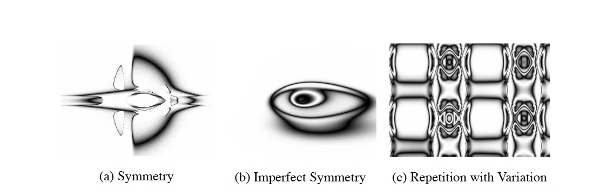

---

title: 【转载】遗传算法—HyperNEAT Explained——Advancing Neuroevolution
 
description: 

#多个标签请使用英文逗号分隔或使用数组语法

tags: 杂谈

#多个分类请使用英文逗号分隔或使用数组语法，暂不支持多级分类

---

原文地址：

https://hunterheidenreich.com/posts/next-gen-neuroevolution-hyperneat/

<br/>

<br/>

## Expanding NeuroEvolution

Last week, I wrote an article about [NEAT (NeuroEvolution of Augmenting Topologies)](https://hunterheidenreich.com/posts/neuroevolution-of-augmenting-topologies/) and we discussed a lot of the cool things that surrounded the algorithm. We also briefly touched upon how this older algorithm might even impact how we approach network building today, alluding to the fact that neural networks need not be built entirely by hand.

Today, we are going to dive into a different approach to neuroevolution, an extension of NEAT called [HyperNEAT](http://axon.cs.byu.edu/~dan/778/papers/NeuroEvolution/stanley3**.pdf). NEAT, as you might remember, had a direct encoding for its network structure. This was so that networks could be more intuitively evolved, node by node and connection by connection. HyperNEAT drops this idea because in order to evolve a network like the brain (with billions of neurons), one would need a much faster way of evolving that structure.

HyperNEAT is a much more conceptually complex algorithm (in my opinion, at least) and even I am working on understanding the nuts and bolts of how it all works. Today, we will take a look under the hood and explore some of the components of this algorithm so that we might better understand what makes it so powerful and reason about future extensions in this age of deep learning.

## HyperNEAT

### Motivation

Before diving into the paper and algorithm, I think it’s worth exploring a bit more the motivation behind HyperNEAT.

The full name of the paper is [“A Hypercube-Based Indirect Encoding for Evolving Large-Scale Neural Networks”](http://axon.cs.byu.edu/~dan/778/papers/NeuroEvolution/stanley3**.pdf), which is quite the mouthful! But already, we can see two of the major points. It’s a hypercube-based indirect encoding. We’ll get into the hypercube part later, but already we know that it’s a move from direct encodings to indirect encodings (see my last blog on NEAT for a more detailed description of some differences between the two). Furthermore, we get the major reasoning behind it as well: For evolving big neural nets!

More than that, the creators of this algorithm highlight that if one were to look at the brain, they see a “network” with billions of nodes and trillions of connections. They see a network that uses repetition of structure, reusing a mapping of the same gene to generate the same physical structure multiple times. They also highlight that the human brain is constructed in a way to exploit physical properties of the world: symmetry (have mirrors of structures, two eyes for input for example) and locality (where nodes are in the structure influences their connections and functions).

Contrast this what we know about neural networks, either built through an evolution procedure or constructed by hand and trained. Do any of these properties hold? Sure, if we force the network to have symmetry and locality, maybe… However, even then, take a dense, feed-forward network where all nodes in one layer are connected to all nodes in the next! And when looking at the networks constructed by the vanilla NEAT algorithm? They tend to be disorganized, sporadic, and not exhibit any of these nice regularities.

Enter in HyperNEAT! Utilizing an indirect encoding through something called connective Compositional Pattern Producing Networks (CPPNs), HyperNEAT attempts to exploit geometric properties to produce very large neural networks with these nice features that we might like to see in our evolved networks.

### What’s a Compositional Pattern Producing Network?

In the previous post, we discussed encodings, and today we’ll dive deeper into the indirect encoding used for HyperNEAT. Now, indirect encodings are a lot more common than you might think. In fact, you have one inside yourself!

DNA is an indirect encoding because the phenotypic results (what we actually see) are orders of magnitude larger than the genotypic content (the genes in the DNA). If you look at a human genome, we’ll say it has about 30,000 genes coding for approximately 3 billion amino acids. Well, the brain has 3 trillion connections. Obviously, there is something indirect going on here!

Something borrowed from the ideas of biology is an encoding scheme called developmental encoding. This is the idea that all genes should be able to be reused at any point in time during the developmental process and at any location within the individual. Compositional Pattern Producing Networks (CPPNs) are an abstraction of this concept that have been show to be able to create patterns for repeating structures in Cartesian space. See some structures that were produced with CPPNs here:



​                                                                                                       CPPN Images 

<br/>

#### Pure CPPNs[#](https://hunterheidenreich.com/posts/next-gen-neuroevolution-hyperneat/#pure-cppns)

A phenotype can be described as a function of n dimensions, where n is the number of phenotypic traits. What we see is the result of some transformation from genetic encoding to the exhibited traits. By composing simple functions, complex patterns can actually be easily represented. Things like symmetry, repetition, asymmetry, and variation all easily fall out of an encoding structure like this depending on the types of networks that are produced.

We’ll go a bit deeper into the specifics of how CPPNs are specifically used in this context, but hopefully this gives you the general feel for why and how they are important in the context of indirect encodings.

#### Tie In to NEAT

In HyperNEAT, a bunch of familiar properties reappear for the original NEAT paper. Things like complexification over time are important (we’ll start with simple and evolve complexity if and when it’s needed). Historical markings will be used so that we can properly line up encodings for any sort of crossover. Uniform starting populations will also be used so that there’s no wildcard, incompatible networks from the start.

The major difference in how NEAT is used in this paper and the previous? Instead of using the NEAT algorithm to evolve neural networks directly, HyperNEAT uses NEAT to evolve CPPNs. This means that more “activation” functions are used for CPPNs since Gaussian distributions give rise to symmetry and trigonometric functions help with repetition of structure.


### The Algorithm

So now that we’ve talked about what a CPPN is and that we use the NEAT algorithm to evolve and adjust them, it begs the question of how are these actually used in the overall HyperNEAT context?

First, we need to introduce the concept of a substrate. In the scope of HyperNEAT, a substrate is simply a geometric ordering of nodes. The simplest example could be a plane or a grid, where each discrete (x, y) point is a node. A connective CPPN will actually take two of these points and compute weight between these two nodes. We could think of that as the following equation:

```
CPPN(x1, y1, x2, y2) = w
```


​                                                                                    Basic CPPN layout

<br/>

Where CPPN is an evolved CPPN, like that of what we’ve discussed in previous sections. We can see that in doing this, every single node will actually have some sort of weight connection between them (even allowing for recurrent connections). Connections can be positive or negative, and a minimum weight magnitude can also be defined so that any outputs below that threshold will result in no connection.

The geometric layout of nodes must be specified prior to the evolution of any CPPN. As a result, as the CPPN is evolved, the actually connection weights and network topology will result in a pattern that is geometric (all inputs are based on the positions of nodes).

In the case where the nodes are arranged on some sort of 2 dimensional plane or grid, the CPPN is a function of four dimensions, and thus we can say it is being evolved on a four dimensional hypercube. This is where we get the name of the paper!

#### Regularities in the Produced Patterns

All regularities that we’ve mentioned before can easily fall out of an encoding like this. Symmetry can occur by using symmetric functions over something like x1 and x2. This can be a function like a Gaussian function. Imperfect symmetry can occur when symmetry is used over things like both x and y, but only with respect to one axis.

Repetition also falls out, like we’ve mentioned before, with periodic functions such as sine, cosine, etc. And like with symmetry, variation against repetition can be introduced by inducing a periodic function over a non-repeating aspect of the substrate. Thus, all four major regularities that were aimed for are able to develop from this encoding.


​                                                                             CPPN for Weights

<br/>

#### Substrate Configuration[#](https://hunterheidenreich.com/posts/next-gen-neuroevolution-hyperneat/#substrate-configuration)

You may have guessed from the above that the configuration of the substrate is critical. And that makes a lot of sense. In biology, the structure of something is tied to its functionality. Therefore, in our own evolution schema, the structure of our nodes are tightly linked to the functionality and performance that may be seen on a particular task.

Here, we can see a couple of substrate configurations specifically outlined in the original paper:


​                                                      HyperNEAT Substrate Configurations

<br/>

I think it’s very important to look at the configuration that is a three-dimensional cube and note how it simply adjusts our CPPN equation from four dimensional to six dimensional:

```
CPPN(x1, y1, z1, x2, y2, z2) = w
```

Also, the grid can be extended to the sandwich configuration by only allowing for nodes on one half to connect to the other half. This can be seen easily as an input/output configuration! The authors of the paper actually use this configuration to take in visual activation on the input half and use it to activate certain nodes on the output half.

The circular layout is also interesting, as geometry need not be a grid for a configuration. A radial geometry can be used instead, allowing for interesting behavioral properties to spawn out of the unique geometry that a circle can represent.

#### Input and Output Layout

Inputs and outputs are laid out prior to the evolution of CPPNs. However, unlike a traditional neural network, our HyperNEAT algorithm is made aware of the geometry of the inputs and outputs and can learn to exploit and embrace the regularities of it. Locality and repetition of inputs and outputs can be easily exploited through this extra information that HyperNEAT receives.


​                                                                                             HyperNEAT Inputs and Outputs

<br/>

#### Substrate Resolution

Another powerful and unique property of HyperNEAT is the ability to scale the resolution of a substrate up and down. What does that mean? Well, let’s say you evolve a HyperNEAT network based on images of a certain size. The underlying geometry that was exploited to perform well at that size results in the same pattern when scaled to a new size. Except, no extra training is needed. It simply scales to another size!

#### Summarization of the Algorithm

I think with all that information about how this algorithm works, it’s worth summarizing the steps of it.

- Chose a substrate configuration (the layout of nodes and where input/output is located)
- Create a uniform, minimal initial population of connective CPPNs
- Repeat until solution:
  - For each CPPN
    - Generate connections for the neural network using the CPPN
    - Evaluate the performance of the neural network
  - Reproduce CPPNs using NEAT algorithm

## Conclusion

And there we have it! That’s the HyperNEAT algorithm. I encourage you to take a look at the paper if you wish to explore more of the details or wish to look at the performance on some experiments they did with the algorithm (I particularly enjoy their food gathering robot experiment).

What are the implications for the future? That’s something I’ve been thinking about recently as well. Is there a tie-in from HyperNEAT to training traditional deep networks today? Is this a better way to train deep networks? There’s another paper of Evolvable Substrate HyperNEAT where the actual substrates are evolved as well, a paper I wish to explore in the future! But is there something hidden in that paper that bridges the gap between HyperNEAT and deep neural networks? Only time will tell, and only we can answer that question!


<br/>

<br/>

**个人github博客地址：**
[https://devilmaycry812839668.github.io/](https://devilmaycry812839668.github.io/ "https://devilmaycry812839668.github.io/")