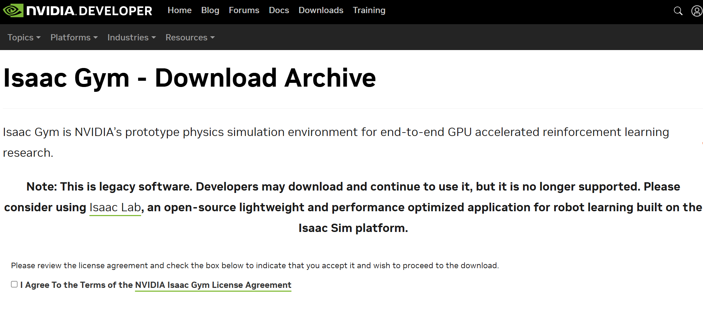
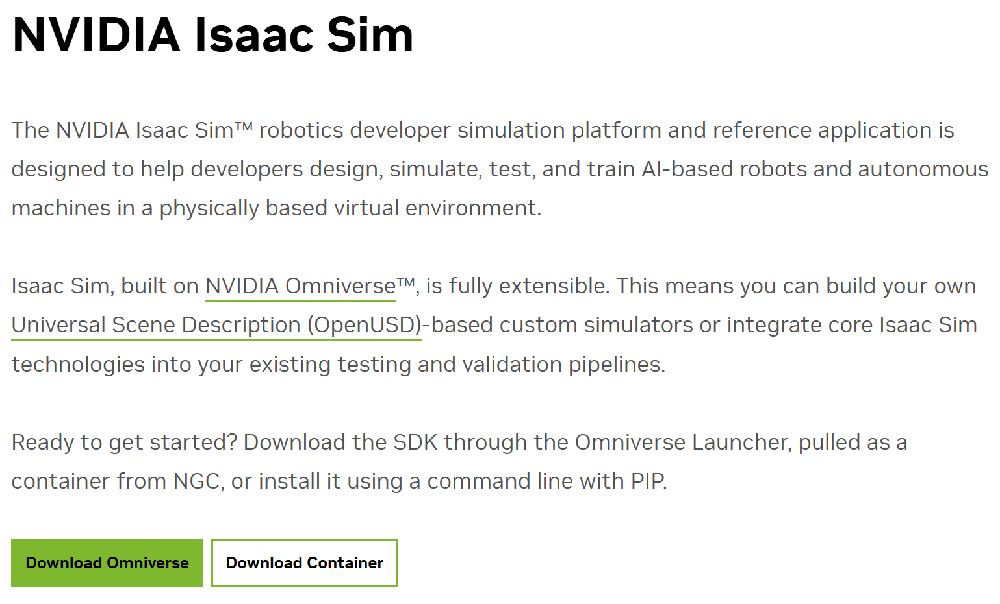

---

title: nvidia公司的机器人仿真环境的历史发展介绍（Isaac-Gym、Isaac-Sim）
 
description: 

#多个标签请使用英文逗号分隔或使用数组语法

tags: 杂谈

#多个分类请使用英文逗号分隔或使用数组语法，暂不支持多级分类
---

相关：

[NVIDIA机器人仿真项目 —— Isaac Gym - Preview Release](https://www.cnblogs.com/xyz/p/18173446)

 

本文说下NVIDIA公司的机器人仿真项目的一些历史发展。

NVIDIA公司的产品最初只有显卡，但是卖着卖着发现有很多人用CPU搞图形化设计，比如OpenGL，于是老黄大受启发，从此NVIDIA的显卡开发计算接口支持图形化计算，慢慢的NVIDIA的显卡被美国、中国等国家的超算机构所采用，于是NVIDIA公司就出现了家用游戏显卡和企业用计算显卡两种硬件产品以及图形化计算平台这个软件产品；随着AI时代的火热，Deep learning下的时代来临，NVIDIA公司在之前的三个产品（家用游戏显卡和企业用计算显卡两种硬件产品以及图形化计算平台）的基础上建立了AI模型库集成AI软件集成平台，然后随着AI平台在监督学习和无监督学习上集成的AI模型初具规模后，NVIDIA公司开始着眼于强化学习以及元宇宙概念，于是就有了NVIDIA公司的机器人仿真平台，这也是本文所要介绍的内容。

 

NVIDIA公司最初推出的机器人仿真平台是NVIDIA issac gym，这个项目一共出了四个版本，preview 1，preview 2，preview 3，preview 4，可以说这个issac gym是NVIDIA公司在机器人仿真方向上的大始祖，下面给出其中的第一、二、四版本的下载资源：

<https://openi.pcl.ac.cn/devilmaycry812839668/issac_gym_store>

由于是初代产品，因此这个Isaac gym平台只能够导入3D模型（urdf、mjdf文件），而不能提供3D设计的操作平台，并且将仿真平台和RL算法等AI算法集成在了一起，随着时间发展，这个产品逐渐成熟，于是在preview 4版本时将AI算法的接口和算法库单独拿了出来形成了IsaacGymEnvs项目：

https://github.com/NVIDIA-Omniverse/IsaacGymEnvs

 

由于NVIDIA公司认为机器人的AI平台是未来走向通用人工智能（AGI）的重要途径，于是不断加码这个领域的投入，于是就出现了多个部门同时在issac gym的基础上进行扩展开发，因此在issac gym项目抽取出issac gym envs项目后又将issac gym项目和issac gym envs项目升级为OmniIsaacGymEnvs项目，此时的重点是加强3D设计的操作界面做准备，也就是加入元宇宙概念，Omniverse：

<https://github.com/NVIDIA-Omniverse/OmniIsaacGymEnvs>

其实这里的元宇宙概念与之前的issac gym项目和issac gym envs项目的区别就是其内部的C++实现接口进行了升级，这样可以在下一个升级版本中加入3D设计的操作接口，这样就可以在一个项目中进行3D设计从而生成urdf和mjdf文件，而不需要从第三方仿真设计平台导入了，因此虽然说OmniIsaacGymEnvs是issac gym和issac gym envs的升级，但是对于使用者来说其实并没有太实质的变化，因为这个升级主要是为了服务其内部开发人员的。

 

在nvidia公司将issac gym和issac gym envs升级为OmniIsaacGymEnvs的同时也进行了fork操作，也就是在issac gym和issac gym envs的基础上又开了一个独立分支，这个分支也是为了元宇宙概念服务的，在这个新分支中考虑对更多的输入数据类型进行处理并且加入更多的AI模型的接入接口，于是有了orbit项目：

<https://github.com/NVIDIA-Omniverse/orbit>

 

因为NVIDIA公司的对机器人项目的投入是一个点开始，然后从一条线分出多条线独立发展，然后再将多条线合并到一起的发展路子，因此OmniIsaacGymEnvs和orbit都可以认为是issac gym项目基础上结合不同的元宇宙发展需要的后期接口进行fork后独立发展的，在issac gym项目分叉为OmniIsaacGymEnvs和orbit项目后，NVIDIA公司又决定将这几个项目合并成一个项目，这就是issac sim项目，地址：

<https://developer.nvidia.cn/isaac/sim>

可以说issac sim是NVIDIA公司的元宇宙技术平台的一个阶段性的汇总，在NVIDIA公司将issac gym项目升级为IsaacGymEnvs，然后再升级为OmniIsaacGymEnvs和orbit的同时，NVIDIA公司也在issac gym的最原始版本开出了其他路线的项目，如：Isaac ROS和Isaac Manipulator，其中Isaac ROS可以看做是issac gym和ROS软件平台的集成，而Isaac Manipulator可以看做是issac gym和视觉识别系统和动作规划系统的集成，于是issac gym发展成了今天的NVIDIA的issac家族，具体如下：

1、Isaac ROS：

https://developer.nvidia.cn/isaac/ros

体验参考指南标准：

https://img-bss.csdnimg.cn/bss/NVIDIA/IsaacROS.docx

2、Isaac Manipulator：

https://developer.nvidia.cn/isaac/manipulator

体验参考指南标准：

https://img-bss.csdnimg.cn/bss/NVIDIA/IsaacManipulator.docx

3、NVIDIA Isaac Sim：

https://developer.nvidia.cn/isaac/sim

体验参考指南标准:

https://img-bss.csdnimg.cn/bss/NVIDIA/IsaacSim.docx

 

issac sim可以看做是在issac gymenvs基础上加入了3D设计的图形化操作界面等支持其他功能接口的一次升级。

 

在NVIDIA推出NVIDIA issac家族后又进行了升级，推出了一个新产品，那就是issac Lab；issac Lab在issac sim基础上进行的，于是就从issac家族再次升级为issac Lab家族，其中issac Lab家族可以看做是在issac家族基础上加入了输入数据类型扩增的一次升级，因此在windows平台下issac sim平台就代表了issac lab平台，这二者是同义词，但是在Linux平台下二者有着不同的下载地址：

Isaac lab的主页地址：

https://developer.nvidia.com/isaac/lab?ncid=ref-inor-146211 

Isaac sim的主页地址：

https://developer.nvidia.com/isaac/sim/

 

可以说issac lab是在issac sim的基础上增加一些功能后的产品，可以看作是一次升级，因此现在NVIDIA的维护项目为issac sim和issac lab项目，而之前的issac gym/issac gym envs/OmniIsaacGymEnvs/orbit项目都已经不再维护了。

因为我是从issac gym项目就关注NVIDIA公司的产品，因为我是从事RL方向的，于是就发现了NVIDIA公司在同一个产品上不对的升级，而且是多部门从事搞，于是就fork出了多个项目，然后项目开发到一定时候就merge到一起，然后再开发遇到问题，然后再fork出分支，于是就出现了今天的这种要人感觉乱七八糟的感觉，如果是新人入手来学机器人的AI方向，那么之前的版本就可以不用太在意了，直接从issac sim和issac lab开始即可。

 

 

**扩展：**

issac-gym下载地址：

https://developer.nvidia.com/isaac-gym/download

 

**Isaac Sim主页地址：**

https://developer.nvidia.com/isaac/sim#isaac-lab

**docker安装方式地址：**

https://catalog.ngc.nvidia.com/orgs/nvidia/containers/isaac-sim

 

 

**个人github博客地址：**
[https://devilmaycry812839668.github.io/](https://devilmaycry812839668.github.io/ "https://devilmaycry812839668.github.io/")