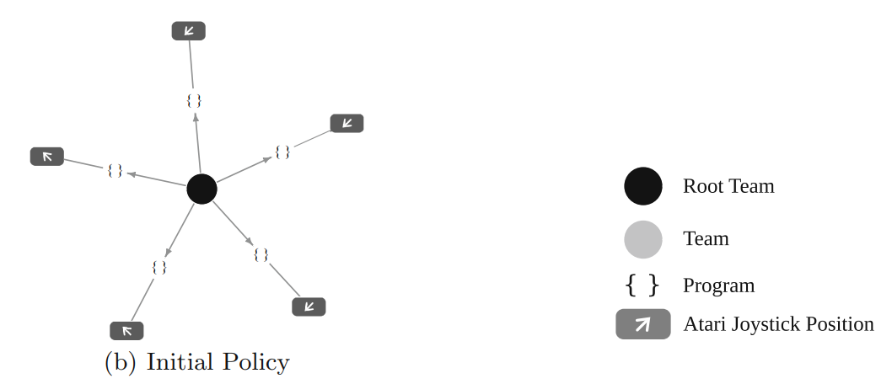
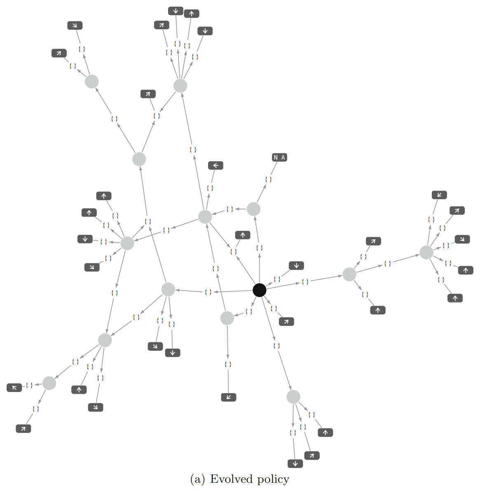
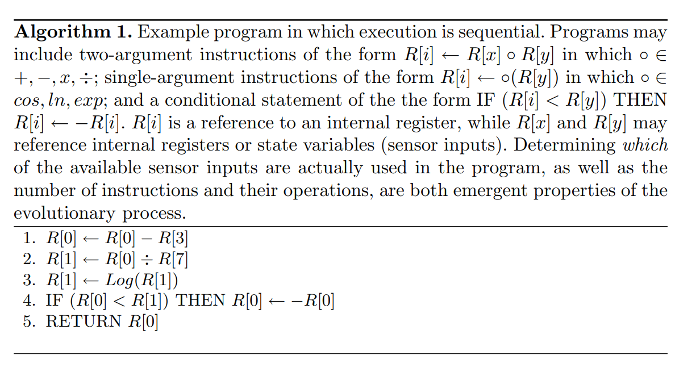
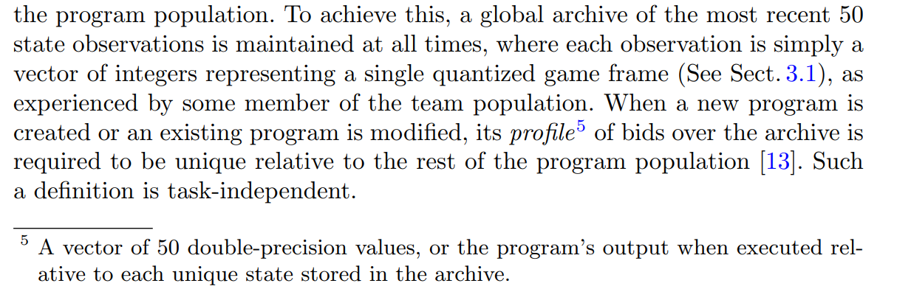
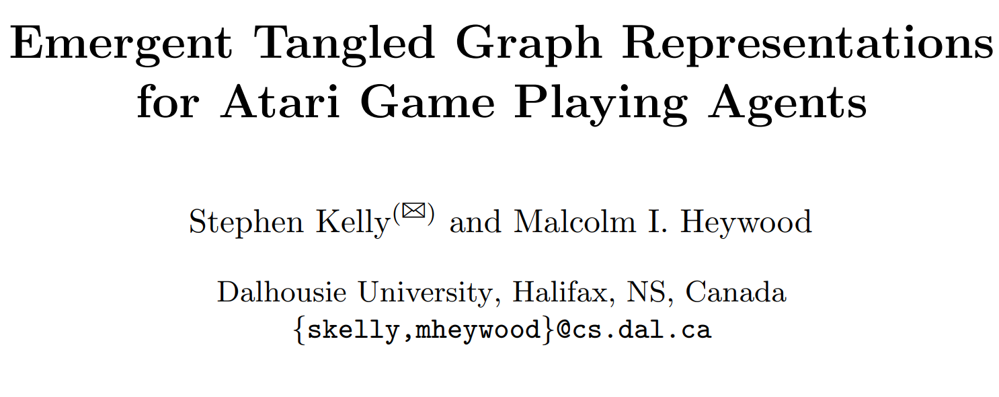
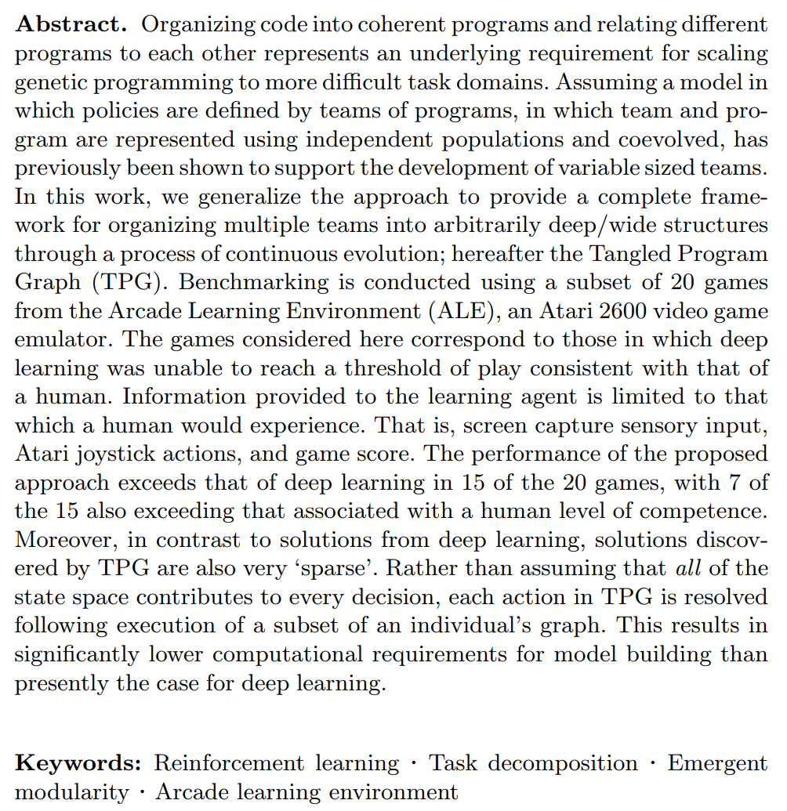

---

title: 遗传算法+强化学习—TPG—Emergent Tangled Graph Representations for Atari Game Playing Agents_2
 
description: 

#多个标签请使用英文逗号分隔或使用数组语法

tags: 杂谈

#多个分类请使用英文逗号分隔或使用数组语法，暂不支持多级分类
---

最近在看进化算法在强化学习(RL)领域的一些应用，有些论文中将使用进化算法解决强化学习问题的算法归为非强化学习算法，然而又有些论文把使用进化算法解决强化学习问题的算法归为强化学习算法，不过更多的论文是不讨论进化算法解决强化学习问题的，由此就出现了大多数论文只讨论使用MDP框架的解决强化学习问题的算法为强化学习算法；也正是因为在深度学习时代（Deep learning age）大家都在用神经网络和深层神经网络并使用梯度优化算法来求解也更加在形势上加重了进化算法解决强化学习问题是不是应该归为强化学习算法的这个分歧，这里我也说下个人的一些观点，我觉得不能因为其小众就不将其归为强化学习算法，而且如果严格按照解决强化学习问题的算法为强化学习算法的这种观点，那么使用进化算法解决强化学习问题自然是可以把这些类型的解决强化学习问题的进化算法归为强化学习算法的一类。

不过使用进化算法解决问题确实和其他的ML领域的算法有些不同，因为进化算法的算法本质就导致其不被强制限制于解决某一类问题，或者说进化算法可以用于所有的求解问题中，其所覆盖的范围是远超其他ML算法的，可以说不论是监督学习算法还是非监督学习算法其都是和问题所绑定的，也就是说监督学习算法只能解决监督学习问题，而非监督学习算法只能解决非监督学习问题，但是进化算法不同，进化算法这一个算法可以解决所有的计算机领域的模型求解问题，可能在很多问题的求解效率和性能不如监督学习算法和非监督学习算法，但是其普遍适用性却是其他算法无法比的。

之所以最近又关注起了进化算法在RL领域的应用，其主要原因是虽然Deep Learning的RL算法在多媒体的环境下表现突出，但是在传统的robotic问题中有很多控制问题是并不涉及多媒体数据的，这种情况和传统的控制问题并没有本质的不同的，而传统的控制问题在进化算法求解领域是有着很多积累的，为了参考这些传统控制问题中的进化RL，便有了本文。

 

遗传算法中在RL领域的常用算法类别，传统遗传算法、进化神经网络、CMA-ES、TPG等等，本文就讨论Tangled Program Graph (TPG)算法中的一些问题。

 

TPG算法的示意图：

  

 

部分算法过程：

 

根据上面的这个介绍可以知道，在TPG算法中需要保存最近的50个observation数据，这些数据是为了增加一个新的program的时候来判断这个program的新颖性的，把这50个observation分别放入到新生成的program中可以得到50个值，这50个值组成了这个program的一个类似id的标识，然后通过这种方式可以获得其他的已有的program的标识，然后根据这个新生成的program的标识是否和其他已有的program完全相同来判断其新颖性，如果在已有的program中存在和其相同的id的program则说明新生成的program不具备新颖性拒绝其加入program种群。

 

 

 

 

 

强化学习算法library库：(集成库)

https://github.com/Denys88/rl_games

https://github.com/Domattee/gymTouch

**个人github博客地址：**
[https://devilmaycry812839668.github.io/](https://devilmaycry812839668.github.io/ "https://devilmaycry812839668.github.io/")