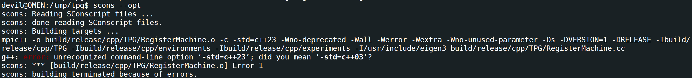

---

title: g++ error unrecognized command-line option ‘-std=c++23’; did you mean ‘-std=c++03’?
 
description: 

#多个标签请使用英文逗号分隔或使用数组语法

tags: 杂谈

#多个分类请使用英文逗号分隔或使用数组语法，暂不支持多级分类
---

编译一个C++的项目代码，报错：

g++: error: unrecognized command-line option ‘-std=c++23’; did you mean ‘-std=c++03’?

 

解决方法：

安装g++-11，修改系统中的默认指定，将g++系统路径指向新安装的g++-11路径。

 

 

强化学习算法library库：(集成库)

https://github.com/Denys88/rl_games

https://github.com/Domattee/gymTouch

**个人github博客地址：**
[https://devilmaycry812839668.github.io/](https://devilmaycry812839668.github.io/ "https://devilmaycry812839668.github.io/")