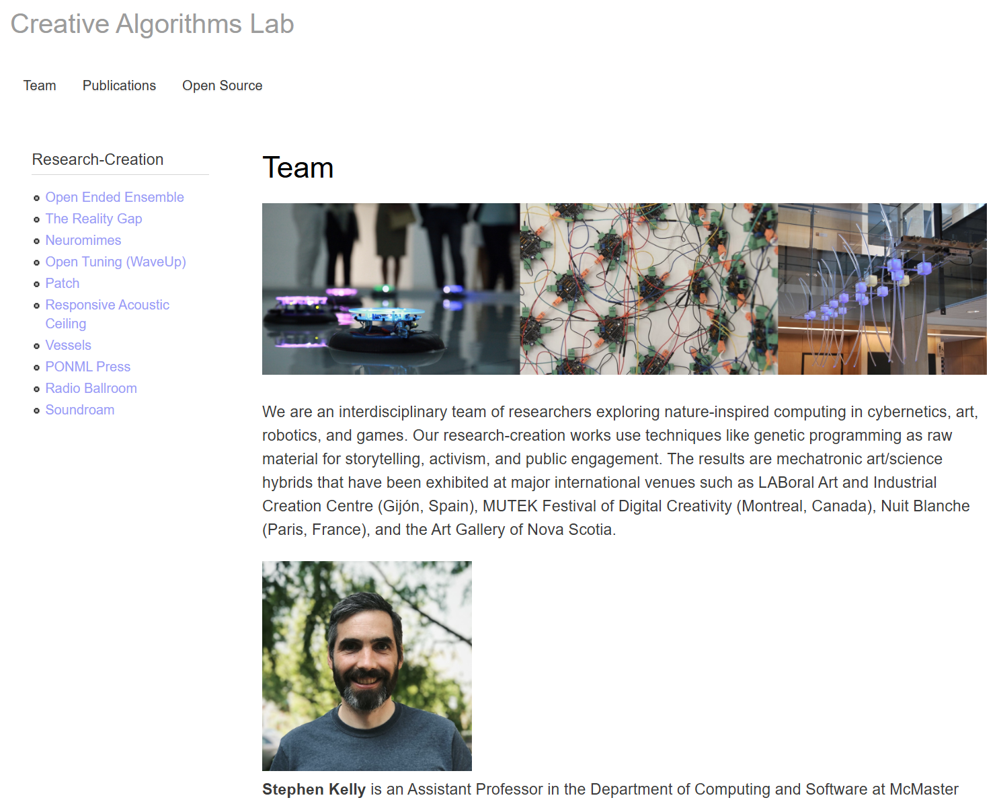
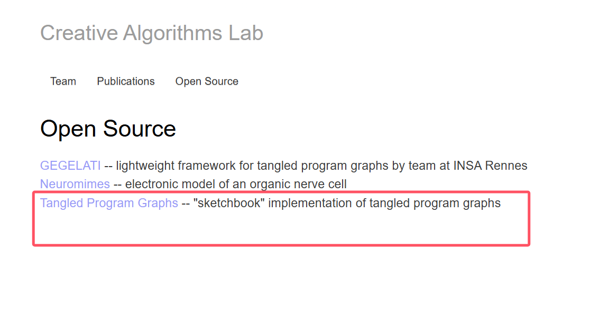
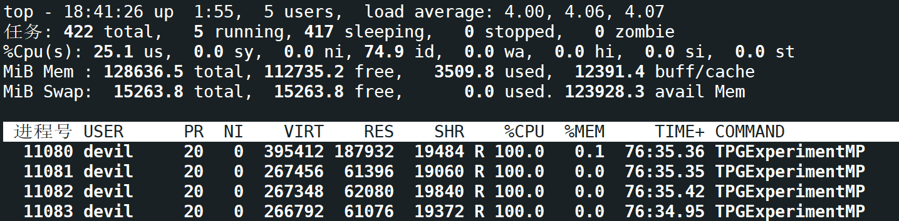

---

title: 强化学习算法——TPG算法（遗传编程GP算法）代码
 
description: 

#多个标签请使用英文逗号分隔或使用数组语法

tags: 杂谈

#多个分类请使用英文逗号分隔或使用数组语法，暂不支持多级分类
---

tpg算法是一个使用模块涌现和复用机制的遗传编程（GP）算法，该算法在一些强化学习问题上有着不错的表现，本文给出该算法的项目地址。

 

 

tpg算法的C++实现代码大概有1万的逻辑代码，如果这个比例换做使用python的话估计会有一定的减少，但是由于是逻辑代码，因此即使使用python代码重构的话代码量也不会有太明显的下降，同时由于该算法的计算量很大，因此难以取得比Deep learning下的DRL的性能优势，甚至在长期来看的话tpg算法是没有DRL性能好的，但是tpg算法同其他的进化算法一样在较短的时间内是会比DRL性能好的，举个例子，比如使用进行10000个episode的训练，每100个episode的数据收集后训练一次（tpg和DRL都如此），在1000 episodes的时候tpg性能优于DRL，但是很快tpg就进入到收敛状态，难以寻找更优解，但是这时DRL的性能曲线已经持续上升，最后在10000 episodes训练结束时很多情况下DRL会明显优于tpg，这一点或许也是当前背景下很多researcher不去研究tpg而是去研究DRL的原因。

由于tpg这样的进化算法运算量大，虽然运行早起有优势，但是后期难以达到DRL的性能，并且tpg这样的进化算法难以有较大的改进空间，并且编码难度极大（上万行的C/C++代码量是常事），因此如今已经很少有人去做tpg这样的进化算法了，不过作为解决AI的，或者说解决ML的最具通用性的黑盒优化算法，在科研领域依然有很小一部分人在做这个领域的研究。

一个难以进一步优化的，并且运算量大，代码实现极为困难的算法确实难以有人fellow的，不过tpg这样的算法不需要使用GPU，因为这类算法主要的操作是逻辑运算而不是矩阵的数值运算，并且如果在较短的优化周期内来看tpg这样的优化算法也确实有其优势的地方，但是如果在一个较长的优化周期来看那就不具备什么优势了；不过我个人任务tpg这样的算法没有太多人fellow的主要问题其实还是其代码实现难度极大，一个SOTA的相关deep learning的代码，如果使用pytorch、TensorFlow这样的框架的话，那么几百行的python代码就可以实现，与之相对比的是进化算法的上万行C++代码，甚至是近10万行的C++代码，这个工作量差的级别不是一个level的，deep learning方面的算法研究，从一个新的方向着手，从想idea，做实现，写论文，投稿，发表会议确认出版，总共时间可能是3个月，也可能是半年，但是对于绝大部门的AI从业者来说，一个上万行的C++代码（更有可能是近10万行的C++代码），可能把这上万行的C++代码弄明白怎么一个流程都或许不是三个月或者半年就能搞定的事情，很有可能这上万行的C++代码看了三个月然后就崩溃了，而其他人的论文都发表CCF A会都录用了，这中研究方向导致的成果差距也是极少有人能接受的，现在还在这个领域（进化算法）的researcher大多都是远古时期（20、30年前）就已经从事这个方向的研究者，可以说进化算法领域的AI研究也是一个濒危方向。

 

 

- [x] unused_code_chunks.cpp 调试代码，实际项目的运行中并没有使用。
- [x] sequence_comparisons.h  计算两个double数组或两个double类型的vector的距离（欧式距离等等距离的度量，输入为矢量，结果为标量）
- [x] state.h
- [x] memoryEigen.h
- [x] instruction.h
- [x] instruction.cc
- [ ] 

 

 

 

项目所属实验室地址：

<https://creativealgorithms.ca/>

 

tpg算法的项目代码地址：

<https://gitlab.cas.mcmaster.ca/kellys32/tpg/>

> This code reproduces results from the paper:
>
> Stephen Kelly, Tatiana Voegerl, Wolfgang Banzhaf, and Cedric Gondro. Evolving Hierarchical Memory-Prediction Machines in Multi-Task Reinforcement Learning. Genetic Programming and Evolvable Machines, 2021. [pdf](https://rdcu.be/czd3s)

 

该项目代码经验证真实可运行：

 

 

强化学习算法library库：(集成库)

https://github.com/Denys88/rl_games

https://github.com/Domattee/gymTouch

**个人github博客地址：**
[https://devilmaycry812839668.github.io/](https://devilmaycry812839668.github.io/ "https://devilmaycry812839668.github.io/")