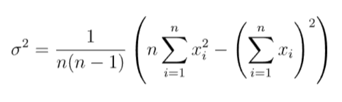
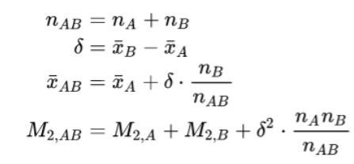
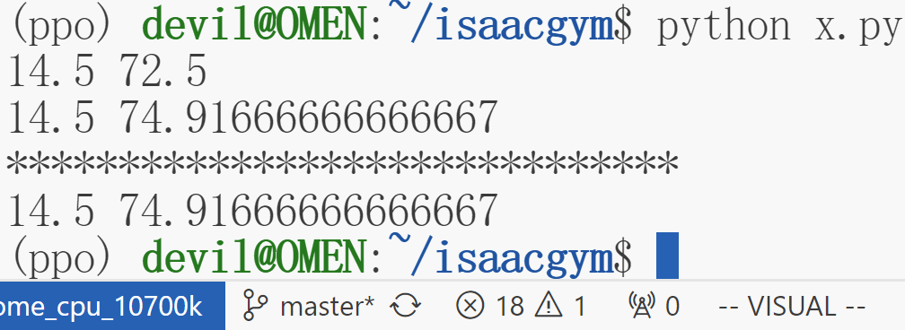

---

title: 如何动态计算样本均值和方差—running_variance和running_mean的计算
 
description: 

#多个标签请使用英文逗号分隔或使用数组语法

tags: 杂谈

#多个分类请使用英文逗号分隔或使用数组语法，暂不支持多级分类

---

相关：

###### [已知两个数列各自的均值和方差，如何快速求出两个数列拼合后的均值和方差](https://www.cnblogs.com/xyz/p/18032081)

###### [从baselines库的common/vec_env/vec_normalize.py模块看方差的近似计算方法](https://www.cnblogs.com/xyz/p/16113597.html)

###### [Accurately computing running variance —— 已知两个数列各自的均值和方差，如何快速求出两个数列拼合后的均值和方差（续）](https://www.cnblogs.com/xyz/p/18032718)

<br/>

本文介绍如何计算running_variance和running_mean。

<br/>

running_variance和running_mean是指动态计算数据样本的方差和均值，一般用于持续不断增加的数据集时，如果一个数据集的数据持续增加，那么我们只需要记录running_variance和running_mean以及总的数据量n就可以快速的计算出动态增加数据后的总的均值和方差。

数据量持续增加时均值是容易计算的，因为我们保留的总数据量和running_mean是可以快速的和新增加的数据计算出总的数据下的新的均值的，但是对于方差的计算却很难直观的进行计算。

<br/>

**第一种方法：**（源自：[Accurately computing running variance —— 已知两个数列各自的均值和方差，如何快速求出两个数列拼合后的均值和方差（续）](https://www.cnblogs.com/xyz/p/18032718)）

该种计算方式可以只保存历史数据的平方和，与历史数据的和；

需要知道动态加入数据的具体数值，也或者知道加入数据的平方和均值以及个数。


具体：




<br/>

**第二种方法：**（源自：[已知两个数列各自的均值和方差，如何快速求出两个数列拼合后的均值和方差](https://www.cnblogs.com/xyz/p/18032081)）

该种方法的重点是要快速求出数列Z的均值方差，或者可以换一种问法，那就是知道数列A的均值和方差和个数，也知道数列B的均值和方差和个数，但是不知道数列A和数列B的具体值，现在要求拼合后的数列Z的均值和方差。



其中，$running\_variance=M_{2,AB} / n_{AB}$ 

<br/>

**第三种方法：**

该种方法需要知道running_mean和running_variance，并且需要知道新加入的数据的具体数值。


给出实现代码：

```python
import numpy as np


num_steps = 0

running_variance = 0
running_mean=0

def update_normalization(observation ):
    global num_steps

    global running_variance
    global running_mean

    num_steps += observation.shape[0]
    input_to_old_mean = observation - running_mean
    mean_diff = np.sum(input_to_old_mean / num_steps)
    running_mean = running_mean + mean_diff
    input_to_new_mean = observation - running_mean
    var_diff = np.sum(input_to_new_mean * input_to_old_mean)
    # var_diff = input_to_new_mean * input_to_old_mean
    running_variance = running_variance + var_diff


# for x in range(30):
#     update_normalization(np.array([x]))
update_normalization(np.arange(10))
update_normalization(np.arange(10,20))
update_normalization(np.arange(20,30))


print(running_mean, running_variance/(num_steps+1))
print(running_mean, running_variance/(num_steps))

print("*"*30)
print(np.mean(np.arange(30)), np.var(np.arange(30)))
```

测试结果：



<br/>

该实现代码源自：

https://openi.pcl.ac.cn/devilmaycry812839668/google_brax_ppo_pytorch

其在项目中的具体实现为：

```
  @torch.jit.export
  def update_normalization(self, observation):
    self.num_steps += observation.shape[0] * observation.shape[1]
    input_to_old_mean = observation - self.running_mean
    mean_diff = torch.sum(input_to_old_mean / self.num_steps, dim=(0, 1))
    self.running_mean = self.running_mean + mean_diff
    input_to_new_mean = observation - self.running_mean
    var_diff = torch.sum(input_to_new_mean * input_to_old_mean, dim=(0, 1))
    self.running_variance = self.running_variance + var_diff

  @torch.jit.export
  def normalize(self, observation):
    variance = self.running_variance / (self.num_steps + 1.0)
    variance = torch.clip(variance, 1e-6, 1e6)
    return ((observation - self.running_mean) / variance.sqrt()).clip(-5, 5)
```


<br/>

<br/>

**个人github博客地址：**
[https://devilmaycry812839668.github.io/](https://devilmaycry812839668.github.io/ "https://devilmaycry812839668.github.io/")