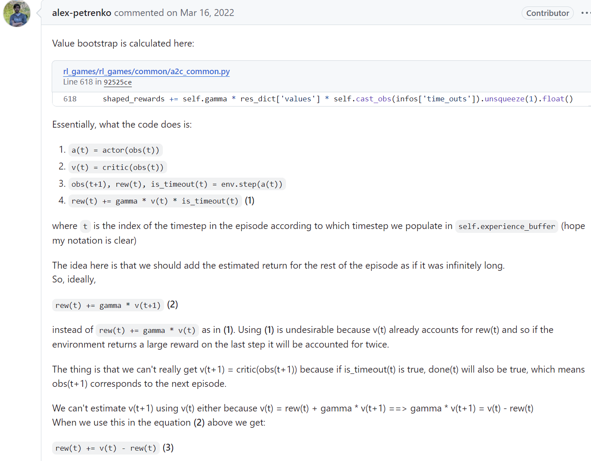
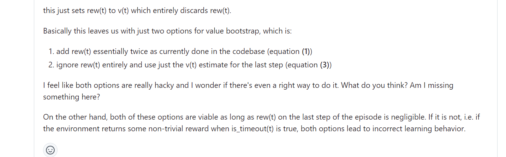

---

title: 强化学习-如何处理截断的情况
 
description: 

#多个标签请使用英文逗号分隔或使用数组语法

tags: 杂谈

#多个分类请使用英文逗号分隔或使用数组语法，暂不支持多级分类

---

相关：

###### [强化学习：如何计算被环境系统截断的terminated state的value值 —— (Bootstrap returns from value estimates if episode is terminated by timeout)](https://www.cnblogs.com/xyz/p/18434594)

https://github.com/Denys88/rl_games/issues/128

<br/>

参考一个外网的帖子：





上面的这个帖子是一个领域中很有名的RL library中的实现，这种对于截断情况的实现是对截断前的timestep的nextstep的V值采用截断前的timestep的V值进行近似。


关于该种对截断处理的方法的相关分析可以参考：

[强化学习：如何计算被环境系统截断的terminated state的value值 —— (Bootstrap returns from value estimates if episode is terminated by timeout)](https://www.cnblogs.com/xyz/p/18434594)

<br/>

可以说上面的这种对于截断的处理是一种近似的方法，而这种近似的好坏是由多种因素所决定的，不过对于大多数情况下都是可以work的，在这种处理截断的方法之外又看到了另一个项目中的对阶段的处理，具体为：

https://openi.pcl.ac.cn/devilmaycry812839668/google_brax_ppo_pytorch


```python
  @torch.jit.export
  def compute_gae(self, truncation, termination, reward, values,
                  bootstrap_value):
    truncation_mask = 1 - truncation
    # Append bootstrapped value to get [v1, ..., v_t+1]
    values_t_plus_1 = torch.cat(
        [values[1:], torch.unsqueeze(bootstrap_value, 0)], dim=0)
    deltas = reward + self.discounting * (
        1 - termination) * values_t_plus_1 - values
    deltas *= truncation_mask

    acc = torch.zeros_like(bootstrap_value)
    vs_minus_v_xs = torch.zeros_like(truncation_mask)

    for ti in range(truncation_mask.shape[0]):
      ti = truncation_mask.shape[0] - ti - 1
      acc = deltas[ti] + self.discounting * (
          1 - termination[ti]) * truncation_mask[ti] * self.lambda_ * acc
      vs_minus_v_xs[ti] = acc

    # Add V(x_s) to get v_s.
    vs = vs_minus_v_xs + values
    vs_t_plus_1 = torch.cat([vs[1:], torch.unsqueeze(bootstrap_value, 0)], 0)
    advantages = (reward + self.discounting *
                  (1 - termination) * vs_t_plus_1 - values) * truncation_mask
    return vs, advantages
```

通过上面的代码可以知道该种方法中对于截断情况时是直接将截断前的那个timestep忽略掉，比如一个episode由timestep0，timestep1，timestep2，timestep3，timestep4所组成，而timestep4后面的则是被截断掉了，这5个timestep所对应的V值分别为V0、V1、V2、V3、V4，之前的方法是通过近似的方法获得target_V4，而上面的这个代码实现是直接忽略掉V4，也就是不对timestep4进行计算，该种方法通过牺牲掉少量的样本数据从而避免了由于处理截断时采用近似造成的可能出现近似误差。可以看到，上面的实现代码中，如果对应的timestep后面被截断，那么这个timestep的advantage由于乘以truncation_mask从而变成0，该timestep对应的V值中的vs_minus_v_xs也由于truncation_mask变为0，这样就导致vs=values，从而在error_loss=(vs-values)**2的计算中导致这个timestep也不会参与计算。


从上面的这个代码的实现中我们可以知道，对于截断的情况下除了采取近似的方法以外我们也可以采取忽略其之前的一个timestep的计算的方法来进行处理，这样牺牲少量的数据而避免了近似所导致的误差，而且最为重要的是这种通过计算truncation_mask的方法是易于计算和处理的，也避免了在多环境并行的情况下增加处理步骤而导致的花销，避免了大规模计算中的对于截断处理的低效开销。


<br/>

<br/>

**个人github博客地址：**
[https://devilmaycry812839668.github.io/](https://devilmaycry812839668.github.io/ "https://devilmaycry812839668.github.io/")