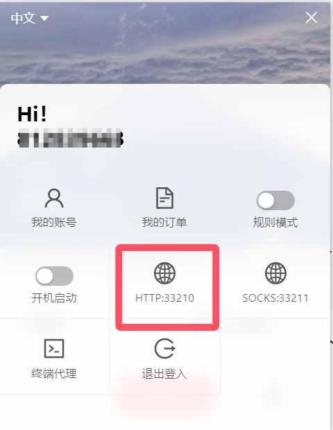

---

title: python语言实现_通过端口转发实现跨网络（多网络之间）通信_science_network
 
description: 

#多个标签请使用英文逗号分隔或使用数组语法

tags: 杂谈

#多个分类请使用英文逗号分隔或使用数组语法，暂不支持多级分类

---


本文使用python语言实现了一个端口转发的程序，该程序可以实现多网络之间的信息通信，当然这里有个前提，那就是多个网络都在一台主机上有可以连通的端口。

<br/>

之所以有这个编写代码的需求，是因为最近使用的science network工具不大好用了，于是就要博士同学发给我一个好用些的来，固然发现同学用的那个工具更好用，效果如下：


<br/>

虽然这个工具好用，但是用着用着就发现了问题，那就是这个工具只能支持本机上网，而和其他的同类工具不同，其他的同类工具都是可以支持局域网中其他主机的请求的，而这个就导致了一定的问题，比如我需要使用GitHub，使用huggingface，等等，而我一般都是在workstation上用这些应用的，而workstation上的系统又是Linux系统，而这个朋友发给我的这个工具又是只能运行在Windows系统上的，并且最为可气的是这个工具只接收localhost的端口转发，而不能只是局域网中其他主机的请求的，这样就导致我的工作电脑（Linux系统）是无法通过这个工具来连接huggingface这样的应用的，为此就想到了自己编写一个代码来实现这中间的gap。

<br/>

一开始想的是自己手动编写这样的代码，但是考虑到比较耗时，并且个人使用，也不需要什么代码优化，也不追求什么性能，于是就想到了使用ChatGPT来自动生成一个，于是得到了下面的代码：

```python
import socket
import threading

# 转发函数
def forward(source, destination):
    while True:
        try:
            data = source.recv(4096)
            if not data:
                break
            destination.sendall(data)
        except Exception as e:
            print(f"Connection error: {e}")
            break

# 处理单个客户端连接
def handle_client(client_socket, target_host, target_port):
    try:
        # 连接到目标地址
        target_socket = socket.socket(socket.AF_INET, socket.SOCK_STREAM)
        target_socket.connect((target_host, target_port))
        
        # 创建两个线程：分别转发客户端到目标和目标到客户端的数据
        threading.Thread(target=forward, args=(client_socket, target_socket)).start()
        threading.Thread(target=forward, args=(target_socket, client_socket)).start()
    except Exception as e:
        print(f"Error handling client: {e}")
        client_socket.close()

# 主端口转发逻辑
def start_port_forwarding(local_host, local_port, target_host, target_port):
    server = socket.socket(socket.AF_INET, socket.SOCK_STREAM)
    server.bind((local_host, local_port))
    server.listen(15)
    print(f"[*] Listening on {local_host}:{local_port} and forwarding to {target_host}:{target_port}")

    while True:
        client_socket, addr = server.accept()
        print(f"[*] Accepted connection from {addr}")
        threading.Thread(target=handle_client, args=(client_socket, target_host, target_port)).start()

if __name__ == "__main__":
    # 配置端口转发信息
    LOCAL_HOST = "0.0.0.0"  # 本地监听地址
    LOCAL_PORT = 8888       # 本地监听端口
    TARGET_HOST = "127.0.0.1"  # 目标地址（替换为实际地址）
    TARGET_PORT = 33210           # 目标端口

    # 启动端口转发
    start_port_forwarding(LOCAL_HOST, LOCAL_PORT, TARGET_HOST, TARGET_PORT)

```

事实证明ChatGPT自动生成的这个端口转发代码还是比较好用的，这样就可以在个人手机上也可以看YouTube了。

<br/>

这里需要注意的是端口的设置，我们可以看到下图中这个工具的本地接受的端口号为HTTP下的33210，于是在我们的这个代码中就需要将TARGET_PORT设置为33210，由于是本地的端口转发，因此本地的IP设置为127.0.0.1，由于我们的这个代码实现的是对局域网中的请求的接收并转发给TARGET_PORT，因此我们的LOCAL_HOST需要设置为0.0.0.0，这样就可以接收局域网中的请求，而如果设置为“127.0.0.1”，那么依然无法实现对局域网中请求的接收。我们的LOCAL_PORT的设置可以比较随意，这个端口号是暴露给局域中的其他主机进行网络设置时使用的。



<br/>

其他主机上（局域网中其他主机）的网络设置：


这里的IP：192.168.1.110，就是运行这个代码和这个science network的工具的Windows主机的IP地址。

<br/>

<br/>

**个人github博客地址：**
[https://devilmaycry812839668.github.io/](https://devilmaycry812839668.github.io/ "https://devilmaycry812839668.github.io/")