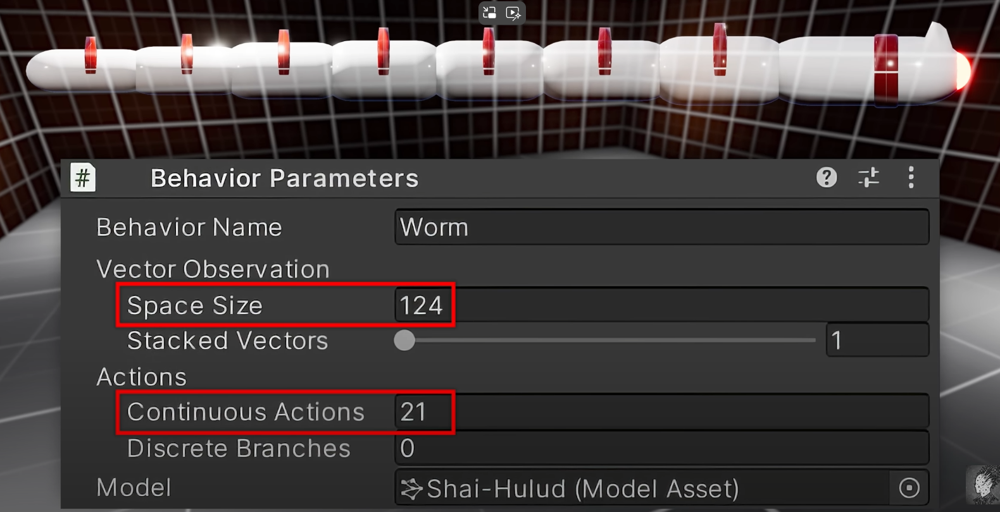
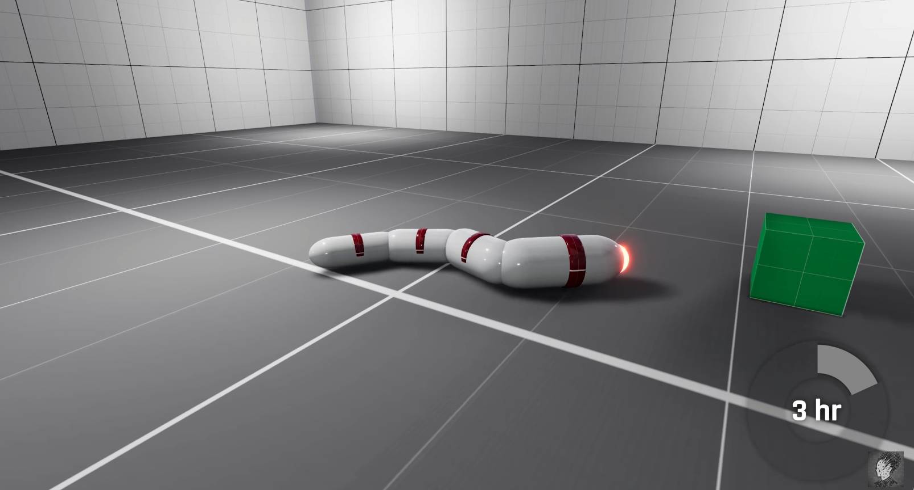
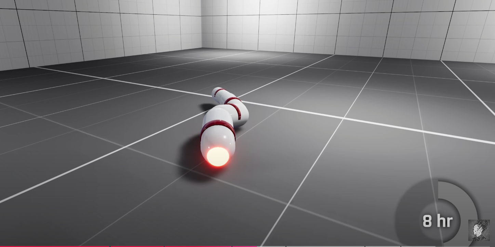
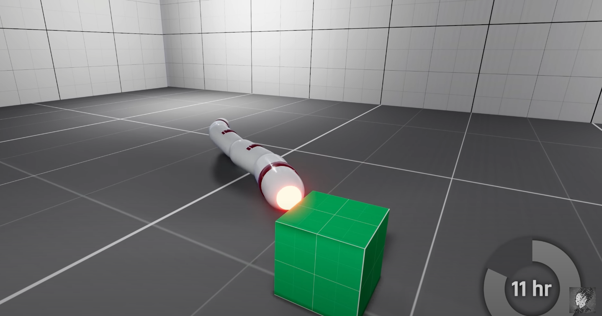
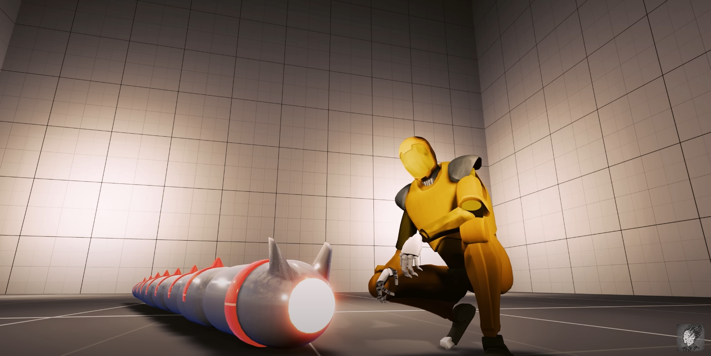

---

title: 强化学习问题中适当的增加反应时长可能会更有利于训练
 
description: 

#多个标签请使用英文逗号分隔或使用数组语法

tags: 杂谈

#多个分类请使用英文逗号分隔或使用数组语法，暂不支持多级分类
---

强化学习问题中适当的增加反应时长可能会更有利于训练。

看到一个视频 [I Trapped this AI Worm in a Dark Room for 1000 Simulated Years](https://www.youtube.com/watch?v=dqL66xD2b2s) ，在视频中是使用强化学习算法训练一个蠕虫机器人运动，在一开始的仿真实验中机器人的建模是没有为关节设置阻尼的，然后机器人agent的action反应时间为1秒，也就是说机器人每次的observation采样后返回动作的这个过程是每一秒发生一次的，我们可以认为机器人的observation采样的时间周期是一秒，但是经过实验发现这样的环境下并不能训练出性能可以接受的阿根廷，于是在为机器人关节设置阻尼并将动作反应时间设置为5秒后并增大神经网络的层数后就使agent的性能有了明显的提升。

 

解决强化学习问题时，在视频类的游戏环境下，我们一般都是同步的交互环境，也就是游戏的每一帧画面间的切换都需要agent发送某个动作后才会发生，一般我们认为agent的反应速度越快越好，但是这个实验告诉我们这或许并不是事实；对于一些问题来说，agent适当的增加反应时间或许更好，比如这里提到的这个蠕虫机器人控制的问题中，如果agent不是1秒一次反馈动作，而是5秒一次反馈一次动作，那么agent发送动作给机器人后都会有5秒的间隔，而机器人可以在这5秒的时间内执行完动作，并且在阻尼的限制下停顿到一个相对稳定的状态，这时agent在反馈给机器人下一步的action，不过要注意，这里的蠕虫机器人环境是异步的交互环境，也就是说机器人环境状态在每一帧之间切换时是不需要实时接受agent的action的，这也是为什么这个问题中存在间agent对环境采样observation的时间周期从一秒调为5秒。

 

在这里的这个问题中，增加action的反应周期最大的原因是为了保证机器人进入到一个相对稳定的动作后再执行动作，因为蠕虫机器人在执行完上一个动作后很可能会出现身体悬空的状态，或者至少存在部门关节或身体部位悬空，更有可能是整个蠕虫机器人悬空，这时候如果action的周期过短（observation的采样周期过短），那么就会出现蠕虫机器人在半空中乱舞的奇怪现象，而这种情况的出现会导致PPO这样的强化学习算法收集到不利于算法训练的数据，从而导致算法难以训练，反之，如果我们适当增加action的反应周期，比如每5秒agent给出一个action，那么蠕虫机器人就有时间在上一个执行动作完成后进入到一个相对平稳的状态（极有可能是进入到一个静止或者是相对平稳的状态或者是贴地的状态），而这样的情况更利于算法训练。

与之相同的问题背景，如果我们要控制一个人形机器人走路，我们的每个动作的反馈应该在上个动作执行后机器人迈开的脚落地平稳后再执行下一个action，如果action的周期过短，那么就会出现机器人执行一个动作后迈开左脚然后在左脚还没有落地的情况下就驱动右脚动作，这样就会导致机器人失稳摔倒；当然，这里都是在仿真环境下进行讨论的，在实际的现实环境下进行操作还是有其他的一些问题的，不过该问题的存在是普适的，并且在实际的人行机器人问题中会更加复杂，如果action周期过长那么不利于机器人的姿态调整，但是action周期过短如何控制action的执行平稳性就又是一个问题，对此我认为在蠕虫机器人中设置5秒的反应周期其目的就是使蠕虫机器人进入到相对平稳的状态，而人形机器人则可以考虑上个动作执行后脚步落地动作完成后再进行一个action的执行。

 

 

 

 

 

 

强化学习算法library库：(集成库)

https://github.com/Denys88/rl_games

https://github.com/Domattee/gymTouch

**个人github博客地址：**
[https://devilmaycry812839668.github.io/](https://devilmaycry812839668.github.io/ "https://devilmaycry812839668.github.io/")