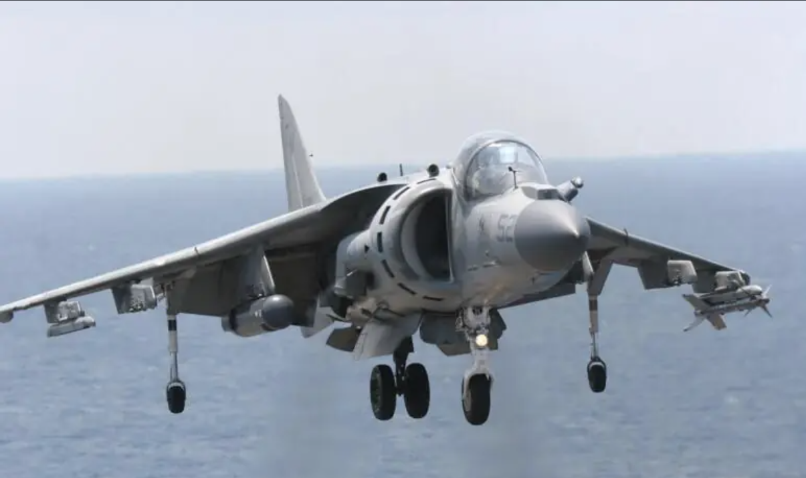

---

title: 应不应该研发垂直起降战斗机
 
description: 

#多个标签请使用英文逗号分隔或使用数组语法

tags: 杂谈

#多个分类请使用英文逗号分隔或使用数组语法，暂不支持多级分类
---

虽然我是搞machine learning research的，但是由于比较水，而且平时也比较水，所以喜欢看看新闻，今天看新闻关于我国的战斗机的这个问题，于是想到了这么一个相关问题：应不应该研发垂直起降战斗机？

 

众所周知的问题，我国的战斗机的研发一直是落后于美国的，不论是飞机的发动机，还是武器系统，还是控制系统等等，不过最近几年由于有了新一代的战斗机的出现，再加上航电系统的升级，所以近几年来我国的战斗机除了发动机以外基本撵上了美国的水平，后来最近两年我国又上线了自研的新型的发动机，于是我国的战斗机发展水平几乎撵上了美国水平，不过纵观中美两个的战斗机的配置，很容易发现目前我国和美国在战斗机方面还有一个空白，那就是我国没有**垂直起降战斗机**。

从美国的发展历史来看，可以知道垂直起降战斗机问题是很多的，安全性差，难维护，应用场景有限，操纵复杂，故障率事故率高，等等，可以说垂直起降战斗机是一种鸡肋一样的存在，但是欧美很多国家都有垂直起降战斗机，这说明这东西也不是完全的没用；要知道垂直起降战斗机的这种可以垂直起降的方式就是最大的优势，该种飞机不仅可以在航空上节省空间（不需要使用跑道），并且适合复杂的多种环境下起降，在特殊环境下的作战往往有出其不意的效果。

在我国看来有些东西虽然看着很鸡肋，但是不能没有，我们可以把其优先级放到最后，但是不能不考虑，要知道在植树种林的过程中最大的一个忌讳就是过于密集的种植同一种树木，作战武器重要的是各类别都要全；要知道谁也不清楚多久后我国的海军也会走向远洋，如果在进行远洋作战或者的一些特殊地形环境下作战（山谷、城市、岛礁），这时候使用垂直起降战斗机往往可以有更大的发挥空间；因此，我的观点是有些东西的研发并不是要其发挥多大的效用，而是敌人有那么我们也要有，有些东西存在手上总比没有的强，我们可以垂直起降战斗机的研发放到最后，但是不能说不考虑，或许真的有一天垂直起降战斗机会派上用途呢，有备无患总是好的，从战略考量上来看我们也是应该在有能力的时候进行技术储备的。

弄不好哪天真有了垂直起降战斗机，我们可以用来做埋伏作战呢，比如在某个山谷基地里面放几个垂直起降战斗机，然后周边没有跑道，当敌人逼近时突然垂直起降升空进行突击作战呢，或者是搞成无人的垂直起降战斗机，专打伏击或山谷作战呢。

 

 

 

强化学习算法library库：(集成库)

https://github.com/Denys88/rl_games

https://github.com/Domattee/gymTouch

**个人github博客地址：**
[https://devilmaycry812839668.github.io/](https://devilmaycry812839668.github.io/ "https://devilmaycry812839668.github.io/")