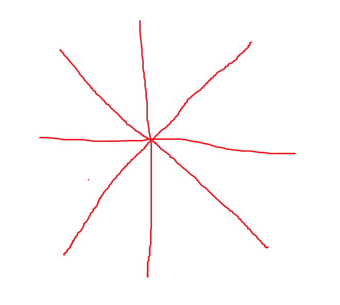
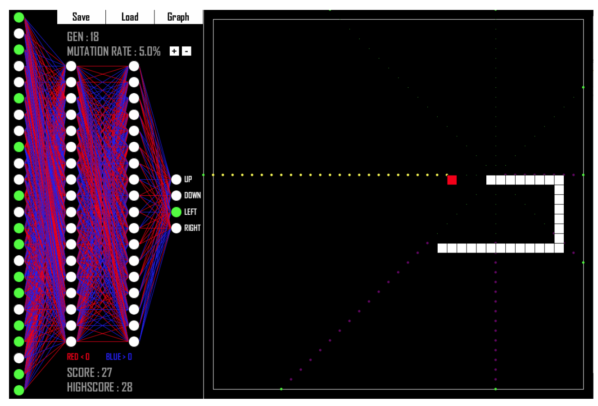
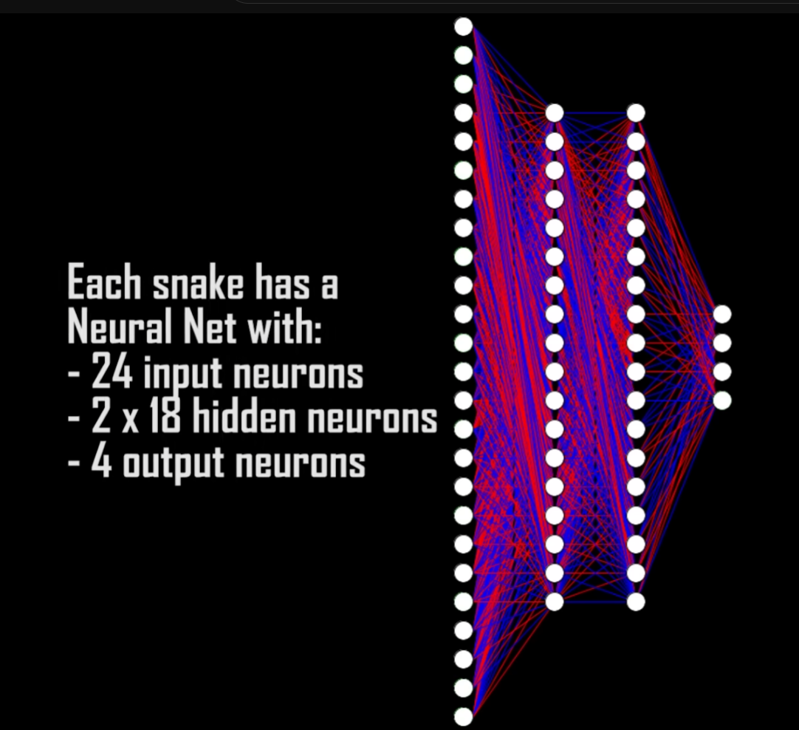
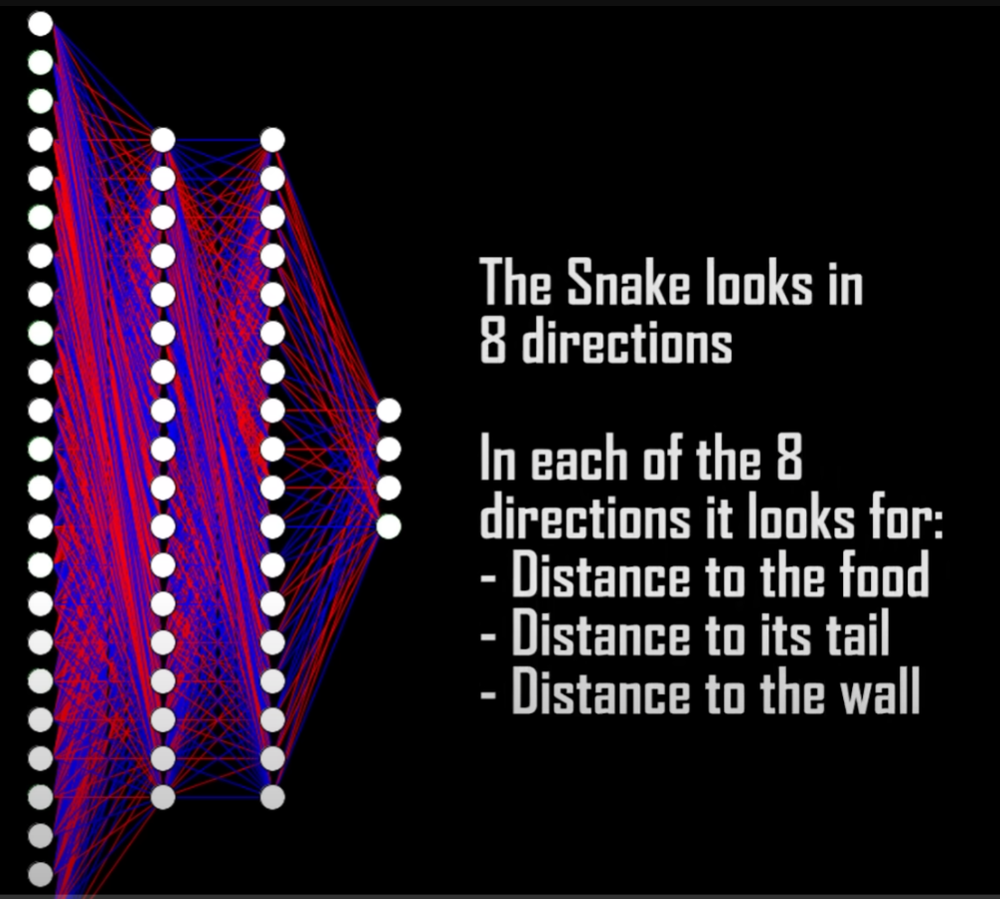
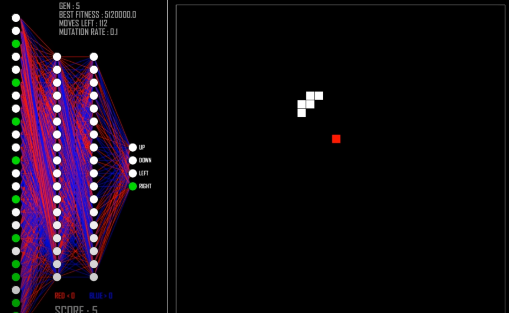

---

title: 如何使用强化学习算法解决贪吃蛇问题（Neural Network Learns to Play Snake）
 
description: 

#多个标签请使用英文逗号分隔或使用数组语法

tags: 杂谈

#多个分类请使用英文逗号分隔或使用数组语法，暂不支持多级分类
---

**相关：**

[Neural Network Learns to Play Snake](https://www.youtube.com/watch?v=zIkBYwdkuTk)

https://github.com/greerviau/SnakeAI/

 

RL算法是有很多baseline算法的，算法library也是比较多的，因此使用ML/RL求解贪吃蛇问题的难点其实在于问题建模而不是使用RL方法求解。

在上面的相关链接中可以知道，这里面的建模方法为：

我们建设蛇的头可以发射8个射线，分别是8个方向，间隔45度角，具体如下：

每个射线返回三个数值，分别是这个射线方向上食物、蛇身体、墙体到蛇头的距离，由此可以得到8*3=24个数值，该数值组成输入向量，输入到神经网络中，表示当前的蛇的状态，这样就完成了贪吃蛇的问题建模。

**注意：**

该问题的建模中蛇的头是没有方向的，也就是说蛇头是没有朝向的，蛇头可以想象为一个点，游戏中是以一个方格的形式出现。

 

### Vision

The snake can see in 8 directions. In each of these directions the snake looks for 3 things:

- Distance to food
- Distance to its own body
- Distance to a wall

3 x 8 directions = 24 inputs. The 4 outputs are simply the directions the snake can move.

 

 

上面给出的是使用机器学习算法解决贪吃蛇问题，其实使用ML/RL方法解决贪吃蛇问题并不是最高效率的方法，由于贪吃蛇问题是可以使用数学方式求解析解的，或者使用数据结构建立好用算法策略来求解，总之，使用启发式算法或者数学解析解的方法可以更高效率求解贪吃蛇问题，不过由于本文主要是研究Reinforcement Learning问题，因此其他方法求解该问题不具体展开，下面给出其他方法的相关资料。

 

**其他方法解决贪吃蛇问题：**

[How to Win Snake: The UNKILLABLE Snake AI](https://www.youtube.com/watch?v=TOpBcfbAgPg)

https://github.com/BrianHaidet/AlphaPhoenix/tree/master/Snake_AI_(2020a)_DHCR_with_strategy

 

 

强化学习算法library库：(集成库)

https://github.com/Denys88/rl_games

https://github.com/Domattee/gymTouch

**个人github博客地址：**
[https://devilmaycry812839668.github.io/](https://devilmaycry812839668.github.io/ "https://devilmaycry812839668.github.io/")