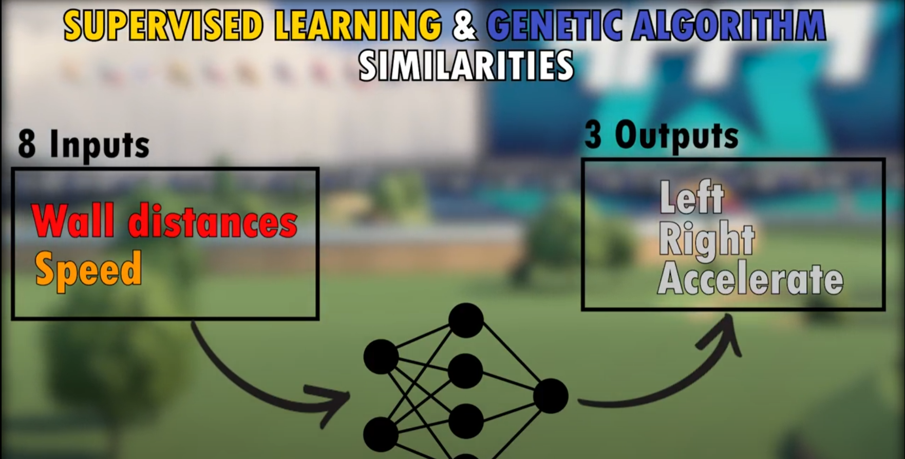
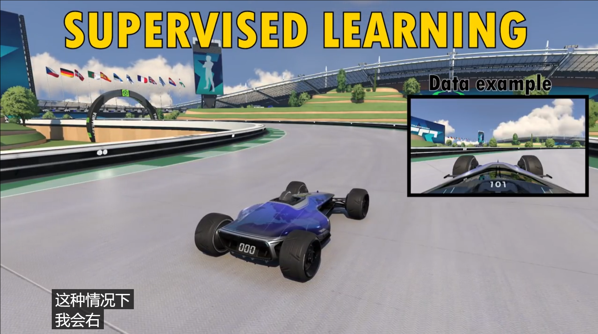
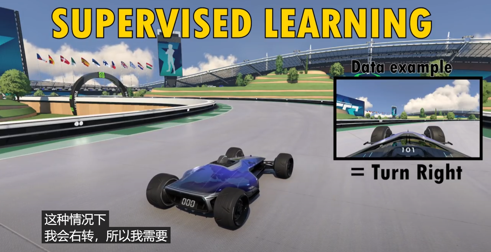

---

title: 如何将强化学习问题转换为监督学习问题
 
description: 

#多个标签请使用英文逗号分隔或使用数组语法

tags: 杂谈

#多个分类请使用英文逗号分隔或使用数组语法，暂不支持多级分类
---

**相关：**

[A.I. teaches itself to drive in Trackmania](https://www.youtube.com/watch?v=a8Bo2DHrrow)

 

如何将强化学习问题转换为监督学习问题？

强化学习算法和监督学习算法有什么区别这里就不讨论了，这属于基本level的问题，强化学习和监督学习的一个不同在于强化学习需要进行问题建模，而监督学习问题往往是给出的问题即为建模后的问题，于是这里就出现了这么一个事情，那就是强化学习问题能否在建模的时候转为监督学习问题，注意，这里说的是问题之间的转换而不是算法之间的转换（弄不清什么是问题和什么是算法的区别的需要注意这一点）；可以说算法之间是无法转换的，但是问题可以转换，因为我们在问题建模的时候可以考虑从其他方面建模或引入其他因素，于是实现问题间的转换。

这里给出一个案例，那就是游戏赛车的驾驶问题，众所周知的，该问题可以快速建模为强化学习问题，然后使用强化学习算法进行求解，但是该问题如果建模为监督学习问题是不是也可以解决呢，或者二者之间有什么性能差距吗？

上面的相关资料中给出一个案例，那就是给出部分的人为的监督数据，也就是给出一些赛车的驾驶数据（车速，等等传感器数据或者是视频或画面数据，同时给出人为的驾驶动作作为标签数据，从而实现监督信号），通过这种方式可以将游戏赛车的驾驶问题转变为监督学习问题，这时候可以对比该问题转为监督学习问题和强化学习问题后求解性能的对比，当然上面给出的资料中的结论是监督学习问题的求解性能是要差于强化学习问题的；但是，我们需要注意的是上面的问题是一个较为简单问题，如果是一个更为复杂的游戏场景，那么人为给出标签数据是很难的，并且人为给出的标签数据的质量和数量都是难以保证的，而这时由于强化学习算法只需要根据较为简单的评价数据给出reward就可以训练，于是可以知道对于较为复杂的游戏场景的话建模为监督学习问题是不现实的，在复杂的游戏环境下使用强化学习问题建模才是最为可行的，因为强化学习的评价信号比监督学习的监督信号（标签数据）是更容易获得和量化的（当然，在一些特殊的问题环境下强化学习问题的reward的建立本身也是一个难题，不过该问题属于shaping reward问题，不在本文讨论中）。

 

 

 

强化学习算法library库：(集成库)

https://github.com/Denys88/rl_games

https://github.com/Domattee/gymTouch

**个人github博客地址：**
[https://devilmaycry812839668.github.io/](https://devilmaycry812839668.github.io/ "https://devilmaycry812839668.github.io/")