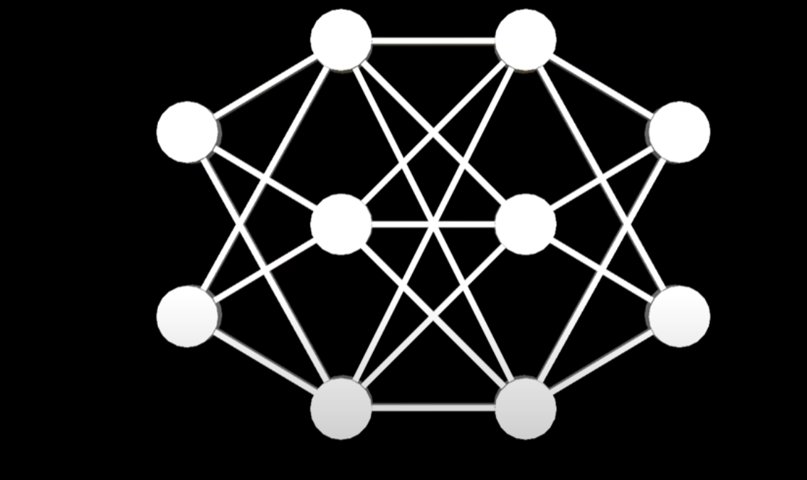
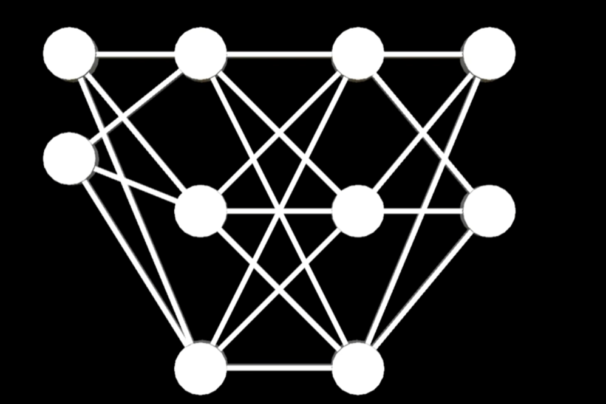
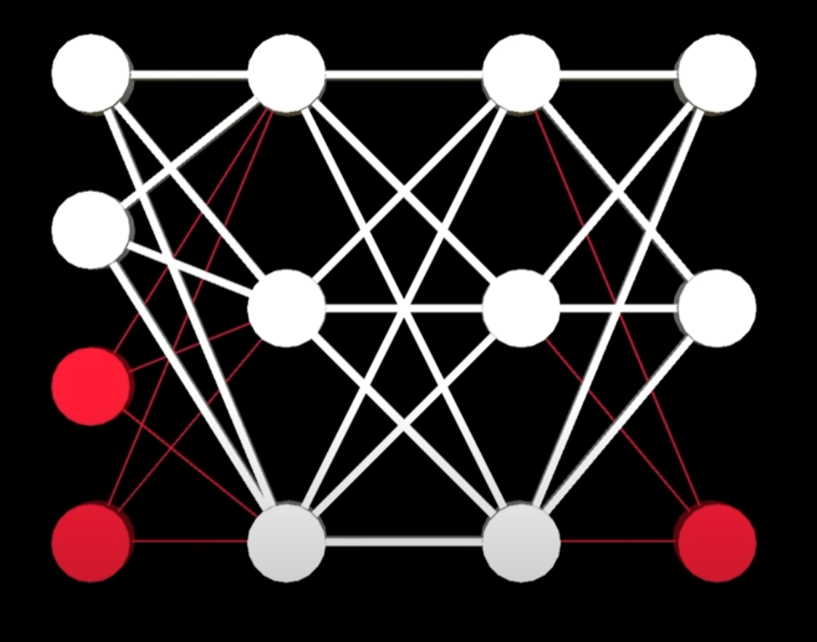
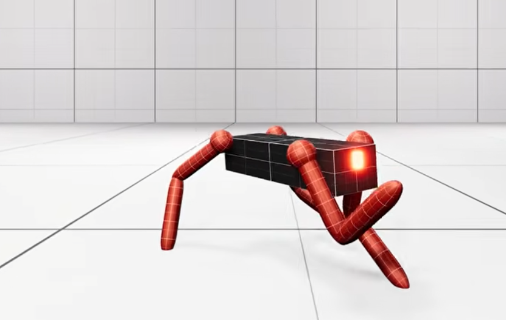
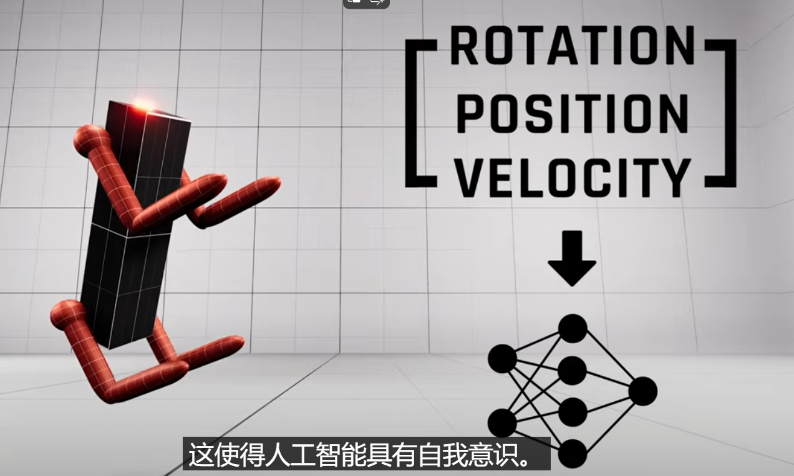
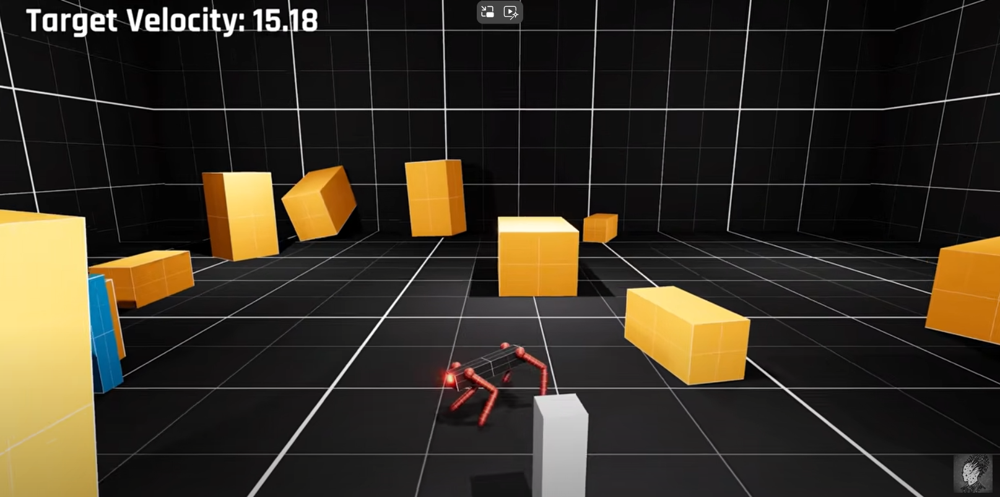

---

title: 强化学习如何解决输入状态维度增加的问题
 
description: 

#多个标签请使用英文逗号分隔或使用数组语法

tags: 杂谈

#多个分类请使用英文逗号分隔或使用数组语法，暂不支持多级分类
---

**相关：**

[AI Invents New Bowling Techniques](https://www.youtube.com/watch?v=EWjUY_3ubf4)

[I Tortured this AI Dog in an Escape Chamber for 1000 Simulated Years](https://www.youtube.com/watch?v=oOtlQ5gs-Mk)

 

强化学习问题很多时候是解决比较复杂的游戏环境的，比如控制机器人打保龄球，在这个游戏中我们需要既能控制机器人保持站立及运行动作的平衡，同时还需要保证机器人可以把保龄球成功打出去并得分；可以看到在这样的问题中可以把RL的训练过程划分为两个阶段，第一个阶段就是训练机器人的站立和行走，以保证机器人的平稳运动状态；第二个阶段则是需要训练机器人可以成功打出保龄球并得分，这时候我们可以适当减少平稳站立时奖励得分并加入保龄球得分的reward，这阶段有时候可能遇到输入状态增加的可能，比如加入保龄球打出的速度、角度等信息，但是这样就会出现一个问题，那就是强化学习算法中**输入状态维度增加的问题**，在本文给出的相关资料中对此种问题给出了一种解决方法，那就是保持原有神经网络权重和结构不变的情况下增加神经网络的输入层维度，并将增加的输入层节点和隐藏层节点之间的权重设为极小值，然后再次基础上进行继续的训练。

 

该种方法不需要因为**“输入状态维度增加的问题”**而重新训练神经网络，可以节省掉大量的重复训练的时间，对于算法开发的探索阶段使用该种方式是极为有意义的，毕竟重新训练的代价是极高的。该种方法最大的问题就是有效性，不过根据本文给出的相关资料中显示该种方式的有效性，也就是说在强化学习问题中在算法的训练阶段如果遇到动态的“**输入状态维度增加的问题**”，可以直接将增加的维度加入到已有的神经网络中，只不过需要将新加入的输入层节点的权重设置为极小的值，并在此基础上继续训练。

 

 

 

 

 

 

强化学习算法library库：(集成库)

https://github.com/Denys88/rl_games

https://github.com/Domattee/gymTouch

**个人github博客地址：**
[https://devilmaycry812839668.github.io/](https://devilmaycry812839668.github.io/ "https://devilmaycry812839668.github.io/")