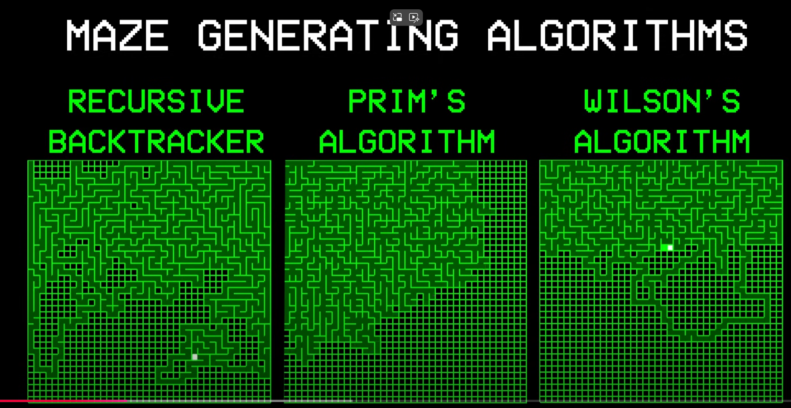
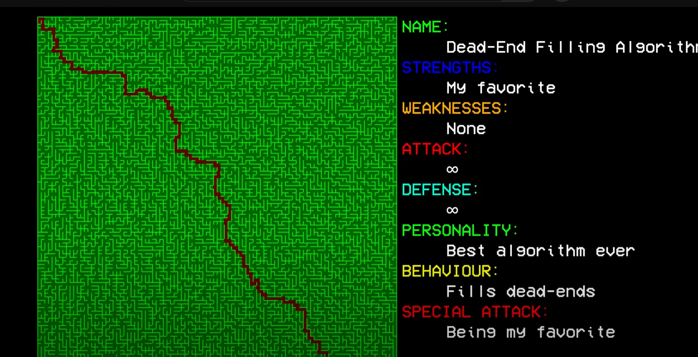
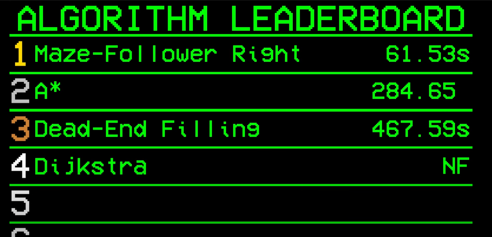

---

title: 如何使用程序生成一个复杂的2D迷宫游戏地图
 
description: 

#多个标签请使用英文逗号分隔或使用数组语法

tags: 杂谈

#多个分类请使用英文逗号分隔或使用数组语法，暂不支持多级分类
---

**相关：**

[**I Solved The World's Hardest Maze (with Code)**](https://www.youtube.com/watch?v=4L7BDRmH4cM)

 

本文不做过多的内容介绍，本文主要是分享上面的这个视频内容，该内容介绍了一些自动生成复杂2D迷宫的算法，当然本文不对此做过多介绍，这里可以当作是一个内容收藏的功能，因为曾经有段时间自己想去写这么一个迷宫生成的算法，后来发现这种迷宫生成的算法是需要现学的，不是说直接就可以靠已有知识就能写出来的，于是就放弃自己编写了，直接选用网上公开的分享的迷宫生成的代码，不过对于迷宫生成的算法却一直没细研究，因此这里也是把相关内容进行收藏而已。

 

 

 

强化学习算法library库：(集成库)

https://github.com/Denys88/rl_games

https://github.com/Domattee/gymTouch

**个人github博客地址：**
[https://devilmaycry812839668.github.io/](https://devilmaycry812839668.github.io/ "https://devilmaycry812839668.github.io/")