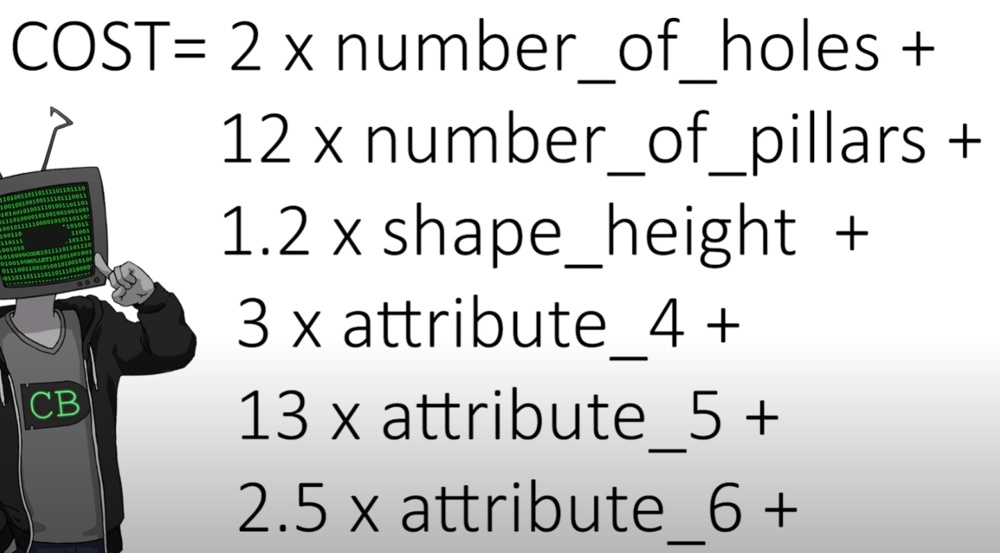
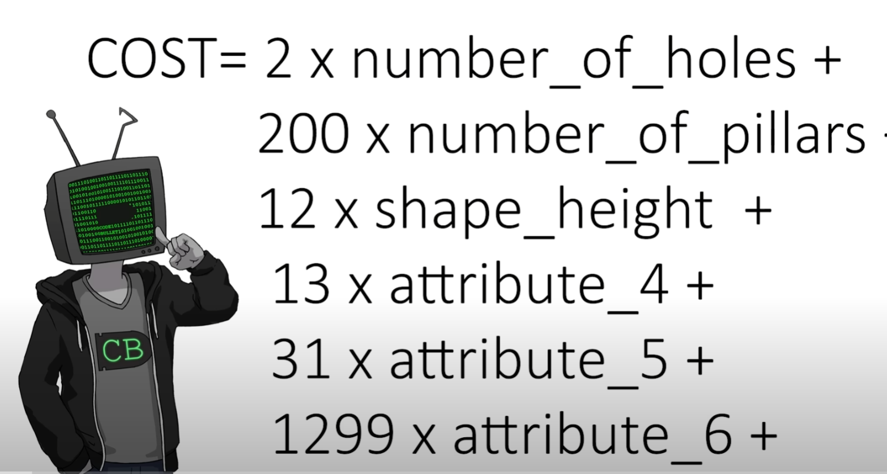
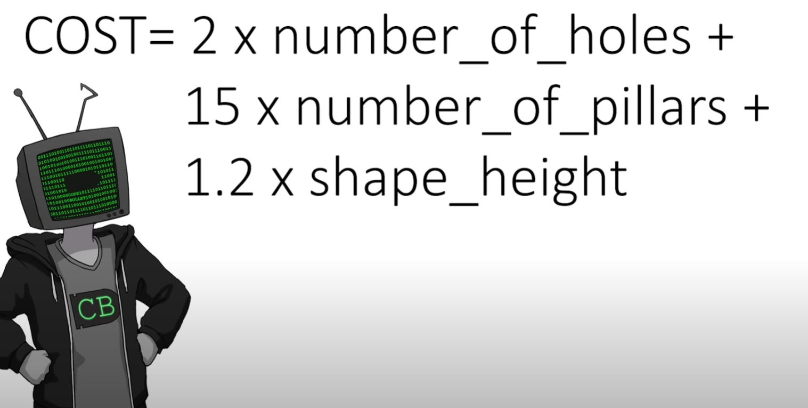
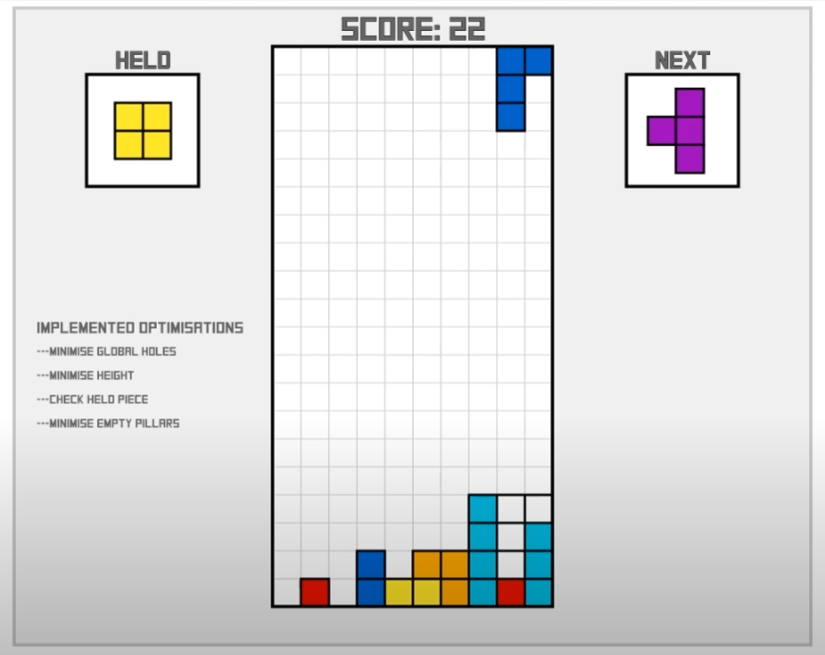

---

title: 对于特定的游戏问题使用启发式算法可以取得比AI算法更好的表现
 
description: 

#多个标签请使用英文逗号分隔或使用数组语法

tags: 杂谈

#多个分类请使用英文逗号分隔或使用数组语法，暂不支持多级分类
---

**相关：**

[Using A.I. to DOMINATE NERDS in TETRIS](https://www.youtube.com/watch?v=os4DcbpL0Nc)

 

 

 

 

强化学习算法library库：(集成库)

https://github.com/Denys88/rl_games

https://github.com/Domattee/gymTouch

**个人github博客地址：**
[https://devilmaycry812839668.github.io/](https://devilmaycry812839668.github.io/ "https://devilmaycry812839668.github.io/")