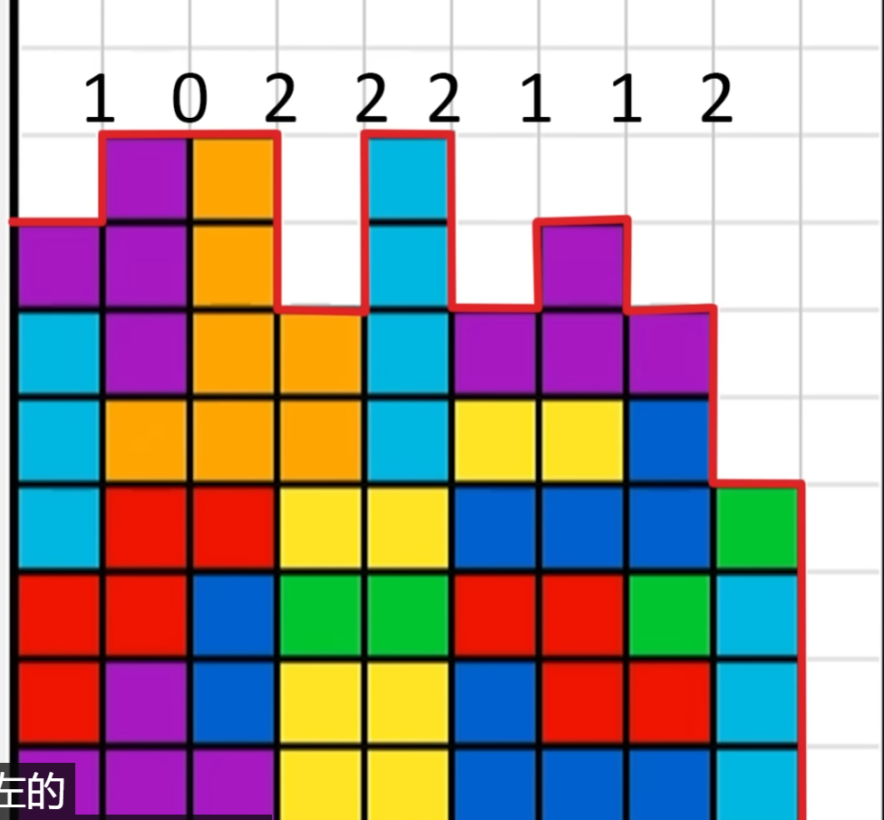

---

title: 对于特定的游戏问题使用启发式算法可以取得比AI算法更好的表现
 
description: 

#多个标签请使用英文逗号分隔或使用数组语法

tags: 杂谈

#多个分类请使用英文逗号分隔或使用数组语法，暂不支持多级分类
---

**相关：**

[Using A.I. to DOMINATE NERDS in TETRIS](https://www.youtube.com/watch?v=os4DcbpL0Nc)

 

有些问题的求解可以通过建模将其转换为强化学习问题，然后再使用强化学习算法对其进行求解，但是很多问题如果不建模为强化学习问题也是可以通过传统的启发式算法进行求解的，甚至很多情况下在特定问题中传统的启发式算法会比AI领域的强化学习算法效果更好，本文就以**俄罗斯方块**的游戏问题为切入进行讨论。

 

首先要知道**俄罗斯方块**问题是一个AI难度较大的问题，使用RL方法是较为困难对其进行求解的，其中最为困难的一点在于俄罗斯方块问题的状态是难以评价的，因为俄罗斯方块的最终目标就是消除方块积累然后使方块游戏可以一直进行下去，但是这个最终目标是难以细化到每一个step过程的操作评价的，比如一个正在下降的积木块，在很多时候我们是难以给出其最好的落点的，因为这时候往往有多个位置可以落，我们可以选择优先用下降的积木块去填补有漏洞的位置，也可以将其优先和最上层的累积积木块拼接以求消减掉最上层的积木，又比如一个下降的竖线性积木块，我们是将其平放实现最先实现上层积木块的消除还是将其插入有多层空前的位置以实现对下层积木块累积位置中缺失位置的填补，总之，在很多情况下（大多数情况下，几乎所有情况下）我们是难以简单的给出将正在下降的积木块进行如何的放置操作是最优的，或者说我们难以给出在状态$s$的情况下执行动作$\{a_1, a_2, a_3, a_4, a_5, a_6\}$后得到下一步状态$s_1, s_2, s_3, s_4, s_5, s_6$后到底这6个下一步的状态哪个更好，而对于下一状态的评价是极为困难的，我们也不能简单的根据一步动作后得分来简单判定，也正是这个原因导致强化学习算法还是启发式算法在解决俄罗斯方块问题都有一点难度。

分析了俄罗斯方块问题的难度后我们可以有以下几种解决方法：

1. 构建为强化学习问题，使用强化学习算法求解；
2. 使用遗传算法这样的进化算法求解；
3. 直接使用规划算法求解；
4. 遗传算法+强化学习算法/规划算法

第一种方法，使用强化学习算法，我们可以设置reward为没存活一步则动作的reward为+1，不过该种方式可能会很难收敛，因为很多无用的无太大意义的操作也会获得reward；我们也可以不为每个step设置reward，而是在episode结束后根据episode的长度给予reward，比如episode长度为100，那么reward为100， episode长度为1000那么reward为1000，由于最终的优化目标是最大化episode长度，那么就会出现算法性能越好则算法训练周期越长，甚至可能导致算法运行时长难以接受的问题；我们也可以根据人为指定reward，即根据reward工程设置具体的每一步reward，这时根据下一步状态的评价给出reward值，此时的reward的设定和启发式方法（规划算法中对游戏状态的评价）中的相同。

第二种，使用遗传算法，也是根据一个episode结束后episode的长度给出适应度的值，episode越长则适应度越高，使用该种方式同第一种方法中完整采集整个episode后进行训练的方式一样会导致训练速度过慢的问题。

第三种，我们可以使用一些人为的判定标准给出对不同游戏状态的评价，（在本文下方给出几张不同评价函数的图片），当我们有了对不同状态的评价后我们自然可以得到下一步状态的最优选择，不过该种方式的求解效果极大程度上取决于人为指定的游戏状态评价函数。

第四种，由于强化学习算法和规划算法求解俄罗斯方块游戏都有对游戏状态进行评价的需要，那么我们可以使用遗传算法去优化这个状态评价函数，具体就为我们可以得到影响游戏状态好坏的几个因素（积木累积的高度、空洞数，等等），而游戏状态的评价函数可以设置为这几个因素的线性和的关系，需要求解的就是这个游戏状态评价函数中各个因素的权重是多少，而这个权重则使用遗传算法求解。该种方式可以看做是遗传算法和强化学习算法/规划算法的结合，因此运行时长也是较长的。

 

在这里可以给出一个结论，那就是如果游戏状态的评价函数很好的情况下，使用规划算法会取得最优的算法性能表现，会远高于单纯使用遗传算法或以每步得分或每步固定得分或按照episode长度给定reward值的强化学习算法性能要好的，也就是说在游戏状态评价函数较好的情况下，使用启发式算法（规划算法）可以比AI算法（强化学习算法）取得更好表现。

 

在资料[Using A.I. to DOMINATE NERDS in TETRIS](https://www.youtube.com/watch?v=os4DcbpL0Nc)中，使用遗传算法来优化游戏状态的评价函数，而在游戏状态评价函数固定的情况下游戏的具体执行动作为规划算法，由此可以看到**“遗传算法+规划算法”**的这种算法组合会比强化学习算法在俄罗斯方块问题上更有优势。当然，我们也可以使用**“遗传算法+强化学习算法”**的这种算法组合，同样是使用遗传算法来优化游戏状态的评价函数，不过在游戏状态评价函数指定的情况下是没有必要使用强化学习算法的，因为训练强化学习算法来执行具体的操作步骤是极为耗费时间的，该训练过程时间花费明显，但是规划算法可以较为容易的得到一个游戏状态到下一个游戏状态所需要的一系列的执行动作的，这其中的动作探索和规划的时间花销会明显优于使用强化学习算法进行具体执行动作训练的。

 

 

 

 

强化学习算法library库：(集成库)

https://github.com/Denys88/rl_games

https://github.com/Domattee/gymTouch

**个人github博客地址：**
[https://devilmaycry812839668.github.io/](https://devilmaycry812839668.github.io/ "https://devilmaycry812839668.github.io/")