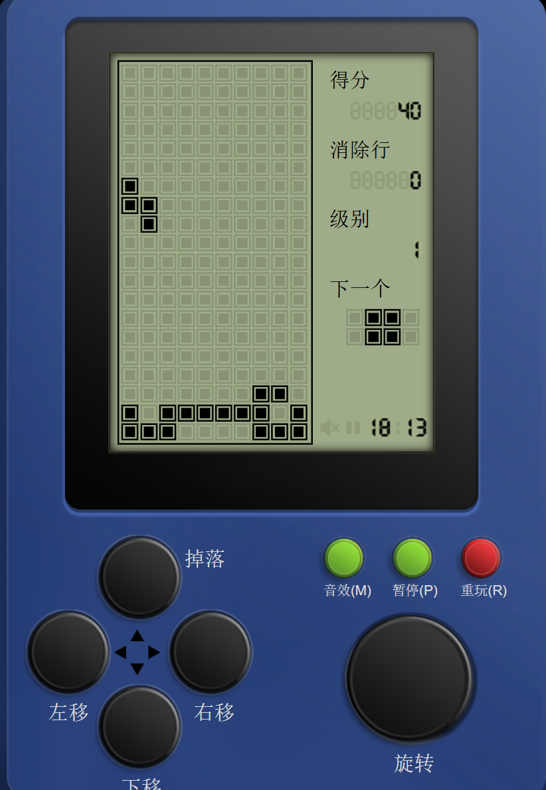

---

title: 如何编程求解俄罗斯方块游戏问题
 
description: 

#多个标签请使用英文逗号分隔或使用数组语法

tags: 杂谈

#多个分类请使用英文逗号分隔或使用数组语法，暂不支持多级分类
---

**相关资料：**

[对于特定的游戏问题使用启发式算法可以取得比AI算法更好的表现](https://www.cnblogs.com/xyz/p/18528975)

https://www.askforgametask.com/tutorial/machine-learning/ai-plays-tetris-with-cnn/

[Using A.I. to DOMINATE NERDS in TETRIS](https://www.youtube.com/watch?v=os4DcbpL0Nc)

[Machine Learning: AI Learns To Play Tetris with Convolutional Neural Network](https://www.askforgametask.com/tutorial/machine-learning/ai-plays-tetris-with-cnn/)

[AI learns to play Tetris using Machine Learning and Convolutional Neural Network](https://www.youtube.com/watch?v=n2clCwNuPmk)

**[A.I. Learns to Play Tetris](https://www.youtube.com/watch?v=LGNiWRhuIoA)**

[I Created An A.I. to DESTROY Tetris](https://www.youtube.com/watch?v=QOJfyp0KMmM)

 

前文（[对于特定的游戏问题使用启发式算法可以取得比AI算法更好的表现](https://www.cnblogs.com/xyz/p/18528975)）中讨论了解决俄罗斯方块的几种方法，不过由于只是介绍了大致的路线并没有给出足够的细节，因此也是很难进行真正的solution开发的，本文就是接着前文给出俄罗斯方块游戏的具体解决方法的细节。

 

就像前文所说的，对于俄罗斯方块游戏如果恰当的使用启发式算法往往可以获得比AI方法更好的解决效果，这就像之前分享的几篇如何解决 《2048》游戏的方法一样，可以说这里的《俄罗斯方块》和之前分享的《2048》游戏一样都属于较难解决的游戏问题，而且这两款游戏也同样属于难以直接使用通用的AI算法求解的游戏环境（不同于gym的atari游戏等等，解决方法需要定制化），也正是因为《俄罗斯方块》和《2048》游戏的具体解法需要定制化，因此分享一下这两款游戏的具体解法细节，关于《2048》游戏的解法和代码之前已经分享过了，本文则接续分享《俄罗斯方块》游戏的解法。

 

给出解法介绍之下定义一下《俄罗斯方块》游戏中的action空间，即可以操作的游戏动作有那些，这里为了下面介绍中出现歧义因此统一一下这部分概念；这里规定action有left，right，down，up四个按键动作，其中left和right代表控制当前的方块向左或向右移动，按键执行一次则当前方块移动一次；up按键代表方块的变形旋转，每个当前的积木块均有0度、90度、180度、270度这四种旋转角度，每按动一次up键当前下落的积木块都会顺时针旋转90度，即0度旋转为90度，90度旋转为180度，以此类推；由于每个时间步时当前积木都会自动下降一行，而按键down则意味在每个时间步时增加当前积木块的下降行，即在某个时间步按下down键后下落积木块会下降两个行，从而实现下落积木块的加速下落；为了描述简单这里再增加另一个动作就是all down，这个动作的本质就是down动作，不过这个all down意味着一直按down键直到当前下落积木块完成下落。

总结来说，left/right键代表着移动，up键代表着旋转90度，down键意味着加速下降（下降速度加倍）。

 

根据本文开头分享的几个**相关资料**可以知道现在的计算机解决《俄罗斯方块》游戏都有一个共同点，那就是计算机生成的执行动作序列大致为如下样式：

up, up, up, left, left, left, all down;

up, left, left, all down;

right, right, right, all down;

up, right, right, all down;

up, up, left, left, all down;

left, left, left, left, left, all down;

right, right, all down;

up, right, all down;

left, all down;

right all down;

而人类操作当前积木块下落的实际操作动作的序列情况可能是：

right, right, left, up, down, left, right, right

left, up, all down

right, right, right, right, left, up, up, left, up

up, left, left, right, right, left, up

left, left, up, right, right, up, left

可以看到，人类的操作东西的序列和计算机生成的操作动作序列有着明显的不同。人类的操作动作序列可以看做是一种不断的尝试的动作，在控制一个积木块下落的过程中时而向左移动，时而向右移动，时而旋转变换，时而再接着移动，而且人类控制过程中并不一定以all down动作结束，甚至人类可以在积木块与其他积木块贴合的同时控制积木块移动（这个动作估计玩过俄罗斯方块的都会懂），给出下面的两个示意图：

通过上面的两个示意图可以看到，人类控制积木块时可以在积木块和其他积木块贴合时依旧可以至少移动一次当前积木块（如果移动合法的话，比如向右移动式右侧不是紧靠墙），而这说明人类控制积木块的方式可以实现更加复杂的动作，以应对一下更加复杂的情景，比如在下面的场景下：

计算机程序生成的执行动作只能得到以下结果：

而人类的操作可以得到以下结果：

 

之所以人类操作和计算机生成的动作有这个区别的原因是现有的计算机程序解决俄罗斯方块都是根据当前的下降积木块和当前的已有积木块布局得到这个新积木块应该落在那个行上并且旋转角该是多少而不是直接获得具体的操作动作，也正因为计算机程序都是为当前下降积木块生成应该落地的列号和旋转角度这两个数值，然后再根据这两个数值生成具体的执行动作，因此才会有上面给出的如此不同的执行动作序列，也是因此所以计算机生成的执行动作都是先执行若干次旋转（包括0次），然后再只向左移动若干次或者只向右移动若干次，然后当下落积木块满足生成的下落列和旋转角后再最后执行all down动作以来加速完成积木块的下落。关于计算机程序解决俄罗斯方块问题时生成下落目标列和旋转角度的具体介绍可以参考<https://www.askforgametask.com/tutorial/machine-learning/ai-plays-tetris-with-cnn/>。

 

之所以计算机程序设计生产下落目标列和旋转角度这两个数值而不是为每一时间步事实生成一个动作，其原因是如果为每个时间步生成一个动作难度极大，因为当前的已落地的积木块的情况和正在下落的积木块所组成的当前状态在相近的时间步中是极为相似的，而这会导致计算机程序难以编码来区分不同timestep下的具体状态，并且如果是使用AI程序的话如果为每个timestep生成一个action，那么这个问题就成了一个稀疏reward问题，而根据已有的相关研究（学术论文及俄罗斯方块解法的学术资料）可以知道如果是按照如此建模的话构建成稀疏reward后是更不利于算法训练和算法性能提高的。因此，计算机程序对俄罗斯方块问题的建模和解决都是计算当前下落积木块的目标落地行和旋转角度的，这部分的示意图如下：

虽然几十年前的解决《俄罗斯方块》游戏的程序都是生成具体动作，而现在设计的计算机程序都是生成目标落地的行和旋转角度，虽然看似是简化问题甚至是有些偷工减料，但是根据相关的资料可以看到这种简化操作成功的避免了把该游戏的解法建模成一个稀疏reward的问题，极大的提高了算法的求解性能，当然由于现在的对于该游戏的计算机解法的这种生成目标落地的行和旋转角度会导致计算机程序无法实现人类操作的这种灵活性（无法在下降到某个行后旋转或再移动等复杂动作，并且如果某个空缺位置的正上方存在遮挡的情况也是直接将遮挡部分与空缺部分之间的部分考虑成不可填充的），但是这种设计（生成目标落地的行和旋转角度）会极大提高算法性能提高最终的算法得分，而对于中间空缺部分并且可以填补的情况毕竟在游戏中出现的比较小概率，而这时把该部分当做已填满部分也不会对算法性能有太多影响。

给出一个有空缺但是上方被遮挡的情况：

在这种情况下计算机程序生成的解决方法并不会通过最右侧的三个空缺格进入下方后进行填补，如：

在计算机程序中这种情况等价于：

而计算机生成的最后操作的空间也是上图红框中最右侧的三列，可以说垂直有遮挡的空格在计算机程序中都被视为已填满的部分。

由于中间有空洞，上方被遮挡，甚至周围都被遮挡的情况下其实很多时候也无法利用当前下落积木对其进行操作的，如：

其中的中间空格也都是无法被直接操作的，因此这些空格可以当做已填满考虑，这样也不会对算法性能有什么影响，如下图中的红色圈中的部分，这些部分都是可以在计算机程序中当做已填满的。

正事因为这种不考虑被遮挡部分的空间的这种假设，最后算法生成的只有目标列和旋转角度，由此避免了难以训练的并且复杂的稀疏奖励建模问题，而得到了一个易于建模并且容易计算的问题建模。

 

在解决了问题建模后我们可以进行具体的算法设计部分了（下面的所有种类的计算机解法都是基于该问题的建模方式）。

在以上的建模方式下给出具体的解法：

1. 规划法
2. 遗传算法+规划法（遗传算法辅助规划法）
3. 监督学习法
4. 强化学习法（TD算法）

 

在进行具体的算法细节之下需要明确的是《俄罗斯方块》游戏中下落积木块和已落地积木块的游戏状态表示（这部分示意图图片来自：<https://www.askforgametask.com/tutorial/machine-learning/ai-plays-tetris-with-cnn/>），关于下落的积木块表示如下：

 

 

 

 

俄罗斯方块游戏的一个演示地址：

https://www.askforgametask.com/html5/tutorials/tetris_ai_bot/source/

 

 

《俄罗斯方块》游戏试玩在线地址：

http://123.geiwosou.net/game/tetris/

 

 

强化学习算法library库：(集成库)

https://github.com/Denys88/rl_games

https://github.com/Domattee/gymTouch

**个人github博客地址：**
[https://devilmaycry812839668.github.io/](https://devilmaycry812839668.github.io/ "https://devilmaycry812839668.github.io/")