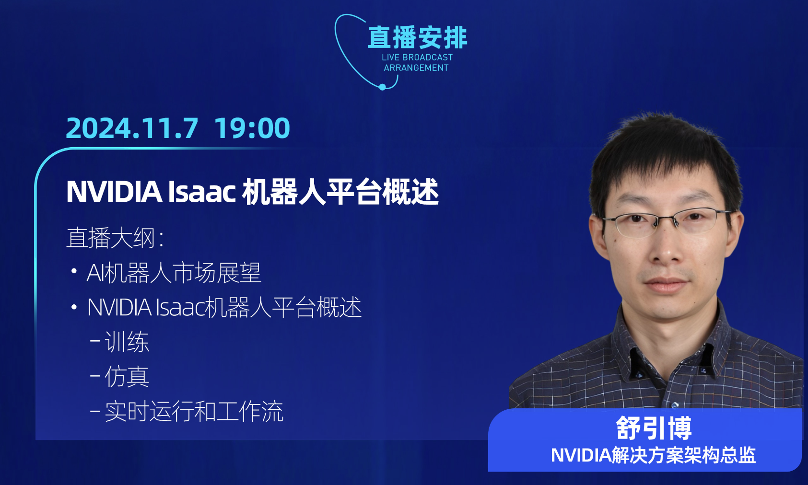
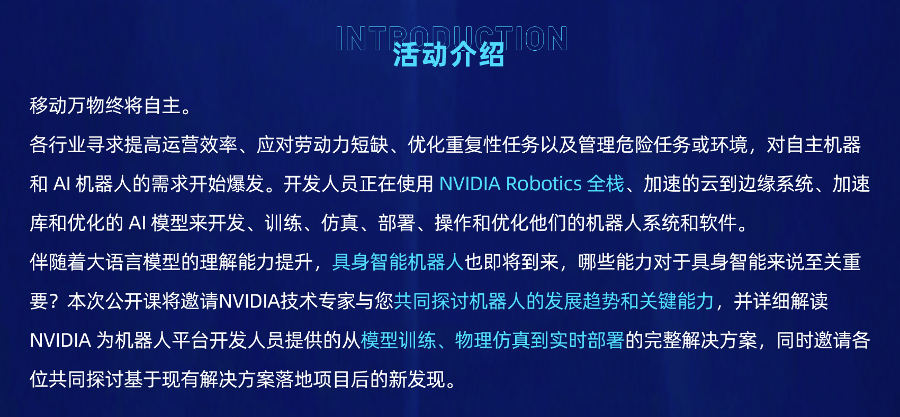
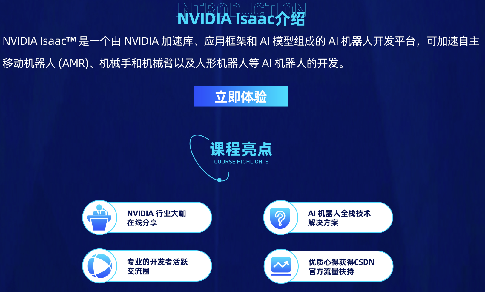

---

title: nvidia机器人仿真控制平台公开课
 
description: 

#多个标签请使用英文逗号分隔或使用数组语法

tags: 杂谈

#多个分类请使用英文逗号分隔或使用数组语法，暂不支持多级分类
---

欢迎加入NVIDIA 机器人技术公开课群！本次活动将为机器人平台开发人员提供的从模型训练、物理仿真到实时部署的完整解决方案，更有与NVIDIA技术专家直播互动机会，参与学习体验&产品测评反馈还有机会拿到周边好礼（U盘、钥匙扣、长钱夹 T恤等 ）课程亮点🌟

（1）NVIDIA 行业大咖在线分享

（2）AI机器人全栈技术解决方案

（3）专业的开发者活跃交流圈

（4）优质心得获得

 

CSDN官方流量扶持课程安排

（1）10月31日：活动报名启动，加入活动群

（2）11月7日：技术公开课直播

（3）11月7日-11月21日：产品体验产出/评审

（4）11月22日：优质产品测评文章公示/激励发放礼品获取规则：

1、参与直播间打卡&有效提问各对应一次抽奖

2、完成平台注册体验对应一次抽奖 （ https://developer.nvidia.cn/ ）

2、完成产品体验后进行有效反馈&话题讨论对应一份周边礼品

3、优质产品测评文章额外有大奖，详询管理员CSDN火锅

 

 

 

NVIDIA Isaac ——AI 机器人开发平台访问入口：https://developer.nvidia.cn/isaac

推荐体验产品

1、Isaac ROS：

https://developer.nvidia.cn/isaac/ros

体验参考指南标准：

https://img-bss.csdnimg.cn/bss/NVIDIA/IsaacROS.docx

2、Isaac Manipulator：

https://developer.nvidia.cn/isaac/manipulator

体验参考指南标准：

https://img-bss.csdnimg.cn/bss/NVIDIA/IsaacManipulator.docx

3、NVIDIA Isaac Sim：

https://developer.nvidia.cn/isaac/sim

体验参考指南标准:

https://img-bss.csdnimg.cn/bss/NVIDIA/IsaacSim.docx

 
 

✨直播间入口:https://live.csdn.net/room/Hansen666666/ADvsaR7L

 

 

 

 

更多详情请点击：https://marketing.csdn.net/p/886d690bf0fa143b26b30694d3622125?pId=2775

 

 

 

 

强化学习算法library库：(集成库)

https://github.com/Denys88/rl_games

https://github.com/Domattee/gymTouch

**个人github博客地址：**
[https://devilmaycry812839668.github.io/](https://devilmaycry812839668.github.io/ "https://devilmaycry812839668.github.io/")