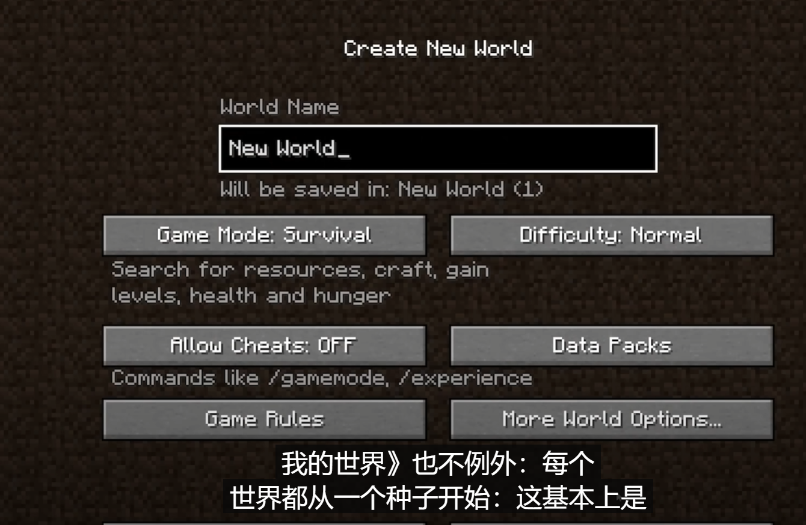
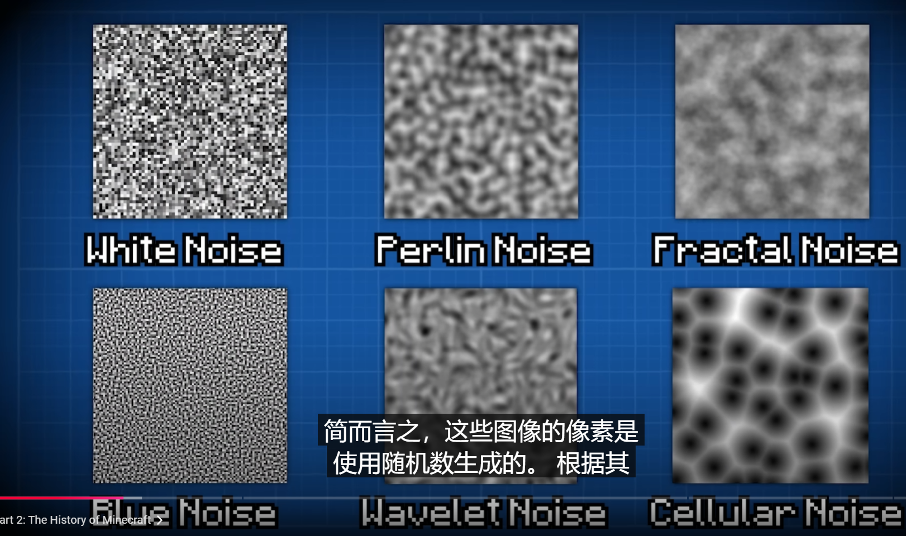
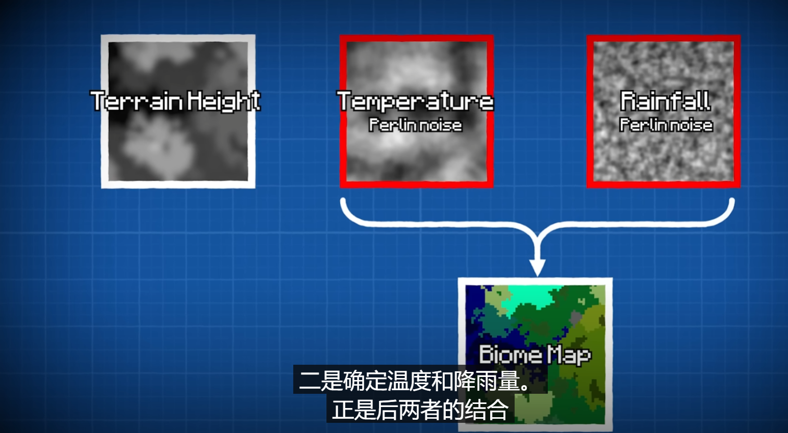
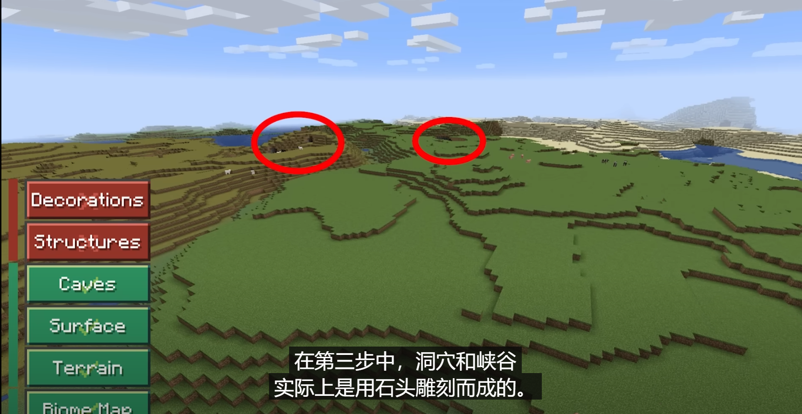
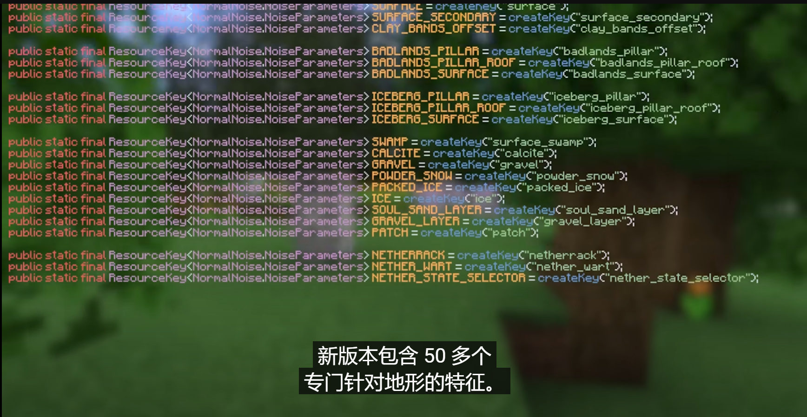
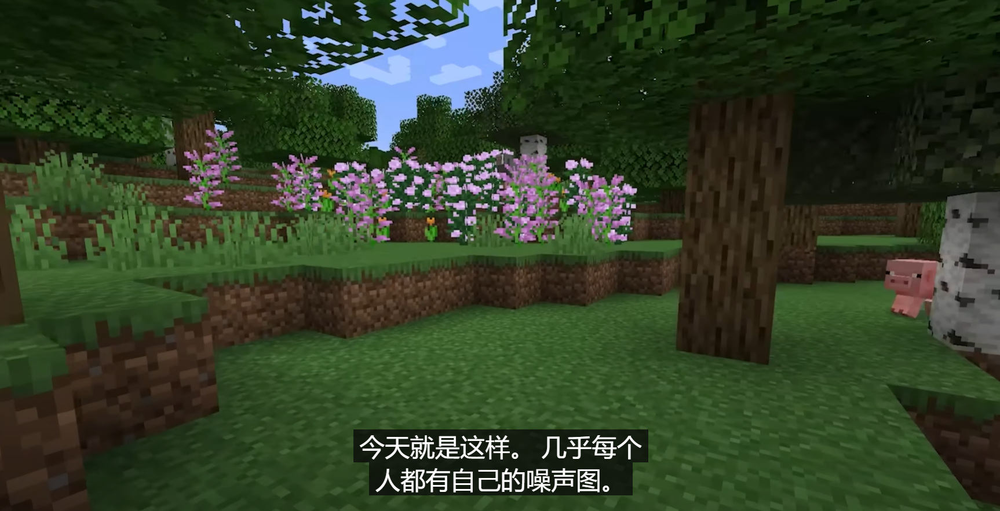
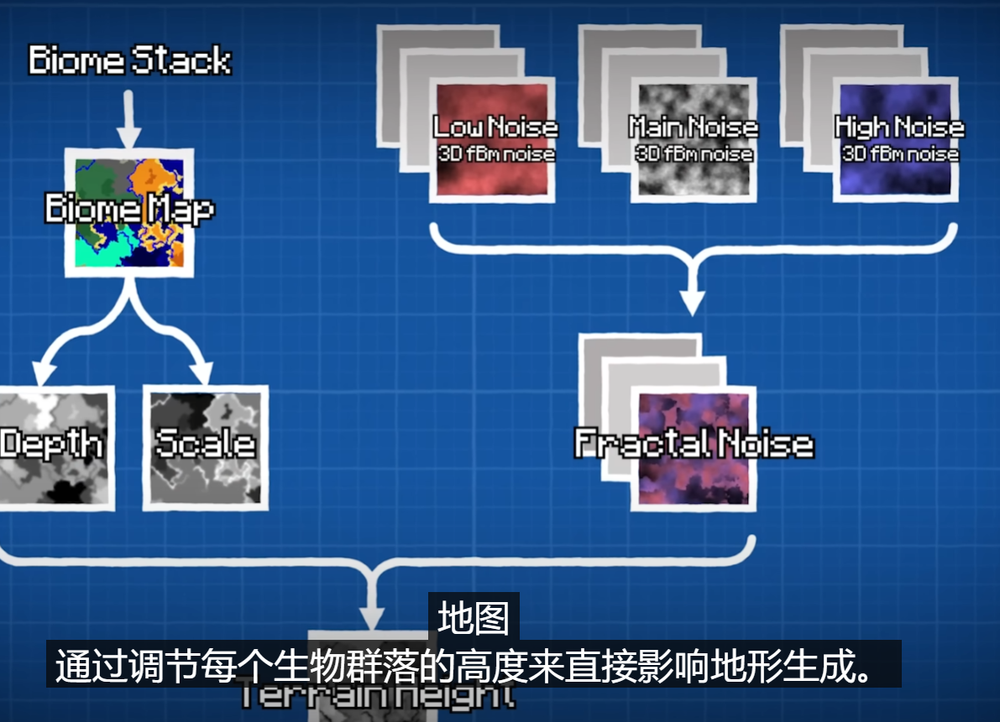
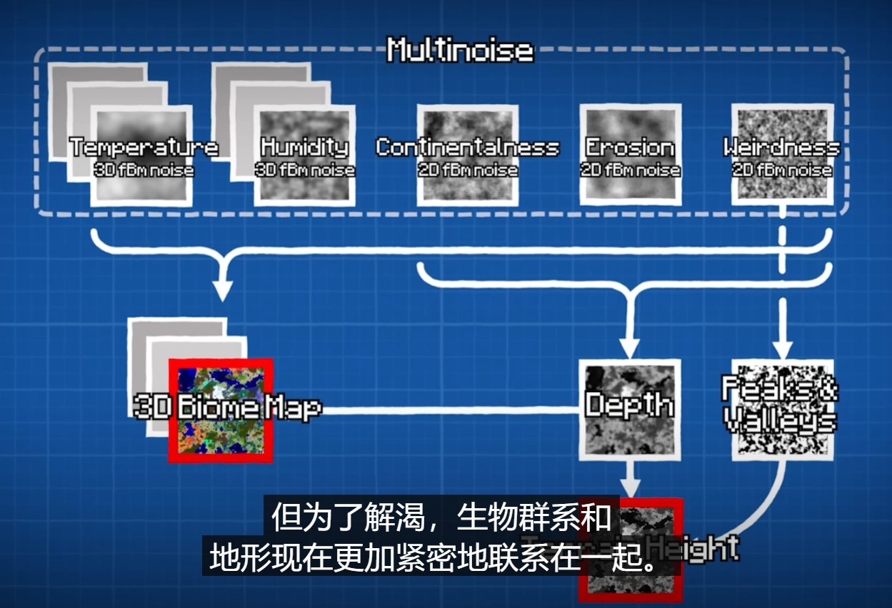
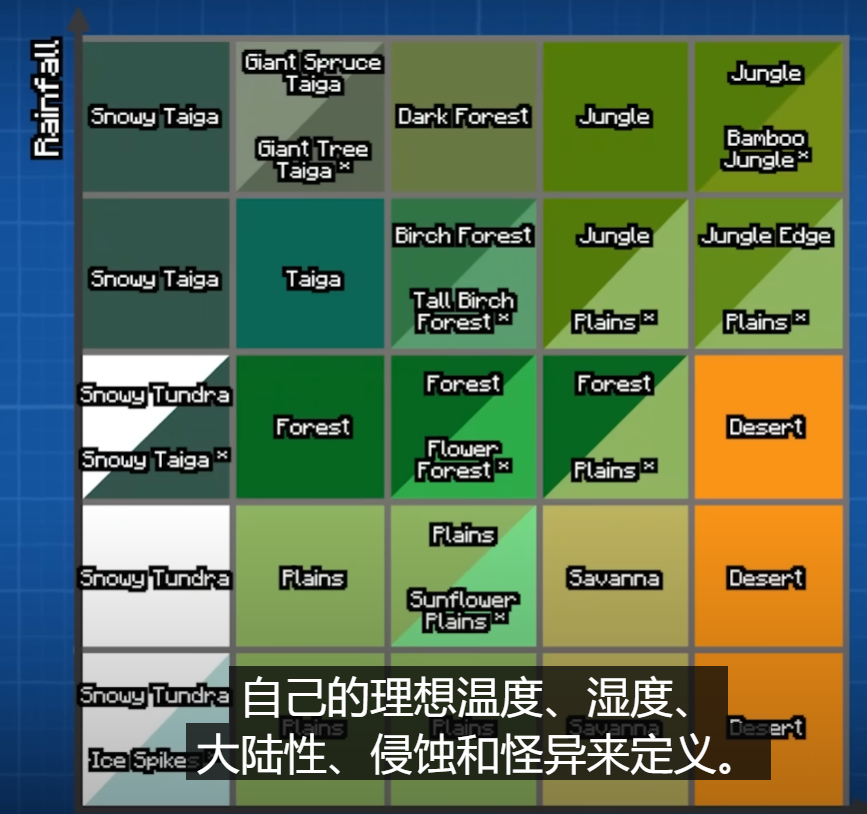

---

title: 我的世界(Minecraft)_游戏地图的生成
 
description: 

#多个标签请使用英文逗号分隔或使用数组语法

tags: 杂谈

#多个分类请使用英文逗号分隔或使用数组语法，暂不支持多级分类
---

**相关：**

[How Minecraft ACTUALLY Works 💎⛏️](https://www.youtube.com/watch?v=YyVAaJqYAfE)

 

本文只分享上面的这个讲解视频，这里主要作为资料记录之用。

 

 

 

 

 

强化学习算法library库：(集成库)

https://github.com/Denys88/rl_games

https://github.com/Domattee/gymTouch

**个人github博客地址：**
[https://devilmaycry812839668.github.io/](https://devilmaycry812839668.github.io/ "https://devilmaycry812839668.github.io/")