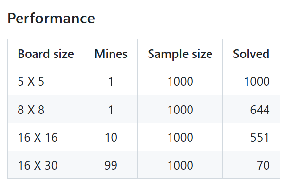
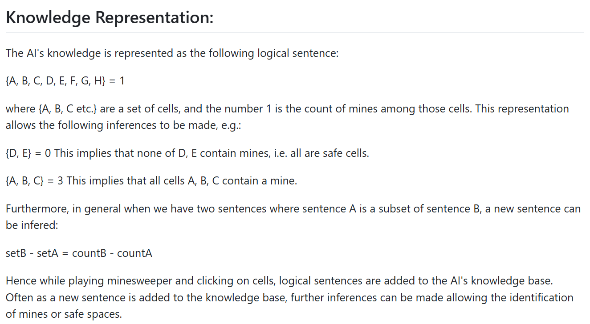
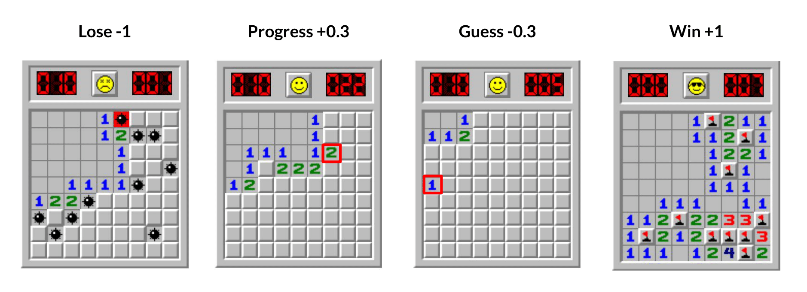
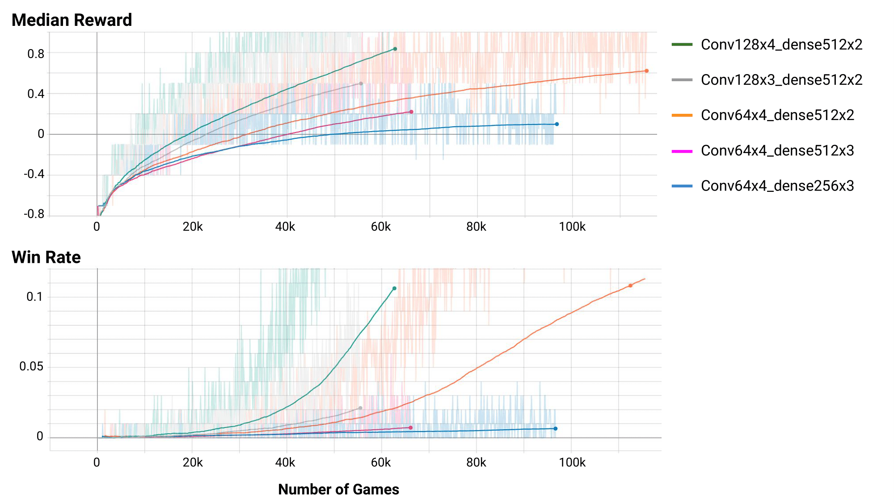
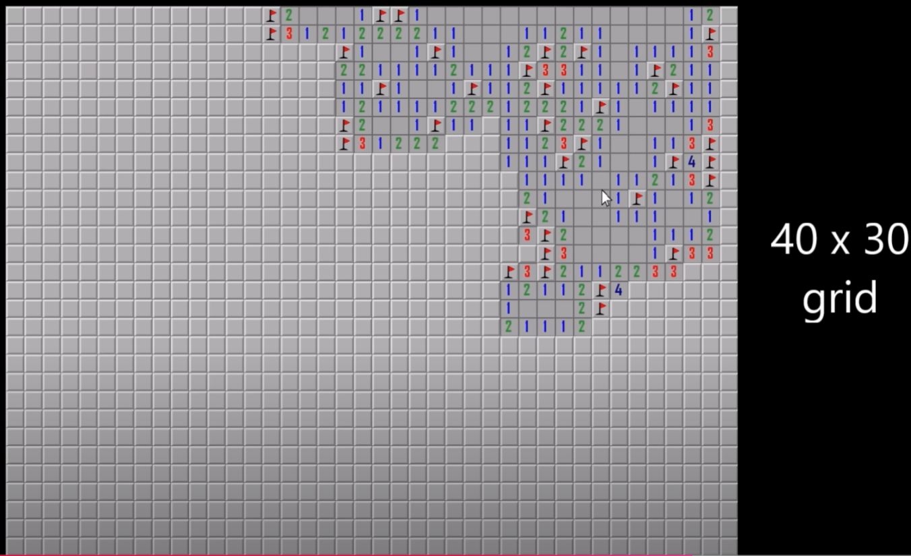
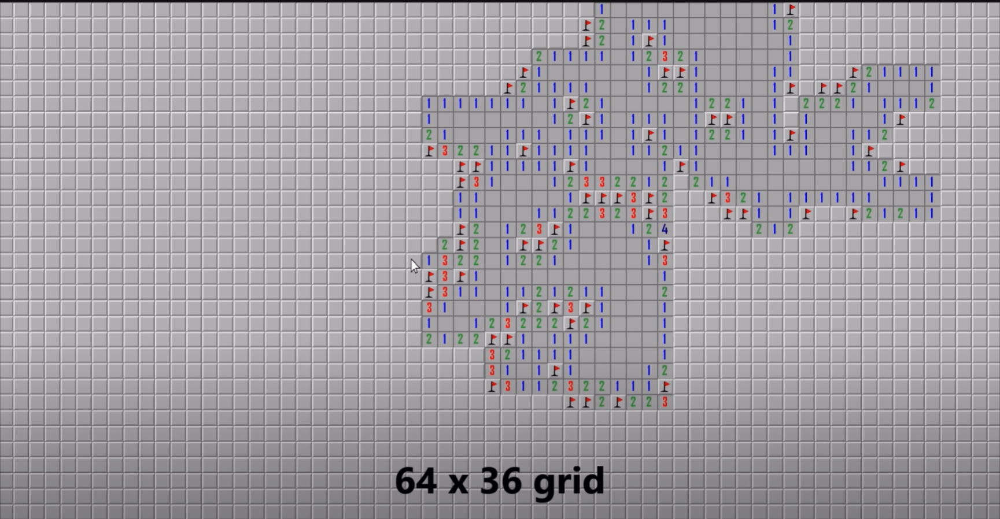

---

title: 如何使用计算机程序求解扫雷游戏
 
description: 

#多个标签请使用英文逗号分隔或使用数组语法

tags: 杂谈

#多个分类请使用英文逗号分隔或使用数组语法，暂不支持多级分类
---

相关：

[I created a PERFECT minesweeper AI](https://www.youtube.com/watch?v=cGUHehFGqBc)

 

 

使用计算机程序求解扫雷程序原本以为是一个比较简单的事情，不过研究研究发现这事情太离谱，原来计算机求解扫雷问题还真不是一个简单的问题。首先，我是认为可以有一个数学方面的求解方法，比如在无法根据现有信息的情况下判断哪个格没有雷或哪个格有雷的情况下那么我们就根据概率来进行计算，选择概率最小的格进行随机开启；然后在格子周边有信息的情况下我们可以根据周边的格的信息来计算出该格是否有雷或者有雷的概率为多少，然而问题就出在这一步，原本以为可以根据数学计算的方式或者简单规则的方式处理这一步，不过发现如果单看一个格的情况下这时可以处理的，但是很多情况下相邻的格之间是互相影响的，于是我又把相邻的三个格在一起处理，不过这时我们可以发现如果相邻3格在一起处理就会很大的放大处理的空间，导致运行量急剧加大，而相邻三个格中的外侧两个格又分别可以再组成3格的形式，以此类推，这样会极大的增加处理时间，而如此大的计算量是难以接受的。

经过仔细的分析后发现，如果严格使用数学推断和概率计算的方式来计算哪个有空格或者哪个有雷以及哪个有雷的概率是多少，那么这个问题的计算量会随着扫雷问题的棋牌大小和雷数的多少进行几何倍数递增，因而这种计算方式导致的巨大计算量是无法接受的，因此大规模的扫雷问题是无法使用数学解析的方式进行求解的（即使是数学方式计算解析解也是同样需要在无法计算概率或概率相同的情况下随机排雷的。

那么扫雷问题的解决方法就又回到了老的解决方法上，AI解法和启发式解法两种方式。

<https://github.com/s4ndhyac/Minesweeper-Bot> 给出以下的启发式规则：

> 以下是基于这些规则的解题方法：
>
> **规则 1**：如果某个单元格的**知觉数**（percept number）为零，或等于相邻已标记为雷的单元格数，则该单元格周围所有仍覆盖的相邻单元格都是安全的，可以**揭开**。
>
> **规则 2**：如果某个单元格的知觉数减去相邻已标记为雷的单元格数，等于相邻单元格数，那么这些剩余的相邻覆盖单元格必定是雷，可以**标记**。
>
> 在**16x30的专家网格**上，还使用了以下两个附加规则：
>
> **规则 3**：我们将单元格成对考虑，寻找1-1模式或1-2模式。如果找到1-1模式，则可以**揭开**与该对模式相邻的第3个单元格；同样，如果找到1-2模式，则可以**标记**与其相邻的第3个单元格。
>
> **规则 4**：如果前三个规则都无法适用，我们使用**回溯算法**，选择一组边界单元格，将其分为独立边界进行考虑，按大小递增排序，并对每组执行递归，假设一个单元格是否是雷，从而寻找矛盾点。
>
> **规则 5**：在最糟情况下，如果回溯算法也无法得出结果，我们采取以下概率方法：
>
> - 如果上一个单元格被揭开，则其每个相邻单元格的雷存在概率为：**知觉数 / 相邻覆盖单元格数**
> - 如果上一个单元格被标记，则该单元格被标记为雷的概率为1。
> - 所有剩余覆盖单元格中雷的概率为：**剩余雷数 / 剩余单元格数**

虽然这个项目给出了启发式算法所基于的启发式规则，但是由于其描述的不是很好，因此细节上还是难以理解的，不过对于rule1和rule2还是容易理解的，这两个规则就是说如果一个cell是无雷的，并且其标记的雷数和附近（附近8个）的cell中未识别的cell个数相同，那么这几个未识别的cell均为雷；而一个cell是无雷的，并且其标记的雷数和附近的cell中标记的有雷的cell个数相同，那么这个cell附近（8个）的未标识的cell均为无雷的。而对于其他的规则就难以理解了，不过有一点可以知道，即使在进行随机选择未标识的cell时也是可以根据一定概率进行计算的。

给出该项目在该启发式条件下的成功率：

 

 

通过在外网上的资料搜寻发现了其他的关于扫雷解法的项目，给出一个比较有代表性的：

https://github.com/PLCoster/cs50ai-week1-minesweeper

可以看到这个项目中的启发式规则和上个项目中的rule1和rule2是一致的，不过不同的是该项目给出了处理rule 1和rule 2时的数据结构问题，这里是使用的set集合进行处理的，这一点也正好符合我个人的设计，这也给予了我个人建立全新项目的一个思路上的肯定，而我也思考过通过建立线性代数这种完全数学解析的方式来求解《扫雷》游戏，不过如果使用建立线性恒等式的方法那么也就意味着编码的复杂性，同时在仔细思考下也发现如果建立数学解析的方法那么这个运行量会随着游戏规模的变大而成指数级别增加的。

 

 

除了上面介绍的网上可以看到的几种启发式方法求解《扫雷》游戏的，还有人写了一个DQN方法求解《扫雷》游戏的，虽然《扫雷》游戏不能使用数学的方法直接求出解，但是根据一定的启发方法和概率计算的方式也是可以保证极高的概率获得解的，并且从算法运算训练（AI算法中RL算法需要长时间的训练过程，启发式算法不需要训练）的效率还是算法最终性能上来看启发式方法都远远高于RL方法，虽然《扫雷》游戏没有数学上的解析解，但是依照启发式规则和数学推断和概率计算是可以通过多步计算来获得一个近似解析解的最高性能的解法的，而这一点和之前几篇blogs介绍的《贪吃蛇》、《俄罗斯方块》、《2048》游戏不同，因此在《扫雷》游戏上使用RL算法确实有些太不合适了，虽然启发式算法也是AI算法的一种，但是在《扫雷》游戏问题中启发式方法的解法是一种和解析解几乎同等性能的解法，但是为了丰富本篇blog在该游戏解法的全面性依旧给出《扫雷》游戏的RL解法的相关资料：

DQN方法求解《扫雷》游戏：

https://github.com/sdlee94/Minesweeper-AI-Reinforcement-Learning/

该项目中对RL问题的建模时对reward function的定义为如下形式：

The reward structure for my Minesweeper agent is as follows:

该奖励函数的含义就是：触发雷则游戏结束获得reward为-1；通过计算获得开启一个无雷的cell得reward+0.3，通过随机方式开启一个无雷的cell得reward为-0.3；获得最终胜利得+1。

根据该项目给出的最终效果可以看到，对于$9*9$d的扫雷游戏，该DQN方法的求解效果不是很理想：（最终胜率在10%左右）

个人评价：

这个DQN求解《扫雷》游戏的解法确实有些不恰当，这就和用RL算法求解线性回归问题一样，不是很合适，而且该项目实现是把整个棋牌数据作为输入的，因此该问题中整个棋牌的大小都是方形的，这里是$9*9$，而且这些的输出action也是整个棋牌的下一步揭开的cell索引对应的value，那么这个问题中的action维度则为$9*9=81$，但是很多时候扫雷游戏的棋牌大小可能不是方形的，并且很多时候棋牌布局大小也是比较大的，如果$60*60$的棋牌，那么整个动作的输入则为3600个，而这个情况下是难以训练的，而根据该项目的结果示意图在$9*9$这样的小型问题中的成功率也都仅仅在10%左右，因此在大型棋盘下该解法的成功率只会更小，因此在这里使用RL算法求解《扫雷》更多的不是实用也不是教学演示，而是单纯为了丰富求解方法的种类，虽然RL方法确实不适合求解《扫雷》问题。

 

 

 

 

其他启发式方法：

https://github.com/MoosaSaadat/minesweeper/

https://github.com/s4ndhyac/Minesweeper-Bot

 

 

 

强化学习算法library库：(集成库)

https://github.com/Denys88/rl_games

https://github.com/Domattee/gymTouch

**个人github博客地址：**
[https://devilmaycry812839668.github.io/](https://devilmaycry812839668.github.io/ "https://devilmaycry812839668.github.io/")