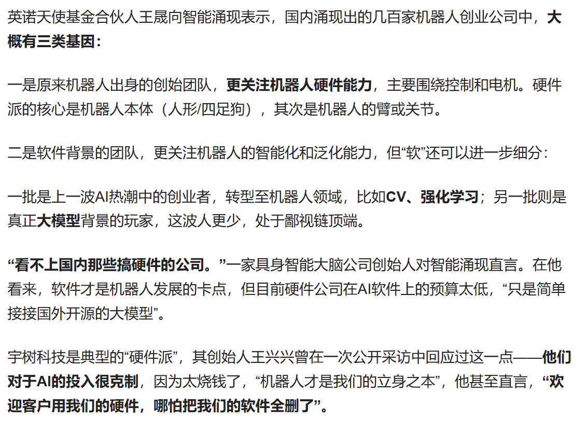
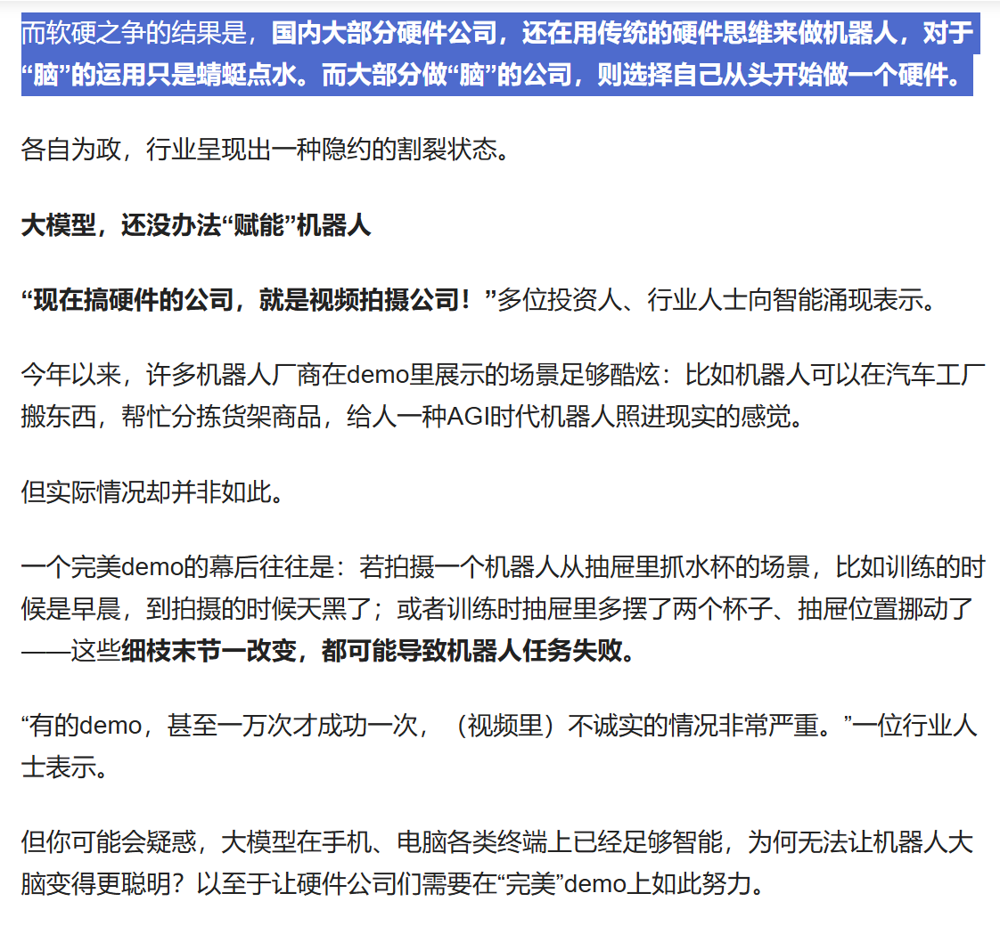
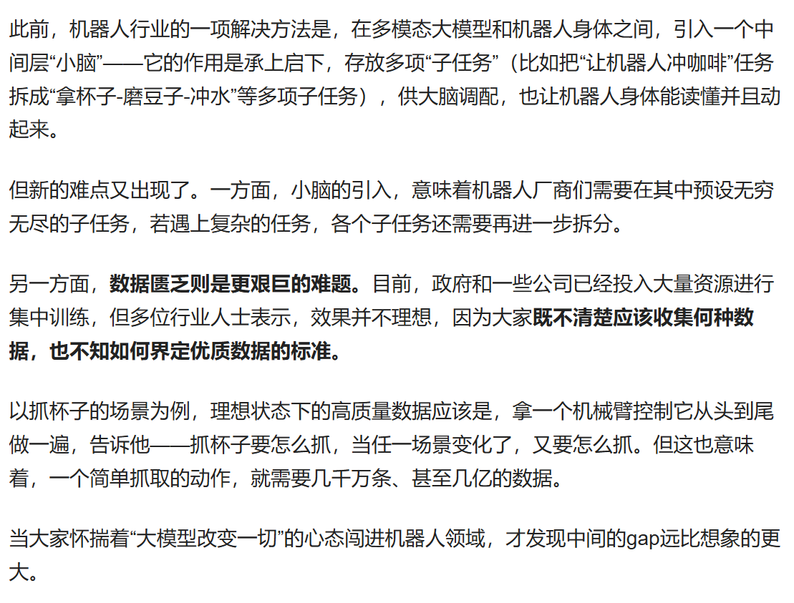

---

title: 人形机器人—圈子里的鄙视链
 
description: 

#多个标签请使用英文逗号分隔或使用数组语法

tags: 杂谈

#多个分类请使用英文逗号分隔或使用数组语法，暂不支持多级分类

---

**相关：**

[谈谈「机器人创业」圈子里的鄙视链丨智涌分析](https://mbd.baidu.com/newspage/data/landingsuper?context=%7B%22nid%22%3A%22news_10350276742918725141%22%7D&n_type=1&p_from=3)

 

 

“**搞软件的，鄙视搞硬件的，搞大模型的，看不起强化学习的**”

 

人形机器人的发展是在产业内存在争议的，是先搞硬件呢，还是先搞软件呢？

 

国内的人形机器人公司几乎都是搞硬件的，而国内搞具身智能的几乎都是大学和研究院，那么在外国呢，其实也没有比我们国内好太多，几乎搞硬件的只有那几家企业，而这一点还不如国内的这种各大企业一起上的情景，但是国外的具身智能呢，几乎也是只有研究院和大学在做。

之所以国内外的人形机器人公司都是主要搞硬件而不是主要搞具身智能呢，其实主要就是看哪个方面的甚至更有效率，因为未来人形机器人肯定是趋势，这是共识，这是没有疑问的，那么也就说只要搞硬件的未来肯定是能用的上的，硬件的开发和生产是固定路线的，这就不存在未来真的人形机器人OK了以后出现某些硬件公司被技术淘汰，可以说只要硬件开发跟的上目前的主流水平，那么到了人形机器人真的可以用的时候那么就一定可以分一杯羹的；但是，如果是搞软件的就不好说了，软件这东西是以数字形式存在的，并不以实体形式存在，可以说软件技术是极为容易被复刻的，这就和openai搞大语言模型之后很快国内的各大公司也都搞出了自己的大模型了，也就是说软件的开发需要的是一个方向，只要这个技术方向被确定以后其实就很难有什么实质性的壁垒了，而硬件的开发还是存在着具体的壁垒的，而这就导致如果投资软件，那么在真正具身智能真正实现的时候如果不能抢到最高处，那么就可能获得不到什么回报的，这也就是为什么现在国内外的资本投资都在投硬件公司，而国内外作具身智能的几乎都是大学和研究所。

 

 

我是搞软件的，是搞AI的，我下面说说个人对具身智能的发展方向的看法。

现在的具身智能是很差的，大家看到的演示效果其实大都是搞的视频特效，或者是特定场合和多次拍摄下取的最优结果。

现在的具身智能很大的一个问题就是鲁棒性差，或者说存在sim2real的问题，直白的说就是在理想环境下具身智能还可以用，但是一旦到了现实的复杂环境就歇菜，这其中的gap是目前依旧无法解决的。

在现有的问题下，有的人在做专用场景，有的人在做通用场景。专用场景其实比较好理解，其实就是像专门训练抓的动作的场景，就是专门训练抓水杯的动作，由于现在的技术限制，做好的抓水杯的动作在实际表现上很不稳定，现实测试时只要真实环境有所变化就可能导致失败；而通用场景则是把重点放在任务的分割上，比如把“让机器人冲咖啡”任务拆成“拿杯子-磨豆子-冲水”等多项子任务，如何把任务分割，把专用场景转变为通用场景任务的集合也是一个难点。通用任务确实可以比专用任务要好训练，不论是数据集还是算法的调优上，但是如何把通用任务上的能力结合成可以胜任到专用任务上的能力呢。

把一个复杂的专用任务下的操作转变为多个简单环境下的通用任务的组合，这就存在着如何把专用任务的分割，然后又要解决如何把分割后的通用任务再组合回去，这个过程中的一分一合本身就是目前难以解决的技术问题。

如果这个一分一合的问题解决不了，那么谁也说不好是不是通用任务上的能力不足，还是一分一合的问题，还是说这种从通用任务转向专用任务的技术路线是否有问题。

我这个其实不喜欢一股脑的专门投热点的，我个人认为不论是搞专用任务还是走通用任务转向专用任务都是应该有人去搞的，再不确定到底哪条路可行，那么每条路上都应该有人去搞的，就像现在大家投把钱投到硬件开发上，但是如果软件搞不出，那么再强的硬件也无非就是一堆铁制品，一大腚铁嘎达。搞技术嘛，还是应该秉着开放态度的，确实搞热点的回报率高，但是有时候就是要有人去吃亏的，不然最后大家都得饿死，有些事情只有有人去吃亏才有大家的共同胜利。

 

 

 

 

 

 

  

**个人github博客地址：**
[https://devilmaycry812839668.github.io/](https://devilmaycry812839668.github.io/ "https://devilmaycry812839668.github.io/")